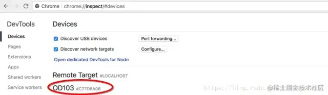
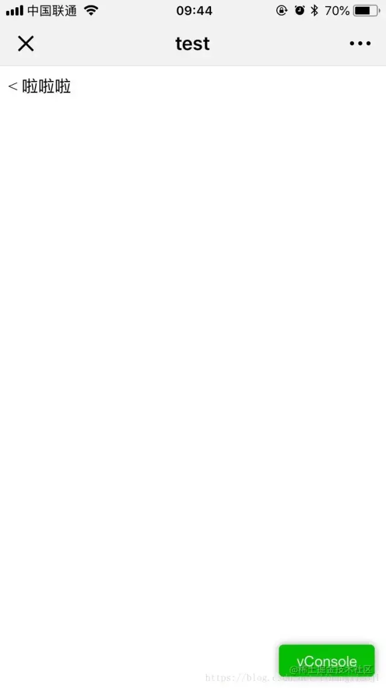
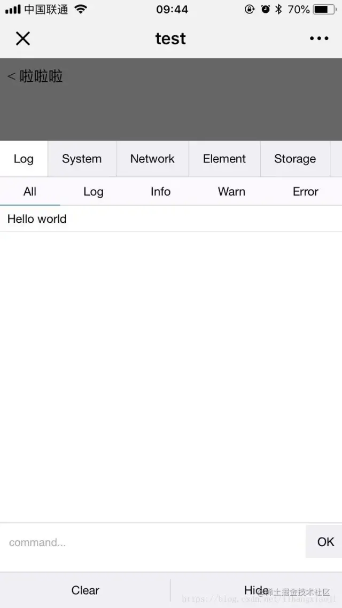
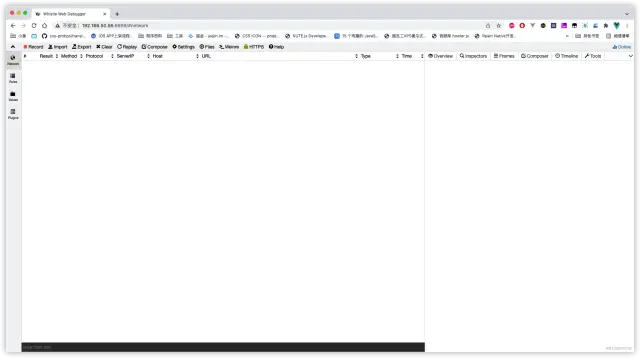

# 移动端真机调试

参考文章：[前端瓶子君--干货！移动端真机调试指南，对调试说easy](https://mp.weixin.qq.com/s?__biz=MzUzNjk5MTE1OQ==&mid=2247514406&idx=1&sn=8d03a35728265a9d33e0fd524569fcda&chksm=faef3dfecd98b4e813f75a661fb13c50c40ada715528a9120033c5a1c446ea8bbd3169efd575&mpshare=1&scene=1&srcid=0114tyHUo8brnZ60FbDiTLki&sharer_sharetime=1642647117910&sharer_shareid=3720a8d166d2fb213015b4eb03622fb5&exportkey=AfsfGYVXONs%2BLSgR5lg6xWw%3D&acctmode=0&pass_ticket=PQVpBBKPyF9S06E5OmnQHdJ6tDlGX0TUzz%2BDLCyl%2FrYZd89fDIXQjbsvoTc01g0I&wx_header=0#rd)

1、谷歌浏览器或者Edge浏览器 + Android

首先在chrome安装ADB Plugin

chrome中输入 chrome://inspect

通过数据线连接你的电脑和 Android 手机，打开USB的调试模式

就可以在上面的页面中看到自己的设备：



点击inspect

然后就可以欢乐地调试了，和使用谷歌调试pc端一样，可惜ios不适用 推荐指数4颗星

备注：如果手机连接成功，但一直没有inspect内容出现，可以在浏览器输入： chrome://inspect/#devices

2、vConsole、eruda等调试库

这个方法需要在页面中插入一段 JS 脚本，这里以vConsole为例，导入vconsole.min.js，并实例化，注实例化代码最好放在头部，以便能一开始就能劫持内容：

```js
  <script src="./vconsole.min.js"></script>
  <script>
    // 初始化
    new VConsole();
  </script>
```
或
```
npm i vconsole
```
```js
import VConsole from 'vconsole';

new VConsole();
```





优点：方便，可查看console、network、elements等；

缺点：css调试不友好，console会劫持consloe的打印，不能定位到打印的代码位置，需要额外加载js脚本

推荐指数3颗星

3、whistle

安卓、ios都能调试，跨平台、代理抓包、H5调试、debugger、请求劫持、HTTPS支持、WebSocket数据捕获等，功能非常强大。weinre是用node编写的，使用npm来进行安装

```
npm install -g whistle

w2 start
```



跨平台、抓包、 DOM、Console、Network 等，功能非常强大。

推荐指数5颗星

4、Mobile Debug

功能和whistle非常相似

需要把手机在同一个局域网wifi设置代理，便可使用，https需要增加安装证书步骤。

推荐指数5颗星

