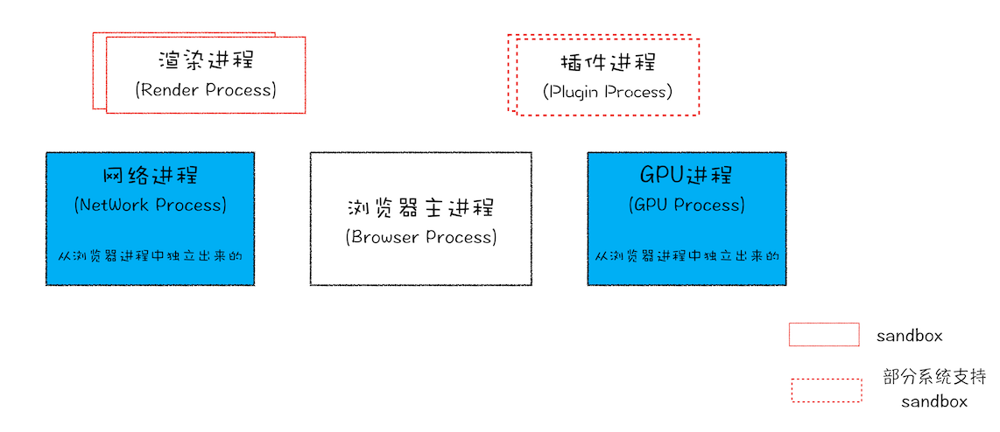
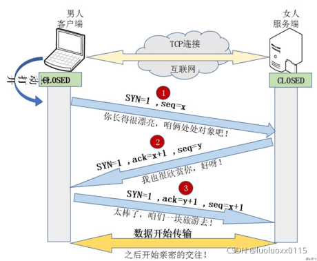
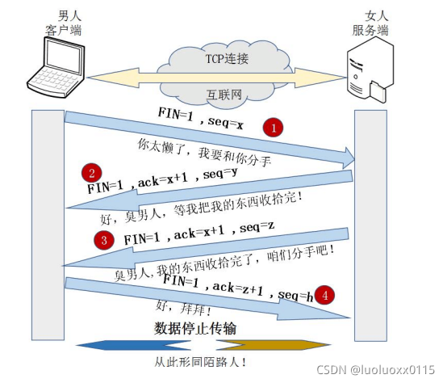

# 从输入URL到页面展示，这中间发生了什么？

## 解答

1、 用户输入URL，浏览器会根据用户输入的信息判断是搜索还是网址，如果是搜索内容，就将搜索内容+默认搜索引擎合成新的URL；如果用户输入的内容符合URL规则，浏览器就会根据URL协议，在这段内容上加上协议合成合法的URL

2、用户输入完内容，按下回车键，浏览器导航栏显示loading状态，但是页面还是呈现前一个页面，这是因为新页面的响应数据还没有获得 

::: tip 补充
当用户输入关键字并键入回车之后，这意味着当前页面即将要被替换成新的页面，不过在这个流程继续之前，浏览器还给了当前页面一次执行 beforeunload 事件的机会，beforeunload 事件允许页面在退出之前执行一些数据清理操作，还可以询问用户是否要离开当前页面，比如当前页面可能有未提交完成的表单等情况，因此用户可以通过 beforeunload 事件来取消导航，让浏览器不再执行任何后续工作。
:::

3、浏览器进程构建请求行信息，会通过进程间通信（IPC）将URL请求发送给网络进程 

4、网络进程获取到URL，先去本地缓存中查找是否有缓存文件，如果有，拦截请求，直接200返回；

5、如果没有缓存文件，则进入网络请求过程

* 5.1 进行DNS解析，获取服务器ip地址，端口（端口是通过dns解析获取的吗？这里有个疑问）
* 5.2 利用ip地址和服务器建立tcp连接
* 5.3 构建请求头信息
* 5.4 发送请求头信息
* 5.5 服务器响应后，网络进程接收响应头和响应信息，并解析响应内容

6、网络进程解析响应流程

* 6.1 检查状态码，如果是301/302，则需要重定向，从Location自动中读取地址，重新进行第4步；如果是200，则继续处理请求。
* 6.2 200响应处理： 检查响应类型Content-Type，如果是字节流类型，则将该请求提交给下载管理器，该导航流程结束，不再进行后续的渲染，如果是html则通知浏览器进程准备渲染进程准备进行渲染。

7，准备渲染进程

* 7.1 浏览器进程检查当前url是否和之前打开的渲染进程根域名是否相同，如果相同，则复用原来的进程，如果不同，则开启新的渲染进程。

8、传输数据、更新状态

* 8.1 渲染进程准备好后，浏览器向渲染进程发起“提交文档”的消息，渲染进程接收到消息和网络进程建立传输数据的“管道” 。
* 8.2 渲染进程接收完数据后，向浏览器进程发送“确认提交”。
* 8.3 浏览器进程接收到确认消息后更新浏览器界面状态：包括了安全状态、地址栏的 URL、前进后退的历史状态，并更新web页面，此时的web页面是空白页

9、渲染流程：DOM生成、样式计算和布局

* 9.1 渲染进程将 HTML 内容转换为能够读懂的 DOM 树结构。
* 渲染引擎将 CSS 样式表转化为浏览器可以理解的 styleSheets，计算出 DOM 节点的样式。
* 创建布局树，并计算元素的布局信息。对布局树进行分层，并生成分层树。
* 为每个图层生成绘制列表，并将其提交到合成线程。
* 合成线程将图层分成图块，并在光栅化线程池中将图块转换成位图。
* 合成线程发送绘制图块命令 DrawQuad 给浏览器进程。
* 浏览器进程根据 DrawQuad 消息生成页面，并显示到显示器上。

## 知识点和面试题

### 进程和线程

**一个进程就是一个程序的运行实例**。详细解释就是，启动一个程序的时候，操作系统会为该程序创建一块内存，用来存放代码、运行中的数据和一个执行任务的主线程，我们把这样的一个运行环境叫进程。

**线程是不能单独存在的，它是由进程来启动和管理的**


**从图中可以看到，线程是依附于进程的，而进程中使用多线程并行处理能提升运算效率**

#### 进程和线程的关系

1. 进程中的任意一线程执行出错，都会导致整个进程的崩溃。
2. 线程之间共享进程中的数据。线程之间可以对进程的公共数据进行读写操作
3. 当一个进程关闭之后，操作系统会回收进程所占用的内存。
4. 进程之间的内容相互隔离。

进程隔离是为保护操作系统中进程互不干扰的技术，每一个进程只能访问自己占有的数据，也就避免出现进程 A 写入数据到进程 B 的情况。正是因为进程之间的数据是严格隔离的，所以一个进程如果崩溃了，或者挂起了，是不会影响到其他进程的。如果进程之间需要进行数据的通信，这时候，就需要使用用于进程间通信（IPC）的机制了。

### Chrome 进程架构



Chrome 浏览器包括：1 个浏览器（Browser）主进程、1 个 GPU 进程、1 个网络（NetWork）进程、多个渲染进程和多个插件进程

* **浏览器进程**。主要负责界面显示、用户交互、子进程管理，同时提供存储等功能
* **渲染进程**。核心任务是将 HTML、CSS 和 JavaScript 转换为用户可以与之交互的网页，排版引擎 Blink 和 JavaScript 引擎 V8 都是运行在该进程中，默认情况下，Chrome 会为每个 Tab 标签创建一个渲染进程。出于安全考虑，渲染进程都是运行在沙箱模式下。
* **GPU 进程**。其实，Chrome 刚开始发布的时候是没有 GPU 进程的。而 GPU 的使用初衷是为了实现 3D CSS 的效果，只是随后网页、Chrome 的 UI 界面都选择采用 GPU 来绘制，这使得 GPU 成为浏览器普遍的需求。最后，Chrome 在其多进程架构上也引入了 GPU 进程。
* **网络进程**。主要负责页面的网络资源加载，之前是作为一个模块运行在浏览器进程里面的，直至最近才独立出来，成为一个单独的进程。
* **插件进程**。主要是负责插件的运行，因插件易崩溃，所以需要通过插件进程来隔离，以保证插件进程崩溃不会对浏览器和页面造成影响。

### Chrome架构：仅仅打开了1个页面，为什么有4个进程？

因为打开 1 个页面至少需要 1 个网络进程、1 个浏览器进程、1 个 GPU 进程以及 1 个渲染进程，共 4 个；如果打开的页面有运行插件的话，还需要再加上 1 个插件进程。

### 浏览器的缓存策略有哪些？

浏览器每次发起请求时，先在本地缓存中查找结果以及缓存标识，根据缓存标识来判断是否使用本地缓存。如果缓存有效，则使用本地缓存；否则，则向服务器发起请求并携带缓存标识。

根据是否需向服务器发起HTTP请求，将缓存过程划分为两个部分：**强缓存**和**协商缓存**，强缓存优先于协商缓存。

**强缓存**：服务器通知浏览器一个缓存时间，在缓存时间内，下次请求，直接用缓存，不在时间内，执行比较缓存策略。

**协商缓存**：让客户端与服务器之间能实现缓存文件是否更新的验证、提升缓存的复用率，将缓存信息中的Etag和Last-Modified通过请求发送给服务器，由服务器校验，返回304状态码时，浏览器直接使用缓存。

HTTP缓存都是从第二次请求开始的：

第一次请求资源时，服务器返回资源，并在response header中回传资源的缓存策略；

第二次请求时，浏览器判断这些请求参数，击中强缓存就直接200，否则就把请求参数加到request header头中传给服务器，看是否击中协商缓存，击中则返回304，否则服务器会返回新的资源。

参考内容：[Http 缓存策略，有什么区别，分别解决了什么问题](https://blog.csdn.net/weixin_28432777/article/details/112532986)

### 浏览器缓存控制机制有哪些？

浏览器缓存控制机制有两种：HTML Meta标签 和HTTP头信息

**使用HTML Meta 标签**：HTML Meta标签是应用在HTML文件中的head头部分。主要作用就是告诉浏览器此HTML页面不被缓存，每次访问都去服务器上下载。使用上很简单，但只有部分浏览器可以支持，而且所有缓存代理服务器都不支持，因为代理不解析HTML内容本身。所以常说的浏览器缓存还是通过http头信息来控制缓存

**使用HTTP头信息控制缓存**：


通过浏览器开发者工具我们可以看到，浏览器请求服务器静态资源的响应状态码主要就是下图的三种：


页面的缓存状态是由HTTP协议中关于缓存的信息头决定的，主要的控制关键字有4种：Last-Modified、Etag、Cache-Control、Expires

Cache-Control 和 Expires首部用于指定缓存时间，Last-Modified和ETag 首部提供验证机制

更多详细内容参考：[彻底理解浏览器的缓存机制（http缓存机制）](https://www.cnblogs.com/chengxs/p/10396066.html)

### 哪些请求不能被缓存？

1、HTTP 信息头中包含 Cache-Control:no-cache，pragma:no-cache，或 Cache-Control:max-age=0 等告诉浏览器不用缓存的请求

2、需要根据 Cookie，认证信息等决定输入内容的动态请求是不能被缓存的

3、经过 HTTPS 安全加密的请求（有人也经过测试发现，ie 其实在头部加入 Cache-Control：max-age 信息，firefox 在头部加入 Cache-Control:Public 之后，能够对 HTTPS 的资源进行缓存，参考《HTTPS 的七个误解》）

4、POST 请求无法被缓存

5、HTTP 响应头中不包含 Last-Modified/Etag，也不包含 Cache-Control/Expires 的请求无法被缓存

### 部署时缓存的问题：我们不仅要缓存代码，还需要更新代码。如果静态资源名字不变，怎么让浏览器即能缓存又能在有新代码时更新？

简单的解决方式就是静态资源路径添加一个版本值，版本不变就走缓存策略，版本变了就加载新资源。如下：

```js
<script src="xx/xx.js?v=24334452"></script>
```

然而这种处理方式在部署时有问题。

解决方法：静态资源和页面是分开部署

先部署页面再部署静态资源，会出现用户访问到旧的资源

先部署静态资源再部署页面，会出现没有缓存用户加载到新资源而报错

这些问题的本质是以上的部署方式是“覆盖式发布”，解决方式是“非覆盖式发布”。即用静态资源的文件摘要信息给文件命名，这样每次更新资源不会覆盖原来的资源，先将资源发布上去。这时候存在两种资源，用户用旧页面访问旧资源，然后再更新页面，用户变成新页面访问新资源，就能做到无缝切换。简单来说就是给静态文件名加hash值。

那如何实现呢？使用webpack持久化缓存

现在前端代码都用webpack之类的构建工具打包，浏览器有其缓存机制，想要既能缓存又能在部署时没有问题，需要给静态文件名添加hash值。在webpack中，有些配置能让我们实现持久化缓存。

更多详细内容参考：[webpack持久化缓存](https://zhuanlan.zhihu.com/p/102923708)

### DNS查找过程

1、浏览器首先搜索浏览器自身缓存的DNS记录。 浏览器自身也带有一层DNS缓存，Chrome 缓存1000条DNS解析结果，缓存时间大概在一分钟左右。（Chrome浏览器通过输入：chrome://net-internals/#dns打开DNS缓存页面）

2、如果浏览器缓存中没有找到需要的记录或记录已经过期，则搜索hosts文件和操作系统缓存。

在Windows操作系统中，可以通过 ipconfig /displaydns命令查看本机当前的DNS缓存。

通过hosts文件，你可以手动指定一个域名和其对应的IP解析结果，并且该结果一旦被使用，同样会被`缓存到操作系统缓存中。

Windows系统的hosts文件在C:\Windows\System32\drivers\etc下，linux系统的hosts文件在/etc/hosts下。

3、如果在hosts文件和操作系统缓存中没有找到需要的记录或记录已经过期，则向域名解析服务器发送解析请求。

其实第一台被访问的域名解析服务器就是我们平时在设置中填写的DNS服务器一项，当操作系统缓存中也没有命中的时候，系统会向DNS服务器正式发出解析请求。这里是真正意义上开始解析一个未知的域名。

一般一台域名解析服务器会被地理位置临近的大量用户使用（特别是ISP的DNS），一般常见的网站域名解析都能在这里命中。

4、如果域名解析服务器也没有该域名的记录，则开始递归+迭代解析。

5、获取域名对应的IP后，一步步向上返回，直到返回给浏览器。

关于DNS的详细介绍可参考：[DNS解析的过程是什么，求详细的?](https://www.zhihu.com/question/23042131)

### 三次握手

**浏览器通过DNS获取到web服务器真实IP地址后，便向服务器发起TCP连接请求，通过TCP的三次握手建立连接后，浏览器便可以将http请求数据发送给服务器了**

**三次握手：**

第一次握手：建立连接。客户端发送连接请求报文段，将SYN位置为1，Sequence Number为x；然后，客户端进入SYN_SEND状态，等待服务器的确认；

第二次握手：服务器收到SYN报文段。服务器收到客户端的SYN报文段，需要对这个SYN报文段进行确认，设置Acknowledgment Number为x+1(Sequence Number+1)；同时，自己还要发送SYN请求信息，将SYN位置为1，Sequence Number为y；服务器端将上述所有信息放到一个报文段（即SYN+ACK报文段）中，一并发送给客户端，此时服务器进入SYN_RECV状态；

第三次握手：客户端收到服务器的SYN+ACK报文段。然后将Acknowledgment Number设置为y+1，向服务器发送ACK报文段，这个报文段发送完毕以后，客户端和服务器端都进入ESTABLISHED状态，完成TCP三次握手。

三次握手动态过程：


三次握手通俗解释：



把客户端比作男孩，服务器比作女孩，用他们的交往来说明“三次握手”过程：

（1）男孩喜欢女孩，于是写了一封信告诉女孩：我爱你，请和我交往吧！（写完信之后，男孩焦急地等待，因为不知道信能否顺利传达给女孩）

（2）女孩收到男孩的情书后，心花怒放，原来我们是两情相悦呀！于是给男孩写了一封回信：我收到你的情书了，也明白了你的心意，其实，我也喜欢你！我愿意和你交往！（写完信之后，女孩也焦急地等待，因为不知道回信能否能顺利传达给男孩）

（3）男孩收到回信之后很开心，因为发出的情书女孩收到了，并且从回信中知道了女孩喜欢自己，并且愿意和自己交往。然后男孩又写了一封信告诉女孩：你的心意和信我都收到了，谢谢你，还有我爱你！

（女孩收到男孩的回信之后，也很开心，因为发出的情书男孩收到了。由此男孩女孩双方都知道了彼此的心意，之后就快乐地交流起来了~~）

这就是通俗版的“三次握手”，期间一共往来了三封信也就是“三次握手”，以此确认两个方向上的数据传输通道是否正常。

### 四次挥手

**当数据传输完成后，由于TCP是半关闭（half-close）的，因此终止一个连接还要经过四次握手**

一个TCP连接是全双工（即数据在两个方向上能同时传递，可理解为两个方向相反的独立通道），因此每个方向必须单独地进行关闭。这原则就是当一方完成它的数据发送任务后就能发送一个FIN来终止这个方向连接。

**四次挥手：**

当客户端和服务器通过三次握手建立了TCP连接以后，数据已传送完毕，是要断开TCP连接的，那对于TCP的断开连接，这里就有了神秘的“四次分手”：

第一次挥手：主机1（可以是客户端，也可以是服务器端），设置Sequence Number和Acknowledgment Number，向主机2发送一个FIN报文段；此时，主机1进入FIN_WAIT_1状态；这表示主机1没有数据要发送给主机2了；

第二次挥手：主机2收到了主机1发送的FIN报文段，向主机1回一个ACK报文段，Acknowledgment Number为Sequence Number加1；主机1进入FIN_WAIT_2状态；主机2告诉主机1，我“同意”你的关闭请求；

第三次挥手：主机2向主机1发送FIN报文段，请求关闭连接，同时主机2进入LAST_ACK状态；

第四次挥手：主机1收到主机2发送的FIN报文段，向主机2发送ACK报文段，然后主机1进入TIME_WAIT状态；主机2收到主机1的ACK报文段以后，就关闭连接；此时，主机1等待2MSL后依然没有收到回复，则证明Server端已正常关闭，那好，主机1也可以关闭连接了。

四次挥手动态过程：


四次挥手通俗解释：



把客户端比作男孩，服务器比作女孩，通过他们的分手来说明“四次挥手”过程：

（1）“第一次挥手”：日久见人心，男孩发现女孩变成了自己讨厌的样子，忍无可忍，于是决定分手，随即写了一封信告诉女孩。

（2）“第二次挥手”：女孩收到信之后，知道了男孩要和自己分手，怒火中烧，心中暗骂：你算什么东西，当初你可不是这个样子的！于是立马给男孩写了一封回信：分手就分手，给我点时间，我要把你的东西整理好，全部还给你！（男孩收到女孩的第一封信之后，明白了女孩知道自己要和她分手。随后等待女孩把自己的东西收拾好）

（3）“第三次挥手”：过了几天，女孩把男孩送的东西都整理好了，于是再次写信给男孩：你的东西我整理好了，快把它们拿走，从此你我恩断义绝！

（4）“第四次挥手”：男孩收到女孩第二封信之后，知道了女孩收拾好东西了，可以正式分手了，于是再次写信告诉女孩：我知道了，这就去拿回来！

这里双方都有各自的坚持:

女孩自发出第二封信开始，限定一天内收不到男孩回信，就会再发一封信催促男孩来取东西！

男孩自发出第二封信开始，限定两天内没有再次收到女孩的信就认为，女孩收到了自己的第二封信；若两天内再次收到女孩的来信，就认为自己的第二封信女孩没收到，需要再写一封信，再等两天…

倘若双方信都能正常收到，最少只用四封信就能彻底分手！这就是“四次挥手”。

### 为什么TCP连接的时候是3次？2次不可以吗？

因为需要考虑连接时丢包的问题，如果只握手2次，第二次握手时如果服务端发给客户端的确认报文段丢失，此时服务端已经准备好了收发数(可以理解服务端已经连接成功)据，而客户端一直没收到服务端的确认报文，所以客户端就不知道服务端是否已经准备好了(可以理解为客户端未连接成功)，这种情况下客户端不会给服务端发数据，也会忽略服务端发过来的数据。

如果是三次握手，即便发生丢包也不会有问题，比如如果第三次握手客户端发的确认ack报文丢失，服务端在一段时间内没有收到确认ack报文的话就会重新进行第二次握手，也就是服务端会重发SYN报文段，客户端收到重发的报文段后会再次给服务端发送确认ack报文。

### 为什么TCP连接的时候是3次，关闭的时候却是4次？

因为只有在客户端和服务端都没有数据要发送的时候才能断开TCP。而客户端发出FIN报文时只能保证客户端没有数据发了，服务端还有没有数据发客户端是不知道的。而服务端收到客户端的FIN报文后只能先回复客户端一个确认报文来告诉客户端我服务端已经收到你的FIN报文了，但我服务端还有一些数据没发完，等这些数据发完了服务端才能给客户端发FIN报文(所以不能一次性将确认报文和FIN报文发给客户端，就是这里多出来了一次)。

### 为什么客户端发出第四次挥手的确认报文后要等2MSL的时间才能释放TCP连接？

这里同样是要考虑丢包的问题，如果第四次挥手的报文丢失，服务端没收到确认ack报文就会重发第三次挥手的报文，这样报文一去一回最长时间就是2MSL，所以需要等这么长时间来确认服务端确实已经收到了。

### 浏览器可以同时打开多个页签，他们端口一样吗？如果一样，数据怎么知道去哪个页签？

端口一样的，网络进程知道每个tcp链接所对应的标签是那个，所以接收到数据后，会把数据分发给对应的渲染进程。

### TCP传送数据时 浏览器端就做渲染处理了么？如果前面数据包丢了 后面数据包先来是要等么？

接收到http响应头中的content-type类型时就开始准备渲染进程了，响应体数据一旦接受到便开始做DOM解析了！基于http不用担心数据包丢失的问题，因为丢包和重传都是在tcp层解决的。http能保证数据按照顺序接收的（也就是说，从tcp到http的数据就已经是完整的了，即便是实时渲染，如果发生丢包也得在重传后才能开始渲染）

### 如果下载 CSS 文件阻塞了，会阻塞 DOM 树的合成吗？会阻塞页面的显示吗？

当从服务器接收HTML页面的第一批数据时，DOM解析器就开始工作了，在解析过程中，如果遇到了JS脚本，如下所示：

```js
<html>
    <body>
        极客时间
        <script>
        document.write("--foo")
        </script>
    </body>
</html>
```

那么DOM解析器会先执行JavaScript脚本，执行完成之后，再继续往下解析。

第二种情况复杂点了，我们内联的脚本替换成js外部文件，如下所示：

```js
<html>
    <body>
        极客时间
        <script type="text/javascript" src="foo.js"></script>
    </body>
</html>
```

这种情况下，当解析到JavaScript的时候，会先暂停DOM解析，并下载foo.js文件，下载完成之后执行该段JS文件，然后再继续往下解析DOM。这就是JavaScript文件为什么会阻塞DOM渲染。

我们再看第三种情况，还是看下面代码：

```js
<html>
    <head>
        <style type="text/css" src = "theme.css" />
    </head>
    <body>
        <p>极客时间</p>
        <script>
            let e = document.getElementsByTagName('p')[0]
            e.style.color = 'blue'
        </script>
    </body>
</html>
```

当我在JavaScript中访问了某个元素的样式，那么这时候就需要等待这个样式被下载完成才能继续往下执行，所以在这种情况下，CSS也会阻塞DOM的解析。

### 如何减少重绘、重拍？

1、可以使用GPU硬件加速

2、动画可以使用绝对定位或fixed，让其脱离文档流，修改动画不造成主界面的影响

3、使用 visibility 替换 display: none（前者只会引起重绘，后者则会引发回流）

4、避免使用 table 布局，可能很小的一个小改动会造成整个 table 的重新布局

5、使用transform实现动画效果


**参考地址：**

极客时间：[浏览器工作原理与实践](https://time.geekbang.org/column/intro/100033601?tab=catalog)

