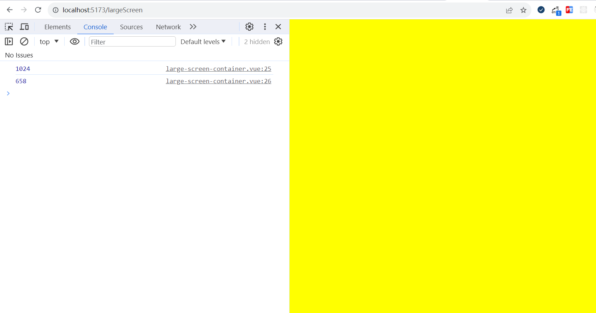

# window.innerWidth获取可视区域不可靠

在计算当前可视区域宽高的时候，我使用了window.innerWidth和dom.clientWidth，发现这俩的值有时候一样，有时候不一样，尤其是在浏览器审查元素的时候，
window.innerWidth的值特别奇怪



```js
    const dom = largeScreenConRef.value
    console.log(dom.clientWidth)
    console.log(window.innerWidth)
```

所以推荐要获取当前页面的可视区域，可以设定最外层的div宽高为100%，然后通过clientWidth获取
