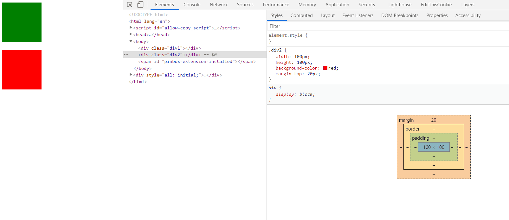
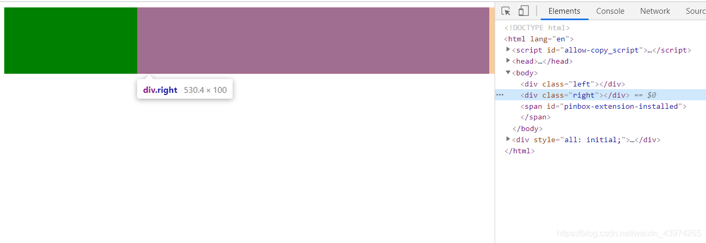
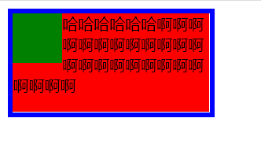
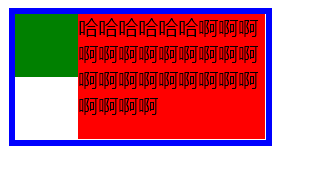
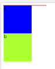
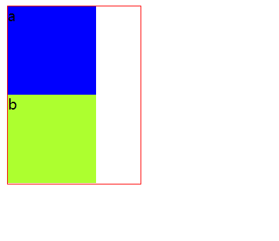

# BFC

转载地址：[https://blog.csdn.net/weixin_43974265/article/details/115416184](https://blog.csdn.net/weixin_43974265/article/details/115416184)

## 什么是BFC

官方定义：**BFC（Block Formatting Context）块格式化上下文**， 是Web页面的可视CSS渲染的一部分，是块盒子的布局过程发生的区域，也是浮动元素与其他元素交互的区域。

说人话：B**FC就是页面上的一个隔离的独立容器，容器里面的子元素不会影响到外面的元素**。 我们经常使用到BFC，只不过不知道它是BFC而已。

## 如何创建一个BFC

常用的方式有以下几种：

* 浮动元素（元素的float不是 none，指定float为left或者right就可以创建BFC）

* 绝对定位元素（元素的 position 为 absolute 或 fixed）

* display:inline-block，display:table-cell，display:flex，display:inline-flex

* overflow指定除了visible的值

## BFC有什么特点

* 在BFC中，块级元素从顶端开始垂直地一个接一个的排列。（当然了，即便不在BFC里块级元素也会垂直排列）

* 如果两个块级元素属于同一个BFC，它们的上下margin会重叠（或者说折叠），以较大的为准。但是如果两个块级元素分别在不同的BFC中，它们的上下边距就不会重叠了，而是两者之和。

* BFC的区域不会与浮动的元素区域重叠，也就是说不会与浮动盒子产生交集，而是紧贴浮动边缘。

* 计算BFC的高度时，浮动元素也参与计算。BFC可以包含浮动元素。（利用这个特性可以清除浮动）

* BFC就是页面上的一个隔离的独立容器，容器里面的子元素不会影响到外面的元素。

## BFC有什么用

### 解决外边距折叠问题

**外边距折叠（Margin collapsing）也只会发生在属于同一BFC的块级元素之间。**

```html
<div class="div1"></div>
<div class="div2"></div>
```

```css
.div1 {
  width: 100px;
  height: 100px;
  background-color: green;
  margin-bottom: 10px;
}

.div2 {
  width: 100px;
  height: 100px;
  background-color: red;
  margin-top: 20px;
}
```

对第一个div的margin-bottom设置为10px，第二个div的margin-top设置为20px，我们可以看到两个盒子最终的边距是20px，是两者之中较大的一个。这就是外边距重叠的问题。



为了解决这个问题，我们可以让这两个div分属于不同的BFC，或者只要把其中一个div放到BFC中就可以。原因是：BFC就是页面上的一个隔离的独立容器，容器里面的元素不会对外边产生影响。

```html
<div class="wrapper">
  <div class="div1"></div>
</div>
<div class="div2"></div>
```

```css
.wrapper{
  /* 开启BFC */
  overflow: hidden;
}

.div1 {
  width: 100px;
  height: 100px;
  background-color: green;
  margin-bottom: 10px;
}

.div2 {
  width: 100px;
  height: 100px;
  background-color: red;
  margin-top: 20px;
}
```

现在的代码可以解决外边距重叠的问题啦！但是注意，在我们这个案例中，虽然指定position属性为absolute和fixed，或者float指定为left、right也可以创建BFC，但是这个元素会从当前文档流中移除，不占据页面空间，并且可以和其它元素重叠。导致下边的div会把上边的div给覆盖掉。

### 制作两栏布局

**BFC的区域不会与浮动的元素区域重叠。**

我们可以利用这个特性来创建CSS中常用的两栏布局（左边宽度固定，右边宽度自适应）。

```html
<div class="left"></div>
<div class="right"></div>
```

```css
.left {
  width: 200px;
  height: 100px;
  background-color: green;
  float: left;
}

.right {
  height: 100px;
  background-color: red;
  overflow: hidden; /* 创建BFC */
}
```

效果如图所示：



另一个案例：

```html
<div class="father">
  <div class="left"></div>
  <div class="right">
    哈哈哈哈哈哈啊啊啊啊啊啊啊啊啊啊啊啊啊啊啊啊啊啊啊啊啊啊啊啊啊
  </div>
</div>
```

```css
.father {
  width: 200px;
  border: 5px solid blue;
}

.left {
  width: 50px;
  height: 50px;
  background-color: green;
  float: left;
}

.right {
  height: 100px;
  background-color: red;
}
```

当在父元素中只设定一个盒子浮动，另一个不浮动时，会造成第二个盒子在第一个盒子的下方，被覆盖掉一部分（但文字不会被覆盖）。效果如图：



给第二个元素设置BFC：

```css
 .right {
   height: 100px;
   background-color: red;
   overflow: hidden;
 }
```

效果如图：



### 清除元素内部的浮动

这里清除浮动的意思并不是清除你设置的元素的浮动属性，而是清除设置了浮动属性之后给别的元素带来的影响。例如我们给子元素设置浮动，那么父元素的高度就撑不开了。

BFC有一个特性：计算BFC的高度时，浮动元素也参与计算，利用这个特性可以清除浮动。

```html
<div class="div1">
  <div class="son1">a</div>
  <div class="son2">b</div>
</div>
```

```css
.div1 {
  width: 150px;
  border: 1px solid red;      
}

.son1, .son2 {
  width: 100px;
  height: 100px;
  background-color: blue;
  float: left;
}

.son2 {
  background-color: greenyellow;
}     
```

效果如图：

子元素设置float后，父元素没有撑开



```css
 .div1 {
  width: 150px;
  border: 1px solid red;

  /*使用BFC来清除浮动*/
  overflow: hidden;
}

.son1, .son2 {
  width: 100px;
  height: 100px;
  background-color: blue;
  float: left;
}

.son2 {
  background-color: greenyellow;
}    
```

效果如图：


