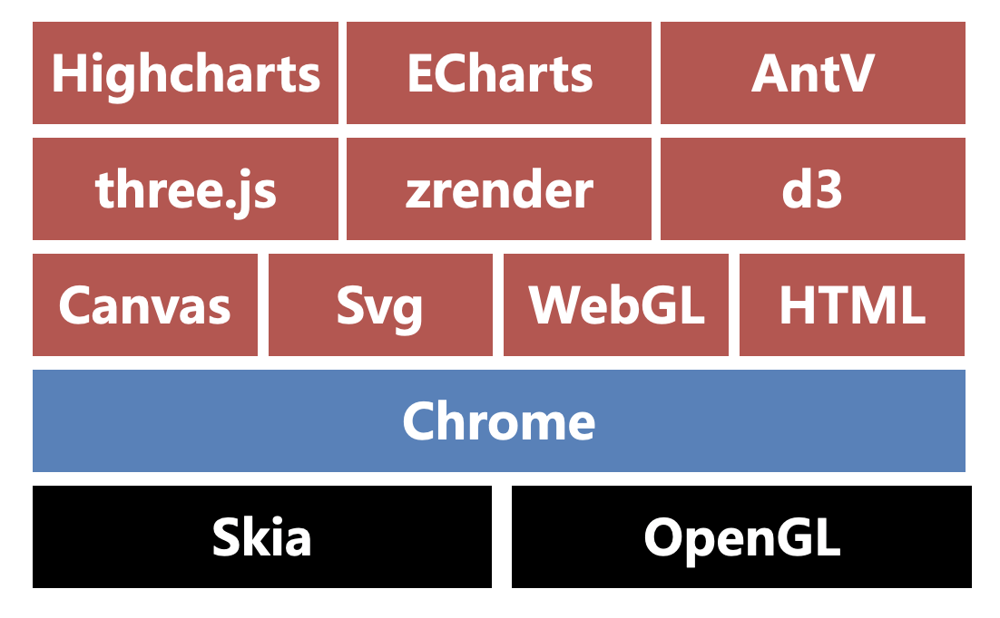

# 数据可视化知识点

## 相关实现方案

[GoView低代码数据可视化](https://www.mtruning.club/)

[DataEase开源数据可视化分析平台](https://dataease.io/templates/)

[DataV Vue大屏数据展示组件库](http://datav.jiaminghi.com/) 好几年没有更新了

[大姐大封装的数据可视化组件库](https://www.npmjs.com/package/evdataui?activeTab=readme)

## 数据可视化解决方案



### Skia

Skia 是 Chrome 和 Android 的底层 2D 绘图引擎。Skia 采用 C++ 编程，由于它位于浏览器的更底层，所以我们平常接触较少

### OpenGL

OpenGL（Open Graphics Library）是2D、3D图形渲染库，它可以绘制从简单的2D图形到复杂的3D景象。OpenGL 常用于 CAD、VR、数据可视化和游戏等众多领域。

### Chrome

Chrome 使用 Skia 作为绘图引擎，向上层开放了 canvas、svg、WebGL、HTML 等绘图能力

### canvas

canvas 是 HTML5 的新特性，它允许我们使用 canvas 元素在网页上通过 JavaScript 绘制图像。

示例：

```html
<!DOCTYPE html>
<html lang="en">
<head>
  <meta charset="UTF-8">
  <title>canvas</title>
</head>
<body>
  <canvas id="canvas" width="500" height="500"></canvas>
  <script>
    const canvas = document.getElementById('canvas') // 获取dom对象
    const ctx = canvas.getContext('2d') // 获取canvas对象
    ctx.fillStyle = 'red'
    ctx.fillRect(0, 0, 50, 50) // 绘制矩形

    ctx.beginPath() // 开始绘制路径
    ctx.lineWidth = 1 // 线条宽度
    ctx.strokeStyle = 'blue' // 线条填充色
    ctx.moveTo(100, 100) // 起点坐标
    ctx.lineTo(250, 75) // 中间点坐标
    ctx.lineTo(300, 100) // 终点坐标
    ctx.stroke() // 绘制线条

    ctx.beginPath();
    ctx.lineWidth = 2;
    ctx.strokeStyle = 'green'; // 圆形边框色
    ctx.fillStyle = 'red'; // 圆形填充色
    ctx.arc(200, 200, 50, 0, 2 * Math.PI); // 绘制圆形
    ctx.stroke(); // 绘制圆形的边框
    ctx.fill(); // 绘制圆形的填充色

    ctx.beginPath();
    ctx.lineWidth = 1;
    ctx.strokeStyle = 'red';
    ctx.moveTo(300, 300);
    ctx.lineTo(301, 301); // 绘制一个点
    ctx.stroke();
  </script>
</body>
</html>

```

**总结canvas绘图的流程：**

1、编写 canvas 标签（注意指定宽高）

2、获取 canvas DOM 对象

3、获取 Canvas 对象

4、设置绘图属性

5、调用绘图 API

### svg

SVG是一种基于 XML 的图像文件格式，它的英文全称为Scalable Vector Graphics，意思为可缩放的矢量图形

示例：

```html
<!DOCTYPE html>
<html>
<head>
</head>
<body>
<svg width="800" height="800">
  <rect
    width="50"
    height="50"
    style="fill:red;stroke-width:0;stroke:rgb(0,0,0);"
  />
  <line
    x1="100"
    y1="100"
    x2="250"
    y2="75"
    style="stroke:blue;stroke-width:1"
  />
  <line
    x1="250"
    y1="75"
    x2="300"
    y2="100"
    style="stroke:blue;stroke-width:1"
  />
  <circle
    cx="200"
    cy="200"
    r="50"
    stroke="green"
    stroke-width="2"
    fill="red"
  />
  <line
    x1="300"
    y1="300"
    x2="301"
    y2="301"
    style="stroke:red;stroke-width:1"
  />
</svg>
</body>
</html>

```

**总结svg绘图的流程：**

1、编写 svg 标签，指定宽高

2、编写 svg 绘图标签

3、编写绘图属性和样式

### WebGL

WebGL（Web Graphics Library）是一种 3D 绘图协议，WebGL可以为 HTML5 Canvas 提供硬件3D加速渲染，这样Web开发人员就可以借助系统显卡来在浏览器里更流畅地展示 3D 场景和模型了，还能创建复杂的导航和数据视觉化。

[案例1：3D 魔方](http://www.randelshofer.ch/webgl/rubikscube/)

[案例2：化学模型](https://web.chemdoodle.com/demos/molgrabber-3d)

[案例3：3D 地球](https://www.webglearth.com/#ll=0.00000,0.00000;alt=17000000)

[案例4：3D 大脑](https://www.biodigital.com/)

### zrender

[zrender](https://ecomfe.github.io/zrender-doc/public/)是二维绘图引擎，它提供 Canvas、SVG、VML 等多种渲染方式。ZRender 也是 ECharts 的渲染器。

示例：

```html
<!DOCTYPE html>
<html lang="en">
<head>
  <script src="./zrender.js"></script>
  <title>zrender</title>
</head>
<body>
<div id="container" style="width: 800px;height: 800px;"></div>
<script>
  var zr = zrender.init(document.getElementById('container'));
  var rect = new zrender.Rect({
    shape: {
      x: 0,
      y: 0,
      width: 50,
      height: 50
    },
    style: {
      fill: 'red',
      lineWidth: 0
    }
  });
  var line = new zrender.Polyline({
    shape: {
      points:[
        [100, 100],
        [250, 75],
        [300, 100]
      ]
    },
    style: {
      stroke: 'blue',
      lineWidth: 1
    }
  });
  var circle = new zrender.Circle({
    shape: {
      cx: 200,
      cy: 200,
      r: 50
    },
    style: {
      fill: 'red',
      stroke: 'green',
      lineWidth: 2
    }
  });
  var point = new zrender.Polyline({
    shape: {
      points:[
        [300, 300],
        [301, 301]
      ]
    },
    style: {
      stroke: 'red',
      lineWidth: 1
    }
  });
  zr.add(rect);
  zr.add(line);
  zr.add(circle);
  zr.add(point);
</script>
</body>
</html>

```

**总结zrender绘图的流程:**

1、引入 zrender 库

2、编写 div 容器

3、初始化 zrender 对象

4、初始化 zrender 绘图对象

5、调用 zrender add 方法绘图

### D3

[D3（Data-Driven Documents）](https://d3js.org/) 是一个 Javascript 图形库，基于 Canvas、Svg 和 HTML。

[D3的案例](https://observablehq.com/@d3/gallery)

### Three.js

[Three.js](https://github.com/mrdoob/three.js)是一个基于 WebGL 的 Javascript 3D 图形库

### Highcharts

[Highcharts}(https://www.highcharts.com.cn/)是一个用纯JavaScript编写的一个图表库， 能够很简单便捷的在web网站或是web应用程序添加有交互性的图表，Highcharts 支持的图表类型有直线图、曲线图、区域图、柱状图、饼状图、散状点图、仪表图、气泡图、瀑布流图等多达 20 种图表

Highcharts 系列包含 Highcharts JS，Highstock JS，Highmaps JS 共三款软件，均为纯 JavaScript 编写的 HTML5 图表库

### AntV

[AntV](https://antv.antgroup.com/zh)是蚂蚁金服全新一代数据可视化解决方案，致力于提供一套简单方便、专业可靠、无限可能的数据可视化最佳实践。

AntV 包括以下解决方案：

* G2：可视化引擎

* G2Plot：图表库

* G6：图可视化引擎

* Graphin：基于 G6 的图分析组件

* F2：移动可视化方案

* ChartCube：AntV 图表在线制作

* L7：地理空间数据可视化

## 技术选型

### ECharts VS Highcharts

Highcharts 和 ECharts 的争论非常多，整体来说：

* Highcharts 能够兼容 IE6+，ECharts 通过 VML 兼容低端浏览器

* Highcharts 文档体验略胜一筹

* Highcharts 收费，这是很多开发者转向 ECharts 的主要原因

* Highcharts 基于 svg 实现，ECharts 默认采用 canvas 渲染，4.0 支持 svg 渲染

* ECharts 国内知名度更高，国内企业认可度更高

### ECharts VS AntV

* AntV 文档阅读体验更符合互联网产品使用习惯

* AntV 产品体系拆分更加清晰，但一定程度上提升了学习成本

* ECharts 社区更强大

* ECharts 使用更加广泛
