# ECharts 基本概念

[echarts官网](https://echarts.apache.org/zh/index.html)

## 系列

系列（series）是指：一组数值映射成对应的图

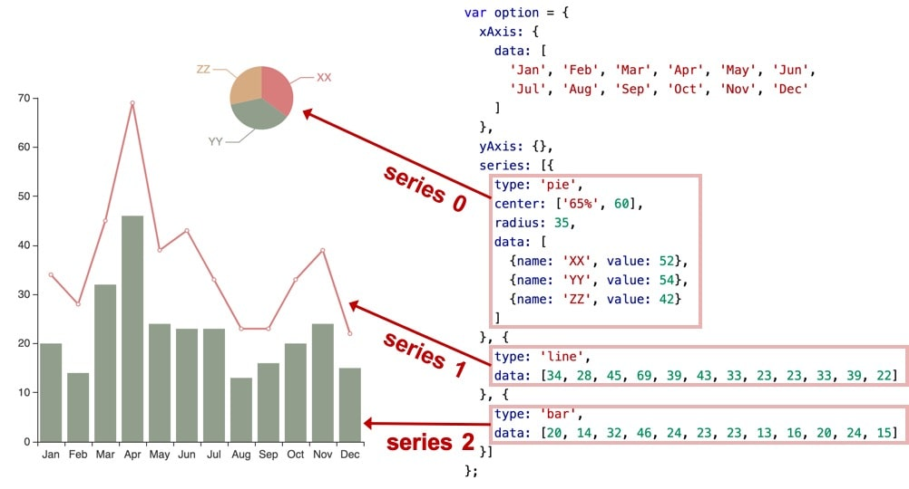

**示例：**

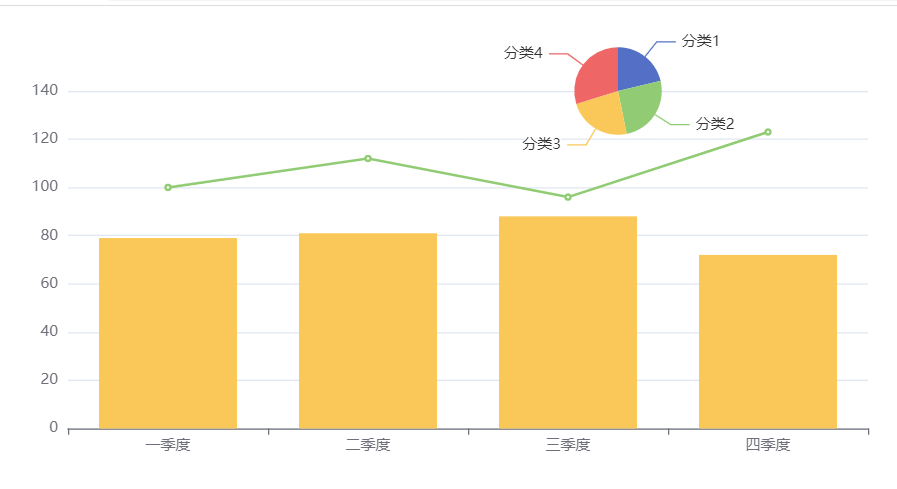

```html
<!DOCTYPE html>
<html lang="en">
<head>
  <meta charset="UTF-8">
  <title>echarts</title>
  <script src="./echarts.js"></script>
  <style>
    #chart{
      width: 800px;
      height: 400px;
    }
  </style>
</head>
<body>
  <div id="chart"></div>
  <script>
    const chartDom = document.getElementById('chart')
    const chart = echarts.init(chartDom)
    const option = {
      xAxis: {
        data: ['一季度', '二季度', '三季度', '四季度']
      },
      yAxis: {},
      series: [
        {
          type: 'pie',
          center: ['65%', 60],
          radius: 35,
          data: [{
            name: '分类1', value: 50
          }, {
            name: '分类2', value: 60
          }, {
            name: '分类3', value: 55
          }, {
            name: '分类4', value: 70
          }]
        },
        {
          type: 'line',
          data: [100, 112, 96, 123]
        },
        {
          type: 'bar',
          data: [79, 81, 88, 72]
        }
      ]
    }

    chart.setOption(option)
  </script>
</body>
</html>

```

## dataset

ECharts 4 开始支持了 数据集（dataset）组件用于单独的数据集声明，从而数据可以单独管理，被多个组件复用，并且可以自由指定数据到视觉的映射。这一特性能将逻辑和数据分离，带来更好的复用，并易于理解。

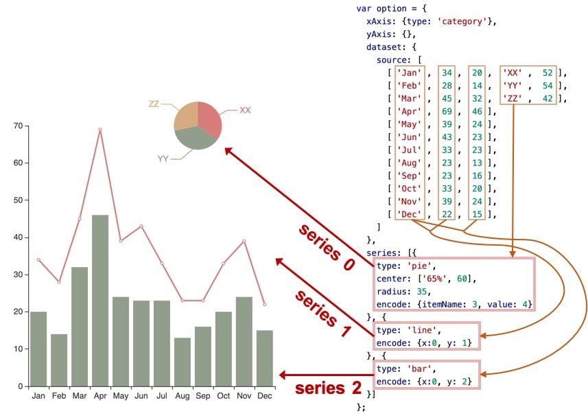

**示例：**


```html
<!DOCTYPE html>
<html lang="en">
<head>
  <meta charset="UTF-8">
  <title>echarts</title>
  <script src="./echarts.js"></script>
  <style>
    #chart{
      width: 800px;
      height: 400px;
    }
  </style>
</head>
<body>
  <div id="chart"></div>
  <script>
    const chartDom = document.getElementById('chart')
    const chart = echarts.init(chartDom)
    const option = {
      xAxis: {
        type: 'category'
      },
      yAxis: {},
      dataset: {
        source: [
          ['一季度', 79, 100, '分类1', 50],
          ['二季度', 81, 112, '分类2', 60],
          ['三季度', 88, 96, '分类3', 55],
          ['四季度', 72, 123, '分类4', 70],
        ]
      },
      series: [
        {
          type: 'pie',
          center: ['65%', 60],
          radius: 35,
          encode: {
            itemName: 3,
            value: 4
          }
        },
        {
          type: 'line',
          encode: {
            x: 0,
            y: 2
          }
        },
        {
          type: 'bar',
          encode: {
            x: 0,
            y: 1
          }
        }
      ]
    }

    chart.setOption(option)
  </script>
</body>
</html>

```

## 组件

ECharts 中除了绘图之外其他部分，都可抽象为 「组件」。例如，ECharts 中至少有这些组件：xAxis（直角坐标系 X 轴）、yAxis（直角坐标系 Y 轴）、grid（直角坐标系底板）、angleAxis（极坐标系角度轴）

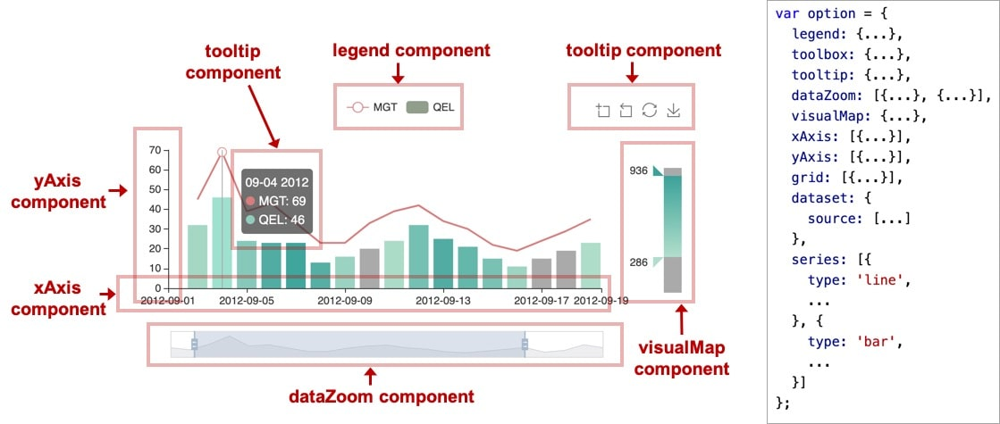

示例：

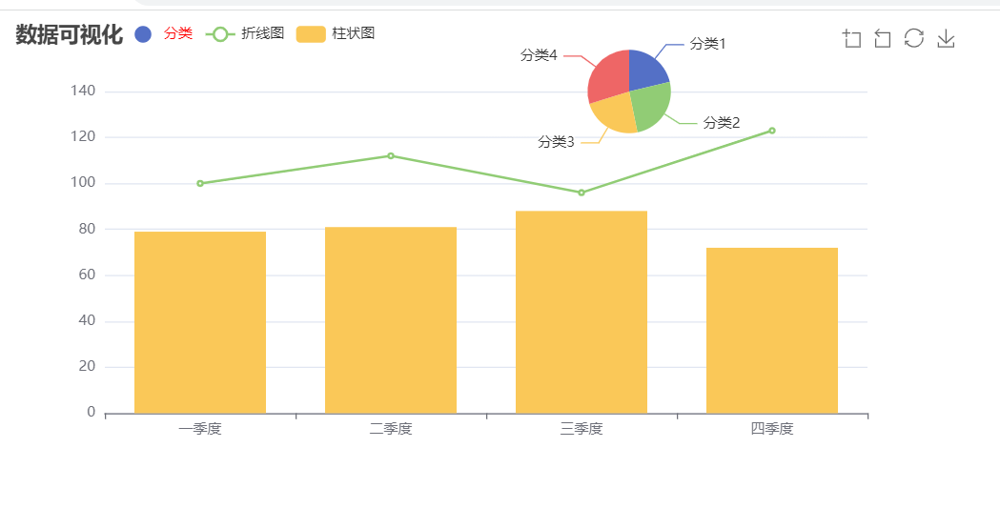

```html
<!DOCTYPE html>
<html lang="en">
<head>
  <meta charset="UTF-8">
  <title>echarts</title>
  <script src="./echarts.js"></script>
  <style>
    #chart{
      width: 800px;
      height: 400px;
    }
  </style>
</head>
<body>
  <div id="chart"></div>
  <script>
    const chartDom = document.getElementById('chart')
    const chart = echarts.init(chartDom)
    const option = {
      title: {
        text: '数据可视化',
      },
      xAxis: {
        type: 'category'
      },
      yAxis: {},
      legend: {
        data: [{
          name: '分类',
          // 强制设置图形为圆。
          icon: 'circle',
          // 设置文本为红色
          textStyle: {
            color: 'red'
          }
        }, '折线图', '柱状图'],
        left: 100
      },
      toolbox: {
        feature: {
          dataZoom: {
            yAxisIndex: 'none'
          },
          restore: {},
          saveAsImage: {}
        }
      },
      dataset: {
        source: [
          ['一季度', 79, 100, '分类1', 50],
          ['二季度', 81, 112, '分类2', 60],
          ['三季度', 88, 96, '分类3', 55],
          ['四季度', 72, 123, '分类4', 70],
        ]
      },
      series: [
        {
          name: '分类',
          type: 'pie',
          center: ['65%', 60],
          radius: 35,
          encode: {
            itemName: 3,
            value: 4
          }
        },
        {
          name: '折线图',
          type: 'line',
          encode: {
            x: 0,
            y: 2
          }
        },
        {
          name: '柱状图',
          type: 'bar',
          encode: {
            x: 0,
            y: 1
          }
        }
      ]
    }

    chart.setOption(option)
  </script>
</body>
</html>

```

## 定位

大多数组件都提供了定位属性，我们可以采用类似 CSS absolute 的定位属性来控制组件的位置，下面这个案例可以通过修改 grid 组件定位来控制图表的位置

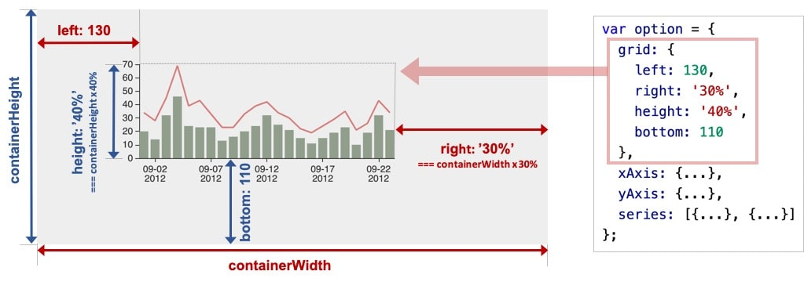

::: tip 备注
grid组件控制的是有坐标系的图，比如折线图，柱状图，散点图（气泡图）。

**团饼图没效果**
:::

## 坐标系

很多系列，例如 line（折线图）、bar（柱状图）、scatter（散点图）、heatmap（热力图）等等，需要运行在 “坐标系” 上。坐标系用于布局这些图，以及显示数据的刻度等等。例如 ECharts 中至少支持这些坐标系：直角坐标系、极坐标系、地理坐标系（GEO）、单轴坐标系、日历坐标系 等。其他一些系列，例如 pie（饼图）、tree（树图）等等，并不依赖坐标系，能独立存在。还有一些图，例如 graph（关系图）等，既能独立存在，也能布局在坐标系中，依据用户的设定而来。

一个坐标系，可能由多个组件协作而成。我们以最常见的直角坐标系来举例。直角坐标系中，包括有 xAxis（直角坐标系 X 轴）、yAxis（直角坐标系 Y 轴）、grid（直角坐标系底板）三种组件。xAxis、yAxis 被 grid 自动引用并组织起来，共同工作。

### 散点图

我们来看下图，这是最简单的使用直角坐标系的方式：只声明了 xAxis、yAxis 和一个 scatter（散点图系列），ECharts 会为它们创建 grid 并进行关联：

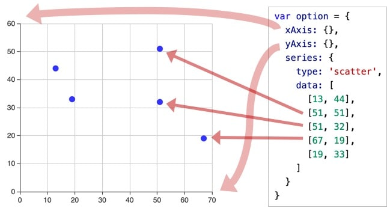

### 双坐标系

两个 yAxis，共享了一个 xAxis。两个 series，也共享了这个 xAxis，但是分别使用不同的 yAxis，使用 yAxisIndex 来指定它自己使用的是哪个 yAxis：

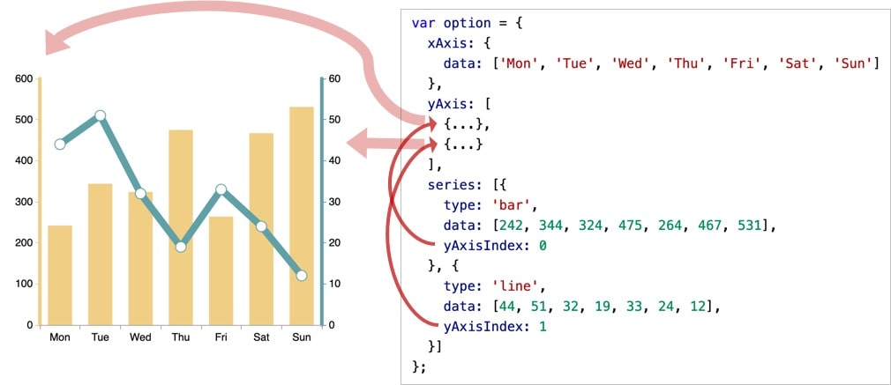

### 多坐标系

一个 ECharts 实例中，有多个 grid，每个 grid 分别有 xAxis、yAxis，他们使用 xAxisIndex、yAxisIndex、gridIndex 来指定引用关系：

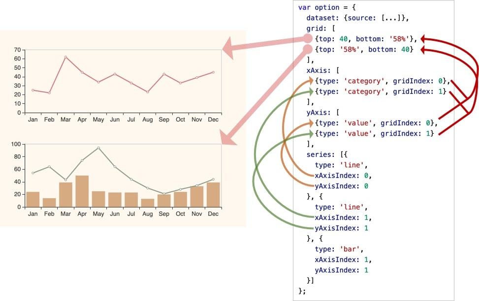

## 示例

### 水球图

文档地址：[https://github.com/ecomfe/echarts-liquidfill](https://github.com/ecomfe/echarts-liquidfill)

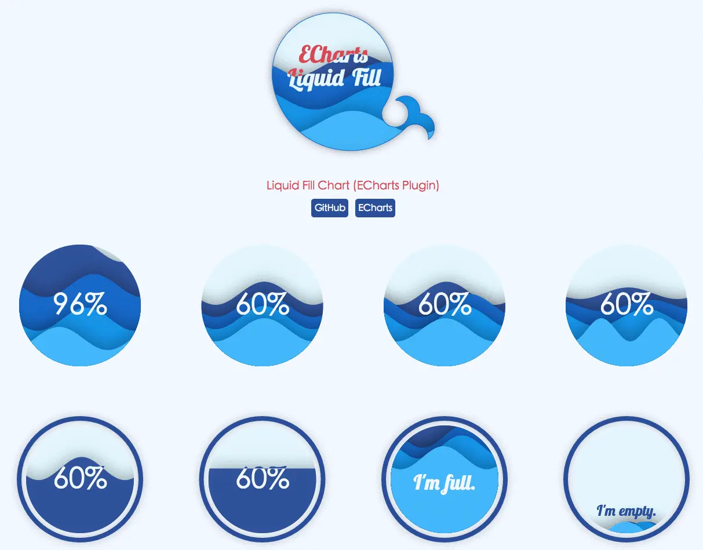

水球图适用于需要展示百分比或比例关系的场景，例如：

* 展示销售额占比情况；

* 展示进度完成情况；

* 展示用户留存率等指标。

### 词云图

文档地址：[https://github.com/ecomfe/echarts-wordcloud](https://github.com/ecomfe/echarts-wordcloud)

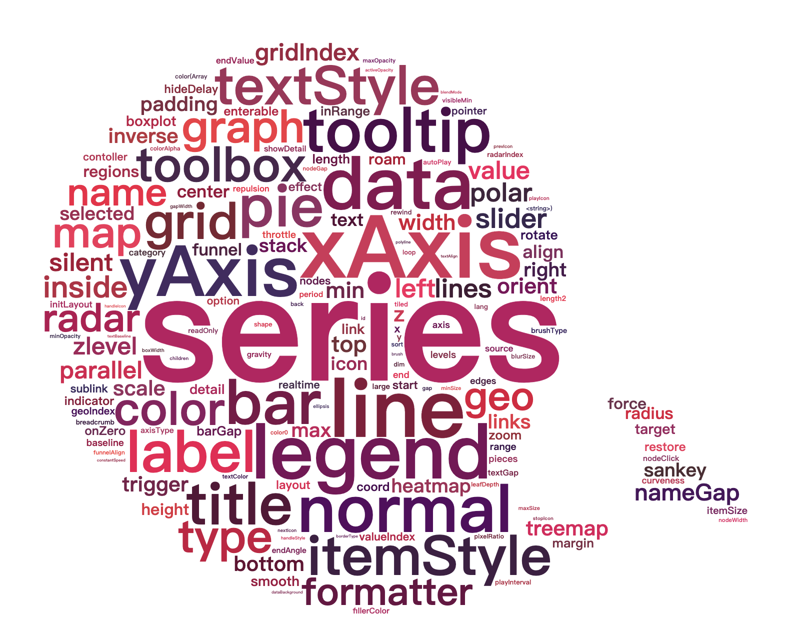
