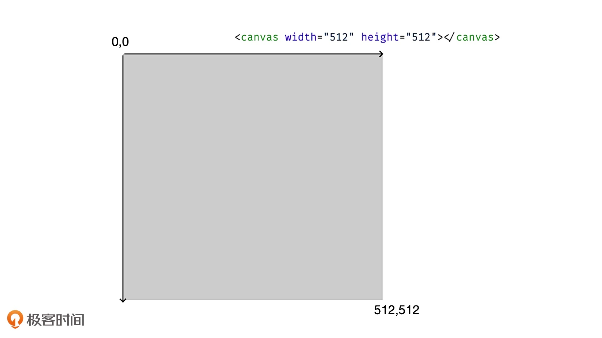
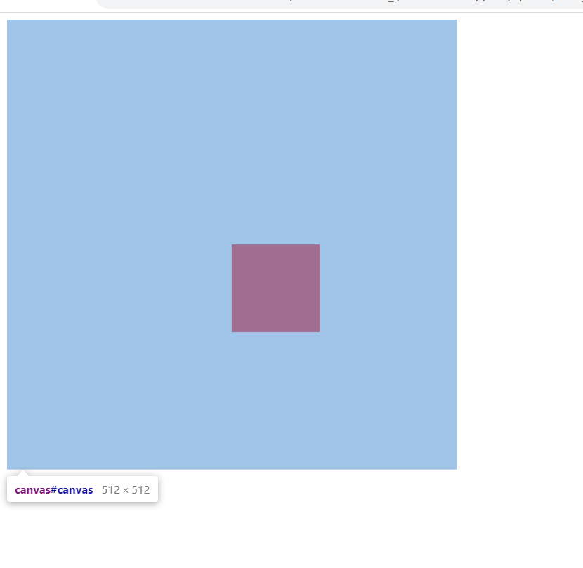
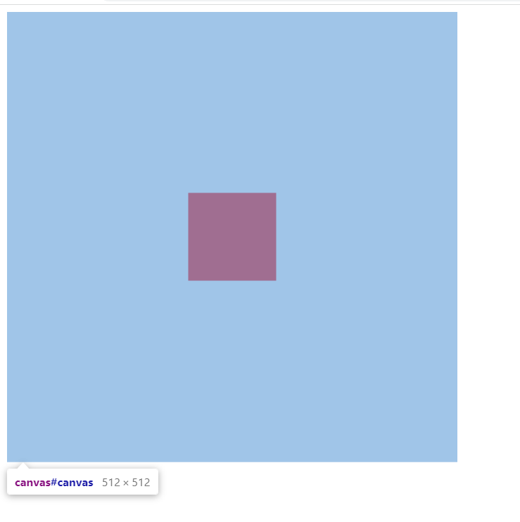

# canvas

## 如何用 Canvas 绘制几何图形？

下面举一个绘制红色正方形的简单例子:

### 1. Canvas 元素和 2D 上下文

对浏览器来说，Canvas 也是 HTML 元素，我们可以用 canvas 标签将它插入到 HTML 内容中。

比如，我们可以在 body 里插入一个宽、高分别为 512 的 canvas 元素。

```html
<body>
<canvas width="512" height="512"></canvas>
</body>
```

直接在Canvas上定义的width和height是Canvas的**画布宽高**，决定的是Canvas的坐标系

通过css给Canvas设置的width和height是Canvas的**样式宽高**，决定的是Canvas 在页面上呈现的大小

在实际绘制的时候，如果我们不设置 Canvas 元素的样式，那么 Canvas 元素的画布宽高就会等于它的样式宽高的像素值，也就是 512px。

因为画布宽高决定了可视区域的坐标范围，所以 Canvas 将画布宽高和样式宽高分开的做法，能更方便地适配不同的显示设备。

比如，我们要在画布宽高为 500*500 的 Canvas 画布上，绘制一个居中显示的 100*100 宽高的正方形。我们只要将它的坐标设置在 x = 200, y = 200 处即可。这样，不论这个 Canvas 以多大的尺寸显示在各种设备上，我们的代码都不需要修改。否则，如果 Canvas 的坐标范围（画布宽高）跟着样式宽高变化，那么当屏幕尺寸改变的时候，我们就要重新计算需要绘制的图形的所有坐标，这对于我们来说将会是一场“灾难”。

### 2. Canvas 的坐标系

Canvas 的坐标系和浏览器窗口的坐标系类似，它们都默认左上角为坐标原点，x 轴水平向右，y 轴垂直向下。那在我们设置好的画布宽高为 512*512 的 Canvas 画布中，它的左上角坐标值为（0,0），右下角坐标值为（512,512） 。这意味着，坐标（0,0）到（512,512）之间的所有图形，都会被浏览器渲染到画布上。



### 3. 利用 Canvas 绘制几何图形

有了坐标系，我们就可以将几何图形绘制到 Canvas 上了。

具体的步骤可以分为两步，分别是获取 Canvas 上下文和利用 Canvas 上下文绘制图形

#### 第一步、获取 Canvas 上下文

```js
    // 获取Canvas元素
    const canvas = document.getElementById('canvas')
    // 获取Canvas上下文
    const ctx = canvas.getContext('2d')
```

#### 第二步，用 Canvas 上下文绘制图形。

```js
// 设置填充色
    ctx.fillStyle = 'red'
    // 设置坐标系偏移（为了让图形在画布的正中间）
    ctx.save()
    const rectSize = [100, 100]
    ctx.translate(-0.5*rectSize[0], -0.5*rectSize[1])
    
    // 开始绘图
    ctx.beginPath()
    ctx.fillRect(0.5*canvas.width, 0.5*canvas.height, 100, 100)
    
    // 将坐标系恢复
    ctx.restore()
```

在绘制的时候，因为fillRect方法里前俩个参数表示的是图形左上角的坐标点，不是图形中心的坐标点，所以图形不在画布的正中间



解决办法是：将画布的坐标系进行偏移

```js
 // 设置坐标系偏移（为了让图形在画布的正中间）
    ctx.save()
    const rectSize = [100, 100]
    ctx.translate(-0.5*rectSize[0], -0.5*rectSize[1])
```

执行完绘制操作后，要记得将坐标系还原

```js
 // 将坐标系恢复
    ctx.restore()
```

绘制红色正方形的完整代码和效果如下：



```html
<!DOCTYPE html>
<html lang="en">
<head>
  <meta charset="UTF-8">
  <title>Title</title>
  <style>
  </style>
</head>
<body>
  <canvas id="canvas" width="512" height="512"></canvas>
  <script>
    // 获取Canvas元素
    const canvas = document.getElementById('canvas')
    // 获取Canvas上下文
    const ctx = canvas.getContext('2d')
    
    // 设置填充色
    ctx.fillStyle = 'red'
    // 设置坐标系偏移（为了让图形在画布的正中间）
    ctx.save()
    const rectSize = [100, 100]
    ctx.translate(-0.5*rectSize[0], -0.5*rectSize[1])
    
    // 开始绘图
    ctx.beginPath()
    ctx.fillRect(0.5*canvas.width, 0.5*canvas.height, 100, 100)
    
    // 将坐标系恢复
    ctx.restore()
  </script>
</body>
</html>

```

## 优缺点

### 优点

Canvas 是一个非常简单易用的图形系统。通过一组简单的绘图指令，就能够方便快捷地绘制出各种复杂的几何图形。

Canvas 渲染起来相当高效。即使是绘制大量轮廓非常复杂的几何图形，Canvas 也只需要调用一组简单的绘图指令就能高性能地完成渲染，这个和 Canvas 更偏向于渲染层，能够提供底层的图形渲染 API 有关

### 缺点

因为 Canvas 在 HTML 层面上是一个独立的画布元素，所以所有的绘制内容都是在内部通过绘图指令来完成的，绘制出的图形对于浏览器来说，只是 Canvas 中的一个个像素点，我们很难直接抽取其中的图形对象进行操作。

## 要点总结

* 在 HTML 中建立画布时，我们要分别设置画布宽高和样式宽高；

* 在建立坐标系时，我们要注意 canvas 的坐标系和笛卡尔坐标系在 y 轴上是相反的；

* 如果要把图形绘制在画布中心，我们不能直接让 x、y 的坐标等于画布中心坐标，而是要让图形中心和画布中心的位置重叠。这个操作，我们可以通过计算顶点坐标或者 平移变换来实现。

## 参考文章：[如何用Canvas绘制层次关系图？](https://time.geekbang.org/column/article/252705)
