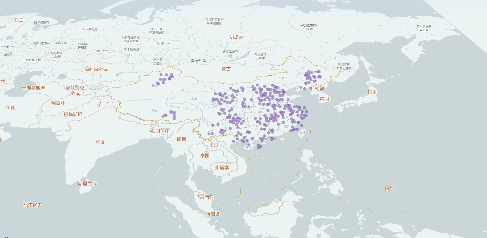

# 百度地图

官网地址：[https://lbsyun.baidu.com/index.php?title=jspopularGL/guide/getkey](https://lbsyun.baidu.com/index.php?title=jspopularGL/guide/getkey)

## 入门示例


```html
<!DOCTYPE html>
<html lang="en">
<head>
  <meta charset="UTF-8">
  <title>百度地图</title>
  <script type="text/javascript" src="https://api.map.baidu.com/api?v=1.0&type=webgl&ak=9OqHt35qxXLSDQjtYVEfRuyXdjN3YGyk"></script>
  <style>
    #map{
      width: 400px;
      height: 400px;
    }
  </style>
</head>
<body>
  <div id="map"></div>
  <script>
    init()
    
    function init() {
      const map = new BMapGL.Map('map'); // 创建地图实例
      const point = new BMapGL.Point(116.404, 39.915); // 创建点坐标
      map.centerAndZoom(point, 15);  // 初始化地图，设置中心点坐标和地图级别
      map.enableScrollWheelZoom(true); //开启鼠标滚轮缩放
    }
  </script>
</body>
</html>

```

在html文件中引入js文件，会造成堵塞，可以使用异步引入

```html
<!DOCTYPE html>
<html lang="en">
<head>
  <meta charset="UTF-8">
  <title>百度地图</title>
<!--  <script type="text/javascript" src="https://api.map.baidu.com/api?v=1.0&type=webgl&ak=9OqHt35qxXLSDQjtYVEfRuyXdjN3YGyk"></script>-->
  <style>
    #map{
      width: 400px;
      height: 400px;
    }
  </style>
</head>
<body>
  <div id="map"></div>
  <script>
    function init() {
      const map = new BMapGL.Map('map'); // 创建地图实例
      const point = new BMapGL.Point(116.404, 39.915); // 创建点坐标
      map.centerAndZoom(point, 15);  // 初始化地图，设置中心点坐标和地图级别
      map.enableScrollWheelZoom(true); //开启鼠标滚轮缩放
    }

    // 文档加载完成后，创建script标签，并赋值src
    // src里要加入callback变量，当js文件加载完成后，会调用callback对应的方法
    window.onload = function () {
      const script = document.createElement('script');
      script.src = 'https://api.map.baidu.com/api?v=1.0&type=webgl&ak=9OqHt35qxXLSDQjtYVEfRuyXdjN3YGyk&callback=init'
      document.body.appendChild(script)
    }
  </script>
</body>
</html>

```

## 百度地图可视化

[MapVGL](https://lbsyun.baidu.com/solutions/mapvdata)，是一款基于WebGL的地理信息可视化库，可以用来展示大量基于3D的地理信息点线面数据。

点图:



```html
<!DOCTYPE html>
<html lang="zh-CN">
<head>
  <meta charset="utf-8">
  <title>MapVGL</title>
  <meta http-equiv="X-UA-Compatible" content="IE=Edge">
  <meta name="viewport" content="initial-scale=1.0, user-scalable=no">
  <style>
    html,
    body {
      width: 100%;
      height: 100%;
      margin: 0;
      padding: 0;
    }
    #map_container {
      width: 100%;
      height: 100%;
      margin: 0;
    }
  </style>
  <script src="//api.map.baidu.com/api?v=1.0&type=webgl&ak=G1LFyjrNGIkns5OfpZnrCGAKxpycPLwb"></script>
  <script src="https://mapv.baidu.com/gl/examples/static/common.js"></script>
  <script src="https://mapv.baidu.com/build/mapv.js"></script>
  <script src="https://unpkg.com/mapvgl@1.0.0-beta.186/dist/mapvgl.min.js"></script>
</head>
<body>
<div id="map_container"></div>
<script>
  /* global BMapGL */

  /* global mapv */

  /* global mapvgl */

  /* global initMap */

  /* global whiteStyle */
  var map = initMap({
    tilt: 56,
    heading: 0.3,
    center: [109.792816,27.702774],
    zoom: 5,
    style: whiteStyle,
    skyColors: [
      // 地面颜色
      'rgba(226, 237, 248, 0)',
      // 天空颜色
      'rgba(186, 211, 252, 1)'
    ]
  });

  var data = [];

  var citys = [
    '北京', '天津', '上海', '重庆', '石家庄', '太原', '呼和浩特', '哈尔滨',
    '长春', '沈阳', '济南', '南京', '合肥', '杭州', '南昌', '福州', '郑州',
    '武汉', '长沙', '广州', '南宁', '西安', '银川', '兰州', '西宁', '乌鲁木齐',
    '成都', '贵阳', '昆明', '拉萨', '海口'
  ];

  var randomCount = 300;

  // 构造数据
  while (randomCount--) {
    var cityCenter = mapv.utilCityCenter.getCenterByCityName(citys[parseInt(Math.random() * citys.length, 10)]);
    data.push({
      geometry: {
        type: 'Point',
        coordinates: [cityCenter.lng - 2 + Math.random() * 4, cityCenter.lat - 2 + Math.random() * 4]
      },
      properties: {
        count: Math.random() * 100
      }
    });
  }

  var view = new mapvgl.View({
    map: map
  });

  var pointLayer = new mapvgl.PointLayer({
    blend: 'lighter',
    size: 15,
    color: 'rgba(102, 0, 204, 0.6)'
  });

  view.addLayer(pointLayer);
  pointLayer.setData(data);


</script>
</body>
</html>

```

1、mapv.utilCityCenter.getCenterByCityName 通过城市获取坐标点


## 参考文档

[百度地图入门](http://www.youbaobao.xyz/datav-docs/guide/guide/bmap.html#%E7%99%BE%E5%BA%A6%E5%BC%80%E5%8F%91%E8%80%85%E8%B4%A6%E5%8F%B7%E7%94%B3%E8%AF%B7)

[百度地图JavaScript API GL](https://lbsyun.baidu.com/index.php?title=jspopularGL)，实现简单的百度地图效果

[百度地图MapVGL](https://lbsyun.baidu.com/solutions/mapvdata)，基于WebGL的地理信息可视化库

[百度地图拾取坐标系统](http://api.map.baidu.com/lbsapi/getpoint/index.html)，用于查询位置对应的坐标点
