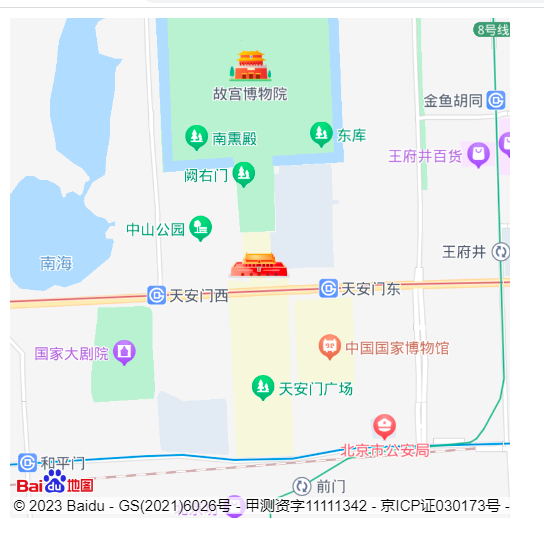

# 百度地图

官网地址：[https://lbsyun.baidu.com/index.php?title=jspopularGL/guide/getkey](https://lbsyun.baidu.com/index.php?title=jspopularGL/guide/getkey)

## 入门示例



```html
<!DOCTYPE html>
<html lang="en">
<head>
  <meta charset="UTF-8">
  <title>百度地图</title>
  <script type="text/javascript" src="https://api.map.baidu.com/api?v=1.0&type=webgl&ak=9OqHt35qxXLSDQjtYVEfRuyXdjN3YGyk"></script>
  <style>
    #map{
      width: 400px;
      height: 400px;
    }
  </style>
</head>
<body>
  <div id="map"></div>
  <script>
    init()
    
    function init() {
      const map = new BMapGL.Map('map'); // 创建地图实例
      const point = new BMapGL.Point(116.404, 39.915); // 创建点坐标
      map.centerAndZoom(point, 15);  // 初始化地图，设置中心点坐标和地图级别
      map.enableScrollWheelZoom(true); //开启鼠标滚轮缩放
    }
  </script>
</body>
</html>

```

在html文件中引入js文件，会造成堵塞，可以使用异步引入

```html
<!DOCTYPE html>
<html lang="en">
<head>
  <meta charset="UTF-8">
  <title>百度地图</title>
<!--  <script type="text/javascript" src="https://api.map.baidu.com/api?v=1.0&type=webgl&ak=9OqHt35qxXLSDQjtYVEfRuyXdjN3YGyk"></script>-->
  <style>
    #map{
      width: 400px;
      height: 400px;
    }
  </style>
</head>
<body>
  <div id="map"></div>
  <script>
    function init() {
      const map = new BMapGL.Map('map'); // 创建地图实例
      const point = new BMapGL.Point(116.404, 39.915); // 创建点坐标
      map.centerAndZoom(point, 15);  // 初始化地图，设置中心点坐标和地图级别
      map.enableScrollWheelZoom(true); //开启鼠标滚轮缩放
    }

    // 文档加载完成后，创建script标签，并赋值src
    // src里要加入callback变量，当js文件加载完成后，会调用callback对应的方法
    window.onload = function () {
      const script = document.createElement('script');
      script.src = 'https://api.map.baidu.com/api?v=1.0&type=webgl&ak=9OqHt35qxXLSDQjtYVEfRuyXdjN3YGyk&callback=init'
      document.body.appendChild(script)
    }
  </script>
</body>
</html>

```

参考文档：[百度地图入门](http://www.youbaobao.xyz/datav-docs/guide/guide/bmap.html#%E7%99%BE%E5%BA%A6%E5%BC%80%E5%8F%91%E8%80%85%E8%B4%A6%E5%8F%B7%E7%94%B3%E8%AF%B7)
