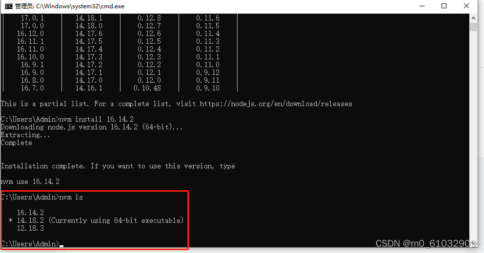
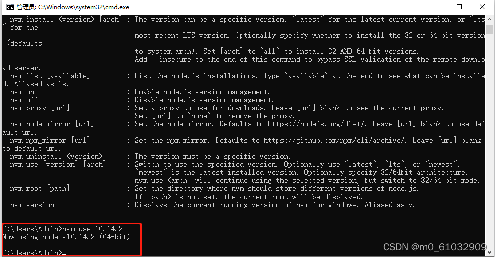

# nvm管理node版本

如果电脑上已经安装有node，需要先卸载node，重启电脑

1、打开[链接](https://github.com/coreybutler/nvm-windows/releases)，下载nvm-setup.zip

2、解压nvm-setup.zip并安装

3、在命令行窗口输入nvm -v查看nvm的版本，如果出现下图，表示已经安装成功

4、运行nvm ls available命令 查看 node版本

5、运行nvm install 16.14.2 命令 安装对应版本的node（16.14.2是node的版本）

6、运行nvm ls 命令 查看电脑上面安装的 node 列表

7、运行nvm use 16.14.2 命令 设置当前使用的node版本

8、运行node -v 命令 查看node是否安装成功

::: tip 温馨提示
nvm use 切换node版本的时候，npm和yarn是根据node版本来的。如果对应的node版本没有安装npm和yarn,是无法正常使用的
:::
