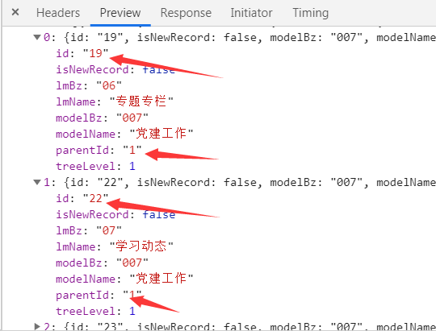
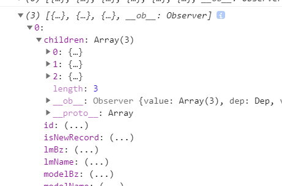

# 常用方法

## 倒计时

```js
function getVerification() {
  // 控制倒计时及按钮是否可以点击
  // TIME_COUNT是自定义的常量
  this.count = TIME_COUNT
  this.timer = window.setInterval(() => {
    if (this.count > 0 && this.count <= TIME_COUNT) {
      // 计时秒数
      this.count--
      // 更新按钮的文字内容
      this.codeContent = this.count + 's后发送'
    } else {
      // 更新按钮文字内容
      this.codeContent = '发送验证'
      // 清空定时器!!!
      clearInterval(this.timer)
      this.timer = null
      this.disabled = false
    }
  }, 1000)
}
```

## 提取身份证信息

- 参数

idCard: 身份证号码

separator: 出生年月日的分割字符，默认为 /

- 返回值

age: 年龄（实岁）

birthday: 出生年月日

gender: 性别（0 女 1 男）

```js
function getIdCardInfo(idCard, separator = '/') {
  if (
    !/^[1-9]\d{5}(?:18|19|20)\d{2}(?:0[1-9]|10|11|12)(?:0[1-9]|[1-2]\d|30|31)\d{3}[\dXx]$/.test(
      idCard
    )
  ) {
    throw Error(`${idCard}不是一个身份证号码`)
  }
  // 提取 idCard 中的字符
  const idSubstr = (s, e) => idCard.substr(s, e)
  // 拼接日期
  const splice = (d) => d.join(separator)
  // 获取出生年月日 性别（0 女 1 男）
  let birthday, gender
  if (idCard.length === 18) {
    birthday = splice([idSubstr(6, 4), idSubstr(10, 2), idSubstr(12, 2)])
    gender = idSubstr(-2, 1) & 1
  } else {
    birthday = splice(idSubstr(6, 2), idSubstr(8, 2), idSubstr(10, 2))
    gender = idSubstr(-1, 1) & 1
  }
  // 获取年龄（实岁）
  const birthDate = new Date(birthday)
  const newDate = new Date()
  const year = newDate.getFullYear()
  let age = year - birthDate.getFullYear()
  if (newDate < new Date(splice([year, birthday.substring(5)]))) {
    age--
  }
  return {
    age,
    birthday,
    gender
  }
}
```

## 环境判断

```js
const UA = window.navigator.userAgent.toLowerCase()

// Android
const isAndroid = /android/.test(UA)

// IOS
const isIOS = /iphone|ipad|ipod|ios/.test(UA)

// 浏览器环境
const inBrowser = typeof window !== 'undefined'

// IE
const isIE = /msie|trident/.test(UA)

// Edge
const isEdge = UA.indexOf('edge/') > 0

// Chrome
const isChrome = /chrome\/\d+/.test(UA) && !isEdge

// 微信
const isWeChat = /micromessenger/.test(UA)

// 移动端
const isMobile = 'ontouchstart' in window
```

## 普通数组转换为tree数组

```js
// 将普通数组转换为tree数组
export function transData (a, idStr, pidStr, chindrenStr) {
  const r = []
  const hash = {}
  const id = idStr
  const pid = pidStr
  const children = chindrenStr
  let i = 0
  let j = 0
  const len = a.length
  for (; i < len; i++) {
    hash[a[i][id]] = a[i]
  }
  for (; j < len; j++) {
    const aVal = a[j]
    const hashVP = hash[aVal[pid]]
    if (hashVP) {
      !hashVP[children] && (hashVP[children] = [])
      hashVP[children].push(aVal)
    } else {
      r.push(aVal)
    }
  }
  return r
}
```

例子：

this.navDataList：



```js
this.navList = transData(JSON.parse(JSON.stringify(this.navDataList)), 'id', 'parentId', 'children')
```
参数说明：

第一个参数是要转换的数组，要转变为json字符串

第二个参数是数组里的id，用来区别每个元素

第三个参数是元素对应的父元素的id值

第四个参数是父元素中子元素的名称

返回结果：


