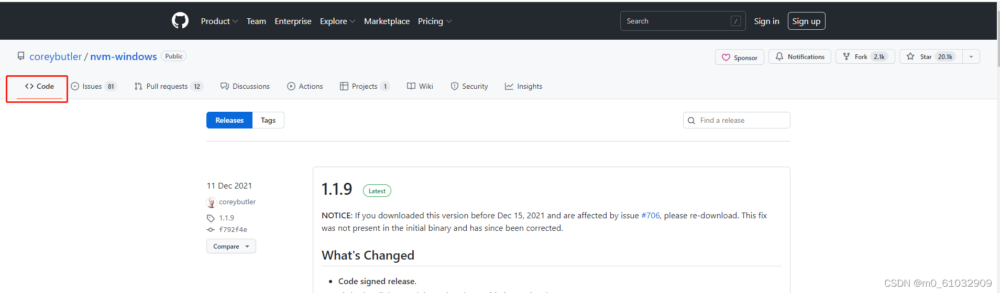
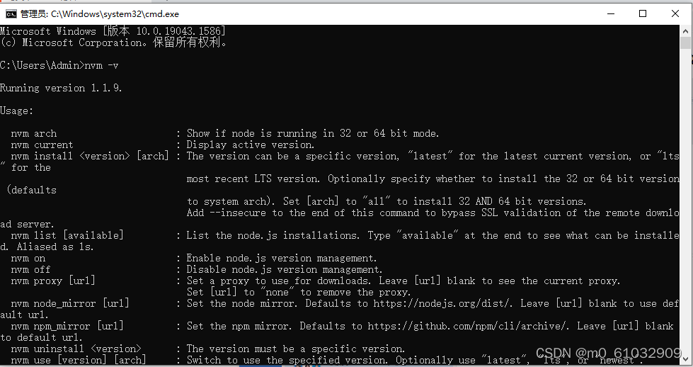
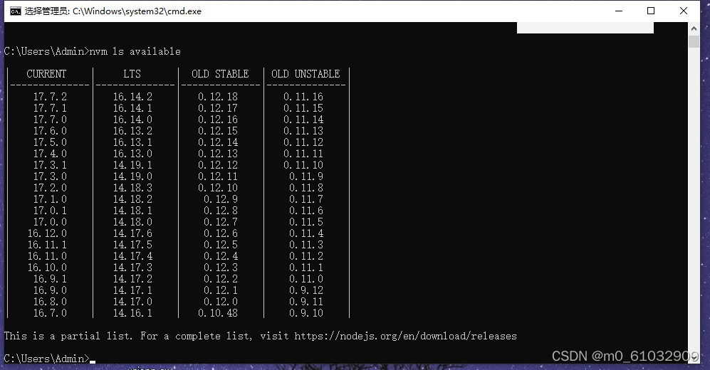
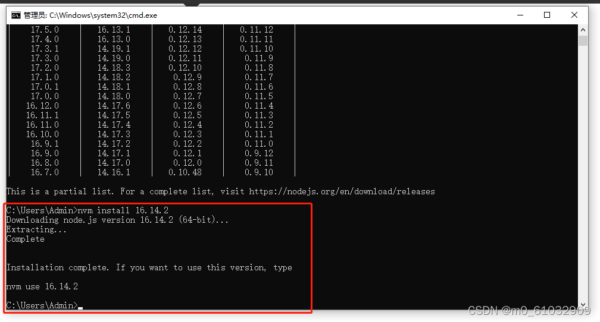
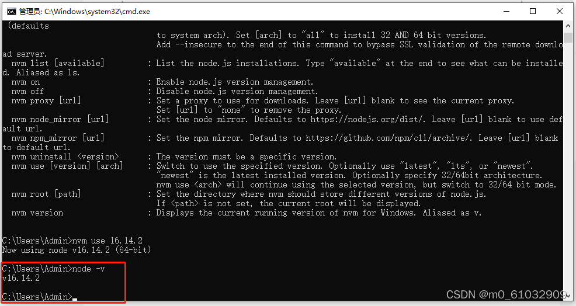
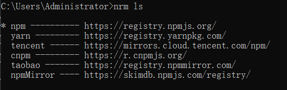
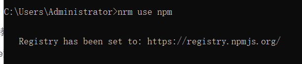

# node知识点

## nvm管理node版本

如果电脑上已经安装有node，需要先卸载node，重启电脑

1、打开[链接](https://github.com/coreybutler/nvm-windows/releases)，下载nvm-setup.zip



2、解压nvm-setup.zip并安装

3、在命令行窗口输入nvm -v查看nvm的版本，如果出现下图，表示已经安装成功



4、运行nvm ls available命令 查看 node版本



5、运行nvm install 16.14.2 命令 安装对应版本的node（16.14.2是node的版本）



6、运行nvm ls 命令 查看电脑上面安装的 node 列表


7、运行nvm use 16.14.2 命令 设置当前使用的node版本


8、运行node -v 命令 查看node是否安装成功



::: tip 温馨提示
nvm use 切换node版本的时候，npm和yarn是根据node版本来的。如果对应的node版本没有安装npm和yarn,是无法正常使用的
:::

## 查看和操作源

### 使用npm

查看当前源：

```npm
npm get registry
```

设置淘宝镜像源：

```npm
npm config set registry http://registry.npm.taobao.org
```

设置官方源：

```npm
npm config set registry http://www.npmjs.org
```

### 使用nrm

通过npm安装nrm

```npm
npm i -g nrm
```

查看可以使用的源列表

```npm
nrm ls
```



**前面的*表示当前正在使用的源**

::: tip 备注
如果前面没有*，可以这样修改

在nrm安装目录下找到cli.js（C:\Users\Administrator\AppData\Roaming\nvm\v16.17.0\node_modules\nrm）

修改代码，把&&修改为||

```js
// 源代码
config(attrs, registry).then(() => {
                console.log('                        ');
                const newR = npm.config.get(FIELD_REGISTRY);
                var customRegistries = getCustomRegistry();
                Object.keys(customRegistries).forEach(key => {
                    delete customRegistries[key][FIELD_IS_CURRENT];
                });
                if (hasOwnProperty(customRegistries, name) && (name in registries || customRegistries[name].registry === registry.registry)) {
                    registry[FIELD_IS_CURRENT] = true;
                    customRegistries[name] = registry;
                }
                setCustomRegistry(customRegistries);
                printMsg(['', '   Registry has been set to: ' + newR, '']);
            }).catch(err => {
                exit(err);
            })
```

```js
// 修改后
config(attrs, registry).then(() => {
                console.log('                        ');
                const newR = npm.config.get(FIELD_REGISTRY);
                var customRegistries = getCustomRegistry();
                Object.keys(customRegistries).forEach(key => {
                    delete customRegistries[key][FIELD_IS_CURRENT];
                });
                if (hasOwnProperty(customRegistries, name) || (name in registries || customRegistries[name].registry === registry.registry)) {
                    registry[FIELD_IS_CURRENT] = true;
                    customRegistries[name] = registry;
                }
                setCustomRegistry(customRegistries);
                printMsg(['', '   Registry has been set to: ' + newR, '']);
            }).catch(err => {
                exit(err);
            })
```
:::

切换源

```npm
nrm use xx
```




