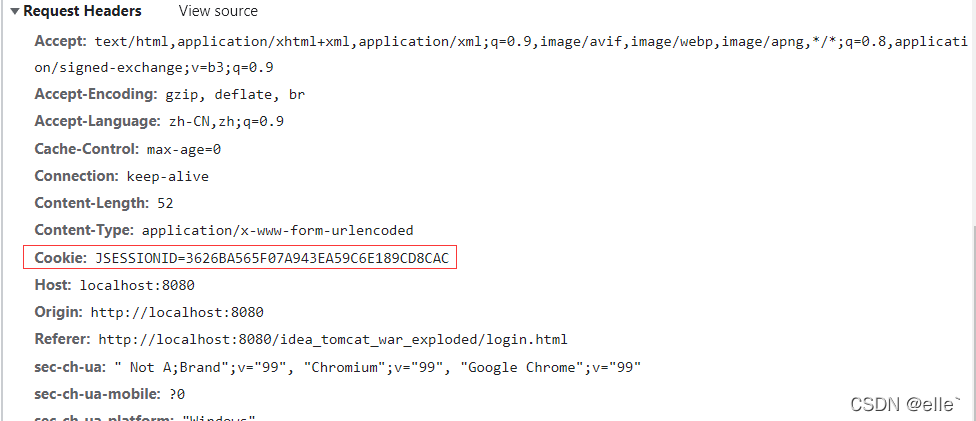

# 登录验证 cookie、session、token

## cookie

校验过程

1、前端输入用户名密码，传给后端

2、后端验证成功，返回信息时执行set-cookie，把值保存到cookie里（后端做）

3、前端所有的接口访问，会自动带上cookie（浏览器的默认行为，http协议的规定）

## session

[参考文章](https://www.cnblogs.com/zhaobao1830/p/11114146.html)

已经有了cookie，为什么还需要session？

cookie的信息是暴露在外面的，如果把所有的信息都保存在cookie里，敏感信息会暴露。

一般操作：cookie只存储id，详细信息保存在session中

后端要保存信息到session中，需要使用HttpSession，调用session.setAttribute，生成sessionId，设置在
Set-Cookie响应头中，响应给客户端

```
@RequestMapping(value = "login.do", method = RequestMethod.POST)
    @ResponseBody
    public ServerResponse<User> login(String username, String password, HttpSession session) {
        ServerResponse<User> response = iUserService.login(username, password);
        if (response.isSuccess()) {
            session.setAttribute(Const.CURRENT_USER, response.getData());
        }
        return response;
    }
```


当客户端再次请求的时候，会把保存在cookie中的sessionId携带在Request Header中给到服务器，你只需要在服务器中再次使用代码
```
HttpSession session = request.getSession()
```
来获取request中的session



### 优点

1、原理简单，易于学习

2、用户信息存储在服务端，可以快速封禁某个登录的用户--有这方面强需求的人，一定选择session

### 缺点

1、占用服务端内存，有硬件成本

2、多进程、多服务时，不好同步--一般使用第三方redis存储，成本高

3、跨域传递cookie，需要特殊配置（没用过，不知道需要什么配置）

## JWT（JSON Web Token)

校验过程

1、前端输入用户名密码，传给后端

2、后端验证成功，返回token字符串（将用户信息<加密规则跨域自己定>加密后得到的）

3、前端获取token存储下来

4、前端访问接口，在header.token中携带

### 优点

1、不占用服务器内存

2、多进程、多服务器，不受影响

3、不受跨域限制

### 缺点

无法快速封禁登录的用户

### JWT和Session的区别

1、JWT用户信息存储在客户端

2、Session用户信息存储在服务端

### 为何选择JWT

1、没有快速封禁登录用户的需求

2、JWT成本低，维护简单

3、需要考虑跨域的扩展性

::: tip 温馨提示
JWT的出现并不是为了解决安全性的，只是为了前后端分离而出现的，谁拿上这个钥匙都能访问

真要确保安全性，就把JWT的有效期设置的短一些
:::


