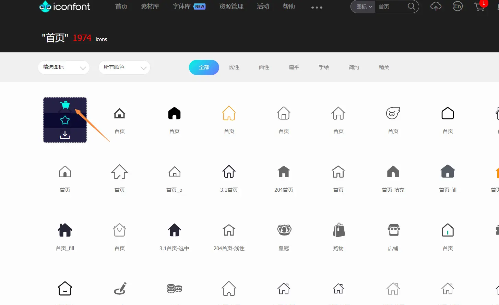
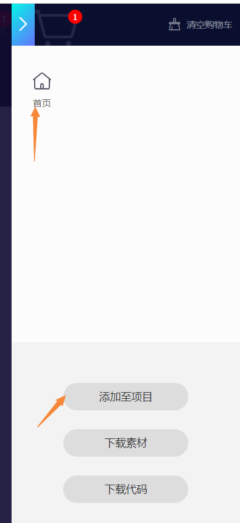
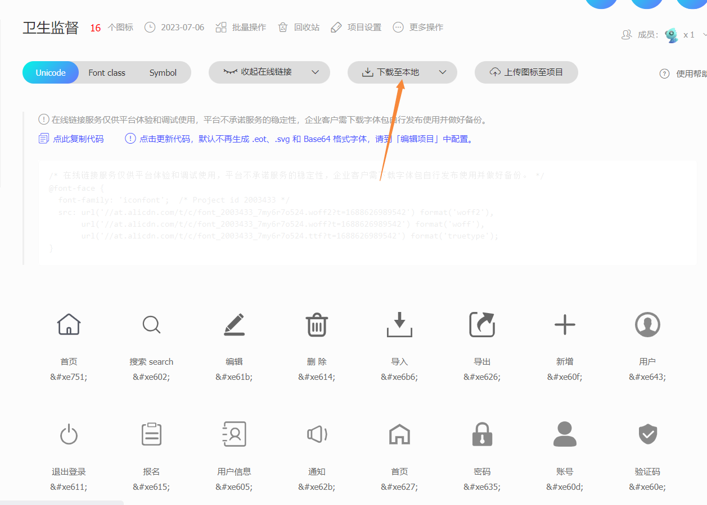
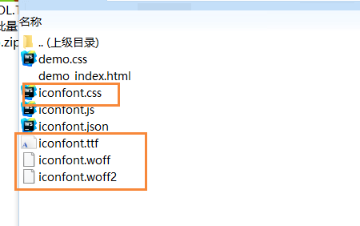
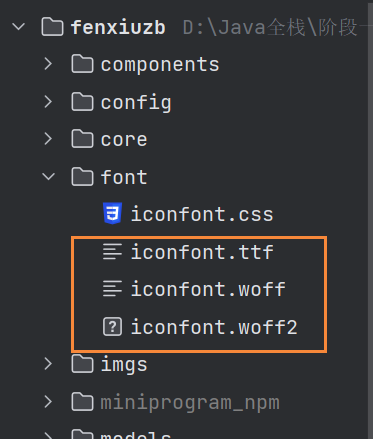
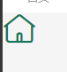

# 自定义图标的使用

在项目开发中，除了使用UI库里自带的图标，很多时候我们还会使用自定义图标

下面以微信小程序中使用自定义图标为例，使用的UI库是[lin-ui](https://doc.mini.talelin.com/)

自定义图标库是[iconfont-阿里巴巴矢量图标库](https://www.iconfont.cn/?spm=a313x.7781069.1998910419.d4d0a486a)

项目地址：[https://github.com/zhaobao1830/fenxiuzb](https://github.com/zhaobao1830/fenxiuzb)

## 获取字体图标

一、在iconfont查找自己想要的图标，添加入库



二、添加至项目



三、下载文件到本地



::: tip 备注
不要选在线的，不稳定
:::

## 项目里使用

第一、将下面的文件拷贝到项目里





第二、在app.wxss文件里定义样式

```wxss
@font-face {
  font-family: "fenxiuzb"; /* Project id 2003433 */
  src: url('./font/iconfont.woff2?t=1688627550105') format('woff2'),
  url('./font/iconfont.woff?t=1688627550105') format('woff'),
  url('./font/iconfont.ttf?t=1688627550105') format('truetype');
}

.fenxiuzb {
  font-family: "fenxiuzb" !important;
  font-size: 30px !important;
  color: #157658 !important;
}

.l-icon-home:before {
  content: "\e751";
}
```

::: tip 备注
@font-face是参考iconfont.css文件的
:::

二、自定义全局样式

```wxss
.fenxiuzb {
  font-family: "fenxiuzb" !important;
  font-size: 30px !important;
  color: #157658 !important;
}
```
::: tip 备注
fenxiuzb是给icon组件里的l-class属性使用的，参考文档是[自定义图标](https://doc.mini.talelin.com/component/basic/icon.html#%E8%87%AA%E5%AE%9A%E4%B9%89%E5%9B%BE%E6%A0%87)

当全局样式和组件里设置的样式冲突时，比如icon组件里的size，可以在全局样式后面加!important
:::

三、定义图标

名称必须是l-icon开头，后面的值自定义，是给icon组件里的name属性使用的

```wxss
.l-icon-home:before {
  content: "\e751";
}
```

::: tip 备注
固定写法，content的值可以参考iconfont.css
:::

四、组件里使用

```
<l-icon size="46" name="home" l-class="fenxiuzb"></l-icon>
```

效果如下：



::: tip 备注
在小程序里，自定义组件不能使用全局的样式，需要自己定义
:::
