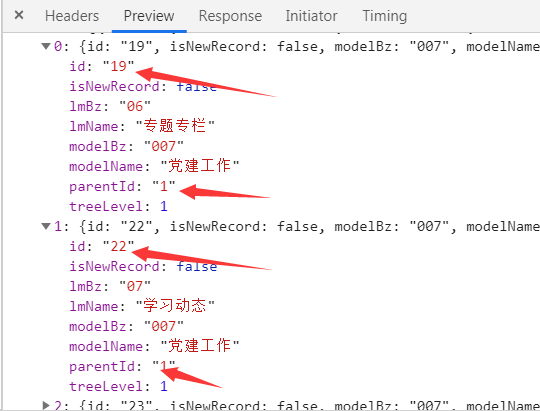

# 常用方法

## 倒计时

```js
function getVerification() {
  // 控制倒计时及按钮是否可以点击
  // TIME_COUNT是自定义的常量
  this.count = TIME_COUNT
  this.timer = window.setInterval(() => {
    if (this.count > 0 && this.count <= TIME_COUNT) {
      // 计时秒数
      this.count--
      // 更新按钮的文字内容
      this.codeContent = this.count + 's后发送'
    } else {
      // 更新按钮文字内容
      this.codeContent = '发送验证'
      // 清空定时器!!!
      clearInterval(this.timer)
      this.timer = null
      this.disabled = false
    }
  }, 1000)
}
```

## 提取身份证信息

- 参数

idCard: 身份证号码

separator: 出生年月日的分割字符，默认为 /

- 返回值

age: 年龄（实岁）

birthday: 出生年月日

gender: 性别（0 女 1 男）

```js
function getIdCardInfo(idCard, separator = '/') {
  if (
    !/^[1-9]\d{5}(?:18|19|20)\d{2}(?:0[1-9]|10|11|12)(?:0[1-9]|[1-2]\d|30|31)\d{3}[\dXx]$/.test(
      idCard
    )
  ) {
    throw Error(`${idCard}不是一个身份证号码`)
  }
  // 提取 idCard 中的字符
  const idSubstr = (s, e) => idCard.substr(s, e)
  // 拼接日期
  const splice = (d) => d.join(separator)
  // 获取出生年月日 性别（0 女 1 男）
  let birthday, gender
  if (idCard.length === 18) {
    birthday = splice([idSubstr(6, 4), idSubstr(10, 2), idSubstr(12, 2)])
    gender = idSubstr(-2, 1) & 1
  } else {
    birthday = splice(idSubstr(6, 2), idSubstr(8, 2), idSubstr(10, 2))
    gender = idSubstr(-1, 1) & 1
  }
  // 获取年龄（实岁）
  const birthDate = new Date(birthday)
  const newDate = new Date()
  const year = newDate.getFullYear()
  let age = year - birthDate.getFullYear()
  if (newDate < new Date(splice([year, birthday.substring(5)]))) {
    age--
  }
  return {
    age,
    birthday,
    gender
  }
}
```

## 环境判断

```js
const UA = window.navigator.userAgent.toLowerCase()

// Android
const isAndroid = /android/.test(UA)

// IOS
const isIOS = /iphone|ipad|ipod|ios/.test(UA)

// 浏览器环境
const inBrowser = typeof window !== 'undefined'

// IE
const isIE = /msie|trident/.test(UA)

// Edge
const isEdge = UA.indexOf('edge/') > 0

// Chrome
const isChrome = /chrome\/\d+/.test(UA) && !isEdge

// 微信
const isWeChat = /micromessenger/.test(UA)

// 移动端
const isMobile = 'ontouchstart' in window
```

## 普通数组转换为tree数组

```js
// 将普通数组转换为tree数组
export function transData (a, idStr, pidStr, chindrenStr) {
  const r = []
  const hash = {}
  const id = idStr
  const pid = pidStr
  const children = chindrenStr
  let i = 0
  let j = 0
  const len = a.length
  for (; i < len; i++) {
    hash[a[i][id]] = a[i]
  }
  for (; j < len; j++) {
    const aVal = a[j]
    const hashVP = hash[aVal[pid]]
    if (hashVP) {
      !hashVP[children] && (hashVP[children] = [])
      hashVP[children].push(aVal)
    } else {
      r.push(aVal)
    }
  }
  return r
}
```

例子：

this.navDataList：



```js
this.navList = transData(JSON.parse(JSON.stringify(this.navDataList)), 'id', 'parentId', 'children')
```
参数说明：

第一个参数是要转换的数组，要转变为json字符串

第二个参数是数组里的id，用来区别每个元素

第三个参数是元素对应的父元素的id值

第四个参数是父元素中子元素的名称

返回结果：


## 获取url中的参数

```vue
// 获取url参数 name 要获取的参数名
    getQueryString(name) {
      const reg = new RegExp('(^|&)' + name + '=([^&]*)(&|$)')
      const r = decodeURI(window.location.search).substr(1).match(reg)
      if (r !== null) {
        return unescape(r[2])
      } else {
        return ''
      }
    }
```

## 日期格式化

```js
function formatDate(date, fmt) {
  if (/(y+)/.test(fmt)) {
    fmt = fmt.replace(RegExp.$1, (date.getFullYear() + '').substr(4 - RegExp.$1.length))
  }
  const o = {
    'M+': date.getMonth() + 1,
    'd+': date.getDate(),
    'h+': date.getHours(),
    'm+': date.getMinutes(),
    's+': date.getSeconds()
  }
  for (const k in o) {
    if (new RegExp(`(${k})`).test(fmt)) {
      const str = o[k] + ''
      fmt = fmt.replace(RegExp.$1, RegExp.$1.length === 1 ? str : padLeftZero(str))
    }
  }
  return fmt
}

function padLeftZero (str) {
  return ('00' + str).substr(str.length)
}
```

使用

```js
const date = formatDate(val, 'yyyy-MM-dd')
```

## 校验数据类型

```js
export const typeOf = function(obj) {
  return Object.prototype.toString.call(obj).slice(8, -1).toLowerCase()
}
```

示例：

```js
typeOf('树哥')  // string
typeOf([])  // array
typeOf(new Date())  // date
typeOf(null) // null
typeOf(true) // boolean
typeOf(() => { }) // function
```

## 防抖

原理：当执行一个事件函数时，会等待一个阈(yu)值，可以设置为n秒，只有在n秒后不再有操作，事件才会真正执行

使用场景：

1.搜索框搜索输入。只需用户最后一次输入完，再发送请求

2.手机号、邮箱验证输入检测

3.窗口大小resize。只需窗口调整完成后，计算窗口大小。防止重复渲染。

```js
export const debounce = (() => {
  let timer = null
  return (callback, wait = 800) => {
    timer&&clearTimeout(timer)
    timer = setTimeout(callback, wait)
  }
})()
```

示例：

```js
methods: {
  loadList() {
    debounce(() => {
      console.log('加载数据')
    }, 500)
  }
}
```

## 节流

原理：某函数持续多次执行，刚开始时便执行，每隔一段时间就执行一次，就是当持续触发事件的时候，函数是开始便执行的，然后每到一定时间再去执行

使用场景：

1.滚动加载，加载更多或滚到底部监听

2.搜索框，搜索联想功能

```js
export const throttle = (() => {
  let last = 0
  return (callback, wait = 800) => {
    let now = +new Date()
    if (now - last > wait) {
      callback()
      last = now
    }
  }
})()
```

## 判断手机是Andoird还是IOS

```js
/** 
 * 1: ios
 * 2: android
 * 3: 其它
 */
export const getOSType=() => {
  let u = navigator.userAgent, app = navigator.appVersion;
  let isAndroid = u.indexOf('Android') > -1 || u.indexOf('Linux') > -1;
  let isIOS = !!u.match(/\(i[^;]+;( U;)? CPU.+Mac OS X/);
  if (isIOS) {
    return 1;
  }
  if (isAndroid) {
    return 2;
  }
  return 3;
}
```

## 数组对象根据字段去重

```js
export const uniqueArrayObject = (arr = [], key = 'id') => {
  if (arr.length === 0) return
  let list = []
  const map = {}
  arr.forEach((item) => {
    if (!map[item[key]]) {
      map[item[key]] = item
    }
  })
  list = Object.values(map)

  return list
}
```

参数说明：

arr 要去重的数组

key 根据去重的字段名

示例：

```js
const responseList = [
    { id: 1, name: '树哥' },
    { id: 2, name: '黄老爷' },
    { id: 3, name: '张麻子' },
    { id: 1, name: '黄老爷' },
    { id: 2, name: '张麻子' },
    { id: 3, name: '树哥' },
    { id: 1, name: '树哥' },
    { id: 2, name: '黄老爷' },
    { id: 3, name: '张麻子' },
]

uniqueArrayObject(responseList, 'id')
// [{ id: 1, name: '树哥' },{ id: 2, name: '黄老爷' },{ id: 3, name: '张麻子' }]
```

## 滚动到页面顶部

```js
export const scrollToTop = () => {
  const height = document.documentElement.scrollTop || document.body.scrollTop;
  if (height > 0) {
    window.requestAnimationFrame(scrollToTop);
    window.scrollTo(0, height - height / 8);
  }
}
```

## 滚动到元素位置

```js
export const smoothScroll = element =>{
    document.querySelector(element).scrollIntoView({
        behavior: 'smooth'
    });
};
```

示例：

```js
smoothScroll('#target'); // 平滑滚动到 ID 为 target 的元素
```

## 金额格式化

```js
export const moneyFormat = (number, decimals, dec_point, thousands_sep) => {
  number = (number + '').replace(/[^0-9+-Ee.]/g, '')
  const n = !isFinite(+number) ? 0 : +number
  const prec = !isFinite(+decimals) ? 2 : Math.abs(decimals)
  const sep = typeof thousands_sep === 'undefined' ? ',' : thousands_sep
  const dec = typeof dec_point === 'undefined' ? '.' : dec_point
  let s = ''
  const toFixedFix = function(n, prec) {
    const k = Math.pow(10, prec)
    return '' + Math.ceil(n * k) / k
  }
  s = (prec ? toFixedFix(n, prec) : '' + Math.round(n)).split('.')
  const re = /(-?\d+)(\d{3})/
  while (re.test(s[0])) {
    s[0] = s[0].replace(re, '$1' + sep + '$2')
  }

  if ((s[1] || '').length < prec) {
    s[1] = s[1] || ''
    s[1] += new Array(prec - s[1].length + 1).join('0')
  }
  return s.join(dec)
}
```

参数说明：

{number} number：要格式化的数字

{number} decimals：保留几位小数

{string} dec_point：小数点符号

{string} thousands_sep：千分位符号

示例：

moneyFormat(10000000) // 10,000,000.00

moneyFormat(10000000, 3, '.', '-') // 10-000-000.000

## 下载文件

```js
const downloadFile = (api, params, fileName, type = 'get') => {
  axios({
    method: type,
    url: api,
    responseType: 'blob', 
    params: params
  }).then((res) => {
    let str = res.headers['content-disposition']
    if (!res || !str) {
      return
    }
    let suffix = ''
    // 截取文件名和文件类型
    if (str.lastIndexOf('.')) {
      fileName ? '' : fileName = decodeURI(str.substring(str.indexOf('=') + 1, str.lastIndexOf('.')))
      suffix = str.substring(str.lastIndexOf('.'), str.length)
    }
    //  如果支持微软的文件下载方式(ie10+浏览器)
    if (window.navigator.msSaveBlob) {
      try {
        const blobObject = new Blob([res.data]);
        window.navigator.msSaveBlob(blobObject, fileName + suffix);
      } catch (e) {
        console.log(e);
      }
    } else {
      //  其他浏览器
      let url = window.URL.createObjectURL(res.data)
      let link = document.createElement('a')
      link.style.display = 'none'
      link.href = url
      link.setAttribute('download', fileName + suffix)
      document.body.appendChild(link)
      link.click()
      document.body.removeChild(link)
      window.URL.revokeObjectURL(link.href);
    }
  }).catch((err) => {
    console.log(err.message);
  })
}
```

参数说明：

api 接口

params 请求参数

fileName 文件名

示例：

```js
downloadFile('/api/download', {id}, '文件名')
```

## 时间操作

日期时间处理库：[Day.js](https://dayjs.fenxianglu.cn/)

## 类数组对象转换成数组

es6: 

```js
Array.form()
```

或

```js
function toArray(nodes){
    try {
        // works in every browser except IE
        return Array.prototype.slice.call(nodes);
    } catch(err) {
        // Fails in IE < 9
        var arr = [],
            length = nodes.length;
        for(var i = 0; i < length; i++){
            // arr.push(nodes[i]); // 两种都可以
            arr[i] = nodes[i];
        }
        return arr;
    }
}
```

## 随机数组

需求：提供一个数组，获取随机的新数组

核心：遍历原数组，获取0到下标值之间的随机数，将下标值和随机数对应的元素位置交换

```js
// 遍历原数组，获取0到下标值之间的随机数，将随机数和下标值表示的元素位置交换
export function shuffle(source) {
  const arr = source.slice() // 从已有的数据返回选定的元素 操作arr数组，不会对原数组产生影响
  for (let i = 0; i < arr.length; i++) {
    const j = getRandomInt(i)
    swap(arr, i, j)
  }
  return arr
}

// 获取0到max之间的随机数（整数）
function getRandomInt(max) {
  return Math.floor(Math.random() * (max + 1))
}

// 根据下标交换数组里的元素
function swap(arr, i, j) {
  const t = arr[i]
  arr[i] = arr[j]
  arr[j] = t
}
```
