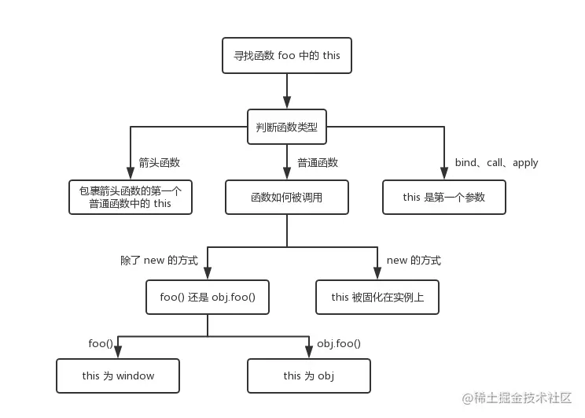

# this指向

```js
function foo() {
  console.log(this.a)
}
var a = 1
foo()

const obj = {
  a: 2,
  foo
}
obj.foo()

const c = new foo()
```

* 对于直接调用 foo 来说，不管 foo 函数被放在了什么地方，this 一定是 window

* 对于 obj.foo() 来说，我们只需要记住，谁调用了函数，谁就是 this，所以在这个场景下 foo 函数中的 this 就是 obj 对象

* 对于 new 的方式来说，this 被永远绑定在了 c 上面，不会被任何方式改变 this

```js
function a() {
  return () => {
    return () => {
      console.log(this)
    }
  }
}
console.log(a()()())
```

箭头函数其实是没有 this 的，箭头函数中的 this 只取决包裹箭头函数的第一个普通函数的 this。在这个例子中，因为包裹箭头函数的第一个普通函数是 a，所以此时的 this 是 window。

另外对箭头函数使用 bind 这类函数是无效的

对于bind、call、apply来说，this 取决于第一个参数，如果第一个参数为空，那么就是 window


