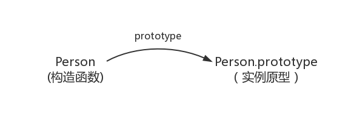
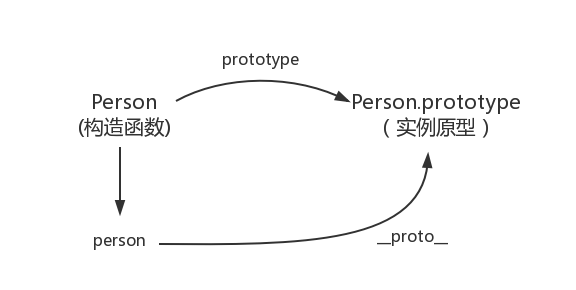
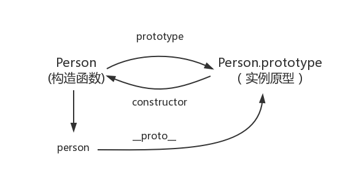
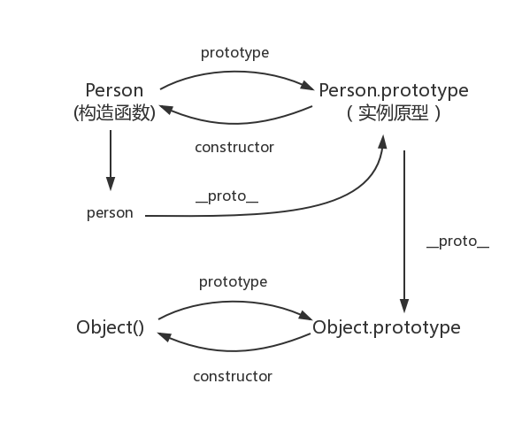
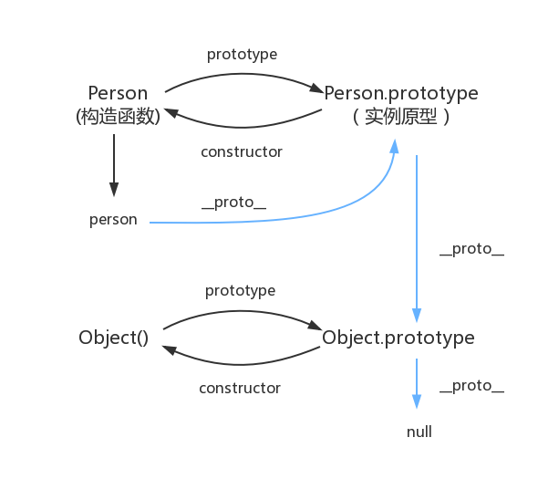

# 原型和原型链

转载地址：[https://www.cnblogs.com/loveyaxin/p/11151586.html](https://www.cnblogs.com/loveyaxin/p/11151586.html)

一、prototype

在JavaScript中，每个函数都有一个prototype属性，这个属性指向函数的原型对象。

```js
function Person(age) {
    this.age = age       
}
Person.prototype.name = 'kavin'
var person1 = new Person()
var person2 = new Person()
console.log(person1.name) //kavin
console.log(person2.name)  //kavin
```

上述例子中，函数的prototype指向了一个对象，而这个对象正是调用构造函数时创建的实例的原型，也就是person1和person2的原型。

原型的概念：每一个javascript对象(除null外)创建的时候，就会与之关联另一个对象，这个对象就是我们所说的原型，每一个对象都会从原型中“继承”属性。

让我们用一张图表示构造函数和实例原型之间的关系：



二、__proto__

这是每个对象(除null外)都会有的属性，叫做__proto__，这个属性会指向该对象的原型。

```js
function Person() {

}
var person = new Person();
console.log(person.__proto__ === Person.prototype); // true
```



补充说明：

绝大部分浏览器都支持这个非标准的方法访问原型，然而它并不存在于 Person.prototype 中，实际上，它是来自于 Object.prototype ，与其说是一个属性，不如说是一个 getter/setter，当使用 obj.__proto__ 时，可以理解成返回了 Object.getPrototypeOf(obj)。

三、constructor

每个原型都有一个constructor属性，指向该关联的构造函数。

```js
function Person() {

}
console.log(Person===Person.prototype.constructor)  //true
```



```js
function Person() {

}

var person = new Person();

console.log(person.__proto__ == Person.prototype) // true
console.log(Person.prototype.constructor == Person) // true
// 顺便学习一个ES5的方法,可以获得对象的原型
console.log(Object.getPrototypeOf(person) === Person.prototype) // true
```

补充说明：

```js
function Person() {

}
var person = new Person();
console.log(person.constructor === Person); // true
```

当获取 person.constructor 时，其实 person 中并没有 constructor 属性,当不能读取到constructor 属性时，会从 person 的原型也就是 Person.prototype 中读取，正好原型中有该属性，所以：

```js
person.constructor === Person.prototype.constructor
```

四、实例与原型

当读取实例的属性时，如果找不到，就会查找与对象关联的原型中的属性，如果还查不到，就去找原型的原型，一直找到最顶层为止。

```js
function Person() {

}

Person.prototype.name = 'Kevin';

var person = new Person();

person.name = 'Daisy';
console.log(person.name) // Daisy

delete person.name;
console.log(person.name) // Kevin
```

在这个例子中，我们给实例对象 person 添加了 name 属性，当我们打印 person.name 的时候，结果自然为 Daisy。

但是当我们删除了 person 的 name 属性时，读取 person.name，从 person 对象中找不到 name 属性就会从 person 的原型也就是 person.__proto__ ，也就是 Person.prototype中查找，幸运的是我们找到了 name 属性，结果为 Kevin。

但是万一还没有找到呢？原型的原型又是什么呢？

五、原型的原型

在前面，我们已经讲了原型也是一个对象，既然是对象，我们就可以用最原始的方式创建它，那就是：

```js
var obj = new Object();
obj.name = 'Kevin'
console.log(obj.name) // Kevin
```

其实原型对象就是通过 Object 构造函数生成的，结合之前所讲，实例的 __proto__ 指向构造函数的 prototype ，所以我们再更新下关系图：



六、原型链

简单的回顾一下构造函数、原型和实例的关系：每个构造函数都有一个原型对象，原型对象都包含一个指向构造函数的指针，而实例都包含一个指向原型对象的内部指针。那么假如我们让原型对象等于另一个类型的实例，结果会怎样？显然，此时的原型对象将包含一个指向另一个原型的指针，相应地，另一个原型中也包含着一个指向另一个构造函数的指针。假如另一个原型又是另一个类型的实例，那么上述关系依然成立。如此层层递进，就构成了实例与原型的链条。这就是所谓的原型链的基本概念。——摘自《javascript高级程序设计》

其实简单来说，就是上述四-五的过程。

继上述五中所说，那 Object.prototype 的原型呢？

```js
console.log(Object.prototype.__proto__ === null) // true
```

所以 Object.prototype.__proto__ 的值为 null 跟 Object.prototype 没有原型，其实表达了一个意思。

所以查找属性的时候查到 Object.prototype 就可以停止查找了。

最后一张关系图也可以更新为：




