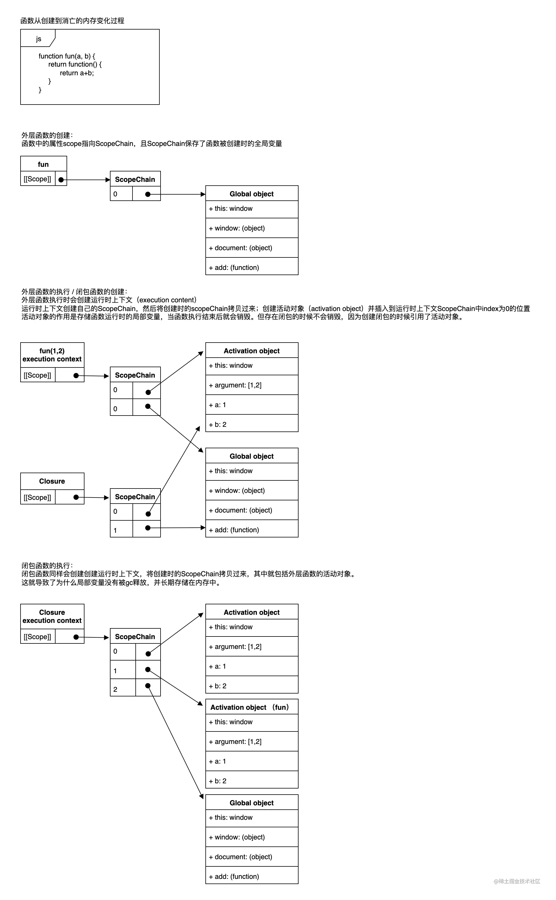

# 作用域和闭包

转载地址：[https://juejin.cn/post/7182571660003213370](https://juejin.cn/post/7182571660003213370)

## 作用域

**作用域**指代码当前上下文，控制着变量和函数的可见性和生命周期。最大的作用是隔离变量，不同作用域下同名变量不会冲突。

**作用域链**指如果在当前作用域中没有查到值，就会向上级作用域查询，直到全局作用域，这样一个查找过程所形成的链条就被称之为作用域链。

作用域可以堆叠成层次结构，子作用域可以访问父作用域，反之则不行。

作用域具体可细分为四种：**全局作用域**、**模块作用域**、**函数作用域**、**块级作用域**

**全局作用域**：代码在程序的任何地方都能被访问，例如 window 对象。但全局变量会污染全局命名空间，容易引起命名冲突。

**模块作用域**：早期 js 语法中没有模块的定义，因为最初的脚本小而简单。后来随着脚本越来越复杂，就出现了模块化方案（AMD、CommonJS、UMD、ES6模块等）。通常一个模块就是一个文件或者一段脚本，而这个模块拥有自己独立的作用域。

**函数作用域**：顾名思义由函数创建的作用域。闭包就是在该作用域下产生，后面我们会单独介绍。

**块级作用域**：由于 js 变量提升存在变量覆盖、变量污染等设计缺陷，所以 ES6 引入了块级作用域关键字来解决这些问题。典型的案例就是 let 的 for 循环和 var 的 for 循环。

```js
// var demo
for(var i=0; i<10; i++) {
    console.log(i);
}
console.log(i); // 10

// let demo
for(let i=0; i<10; i++) {
    console.log(i);
}
console.log(i); //ReferenceError：i is not defined
```

## 闭包

红宝书(p178)上对于闭包的定义：**闭包是指有权访问另外一个函数作用域中的变量的函数** 关键在于下面两点：

* 是一个函数

* 能访问另外一个函数作用域中的变量

闭包的特征：

* 函数中存在函数；

* 内部函数可以访问外层函数的作用域；

* 参数和变量不会被垃圾回收机制回收，始终驻留在内存中；

* 有内存地方才有闭包。

对于闭包有下面三个特性：

* 1、闭包可以访问当前函数以外的变量

```js
function getOuter(){
  var date = '815';
  function getDate(str){
    console.log(str + date);  //访问外部的date
  }
  return getDate('今天是：'); //"今天是：815"
}
getOuter();
```

* 2、即使外部函数已经返回，闭包仍能访问外部函数定义的变量

```js
function getOuter(){
  var date = '815';
  function getDate(str){
    console.log(str + date);  //访问外部的date
  }
  return getDate;     //外部函数返回
}
var today = getOuter();
today('今天是：');   //"今天是：815"
today('明天不是：');   //"明天不是：815"
```

* 3、闭包可以更新外部变量的值

```js
function updateCount(){
  var count = 0;
  function getCount(val){
    count = val;
    console.log(count);
  }
  return getCount;     //外部函数返回
}
var count = updateCount();
count(815); //815
count(816); //816
```

所以使用闭包会消耗内存、不正当使用会造成内存溢出的问题，在退出函数之前，需要将不使用的局部变量全部删除。如果不是某些特定需求，在函数中创建函数是不明智的，闭包在处理速度和内存消耗方面对脚本性能具有负面影响。

以下整理了闭包的应用场景：

```js
// demo1 输出 3 3 3
for(var i = 0; i < 3; i++) {
    setTimeout(function() {
        console.log(i);
    }, 1000);
} 
// demo2 输出 0 1 2
for(let i = 0; i < 3; i++) {
    setTimeout(function() {
        console.log(i);
    }, 1000);
}
// demo3 输出 0 1 2
for(let i = 0; i < 3; i++) {
    (function(i){
        setTimeout(function() {
        console.log(i);
        }, 1000);
    })(i)
}
```

```js
/* 模拟私有方法 */
// 模拟对象的get与set方法
var Counter = (function() {
  var privateCounter = 0;
  function changeBy(val) {
    privateCounter += val;
  }
  return {
    increment: function() {
      changeBy(1);
    },
    decrement: function() {
      changeBy(-1);
    },
    value: function() {
      return privateCounter;
    }
  }
})();
console.log(Counter.value()); /* logs 0 */
Counter.increment();
Counter.increment();
console.log(Counter.value()); /* logs 2 */
Counter.decrement();
console.log(Counter.value()); /* logs 1 */
```

```js
/* setTimeout中使用 */
// setTimeout(fn, number): fn 是不能带参数的。使用闭包绑定一个上下文可以在闭包中获取这个上下文的数据。
function func(param){ 
  return function(){ 
    alert(param)
  }
}

const f1 = func(1);

setTimeout(f1,1000);
```

```js
/* 生产者/消费者模型 */
// 不使用闭包
// 生产者
function producer(){
    const data = new（...）
    return data
}
// 消费者
function consumer(data){
    // do consume...
}
const data = producer()

// 使用闭包
function process(){
    var data = new (...)
    return function consumer(){
        // do consume data ...
    }
}
const processer = process()
processer()
```

```js
/* 实现继承 */
// 以下两种方式都可以实现继承，但是闭包方式每次构造器都会被调用且重新赋值一次所以，所以实现继承原型优于闭包
// 闭包
function MyObject(name, message) {
  this.name = name.toString();
  this.message = message.toString();
  this.getName = function() {
    return this.name;
  };

  this.getMessage = function() {
    return this.message;
  };
}
// 原型
function MyObject(name, message) {
  this.name = name.toString();
  this.message = message.toString();
}
MyObject.prototype.getName = function() {
  return this.name;
};
MyObject.prototype.getMessage = function() {
  return this.message;
};
```

对于闭包的概念好像懂了但又好像缺少了啥？意犹未尽。我也曾也闭包中迷失，但是看完闭包的生命周期让我重新找回自己。



学完就来一波牛刀小试

```js
function test(a, b){
  console.log(b);
  return {
    test: function(c) {
      return test(c,a);
    }
  }
}

var a = test(100);a.test(101);a.test(102);
var b = test(200).test(201).test(202);
var c = test(300).test(301);c.test(302);

// undefined  100  100
// undefined  200 201
// undefined  300 301
```
