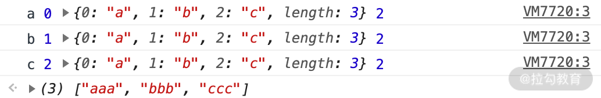

# 数组API

## Array 的构造器

Array 构造器用于创建一个新的数组。通常，我们推荐使用对象字面量的方式创建一个数组，例如 var a = [] 就是一个比较好的写法。但是，总有对象字面量表述乏力的时候，比如，我想创建一个长度为 6 的空数组，用对象字面量的方式是无法创建的，因此只能写成下述代码这样。

```js
// 使用 Array 构造器，可以自定义长度

var a = Array(6); // [empty × 6]

// 使用对象字面量

var b = [];

b.length = 6; // [undefined × 6]

```

Array 构造器根据参数长度的不同，有如下两种不同的处理方式：

* **new Array(arg1, arg2,…)**，参数长度大于0时，传入的参数将按照顺序依次成为新数组的第 0 至第 N 项（参数长度为 0 时，返回空数组）；

* **new Array(len)**，当 len 不是数值时，处理同上，返回一个只包含 len 元素一项的数组；当 len 为数值时，len 最大不能超过 32 位无符号整型，即需要小于 2 的 32 次方（len 最大为 Math.pow(2,32)），否则将抛出 RangeError。

以上就是 Array 构造器的基本情况，我们来看下 ES6 新增的几个构造方法。

**ES6 新增的构造方法：Array.of 和 Array.from**

**Array.of**

Array.of 用于将参数依次转化为数组中的一项，然后返回这个新数组，不管这个参数是数字还是其他。它基本上与 Array 构造器功能一致，唯一的区别就在单个数字参数的处理上。

比如，在下面的这几行代码中，你可以看到区别：当参数为两个时，返回的结果是一致的；当参数是一个时，Array.of 会把参数变成数组里的一项，而构造器则会生成长度和第一个参数相同的空数组。

```js
Array.of(8.0); // [8]

Array(8.0); // [empty × 8]

Array.of(8.0, 5); // [8, 5]

Array(8.0, 5); // [8, 5]

Array.of('8'); // ["8"]

Array('8'); // ["8"]
```

**Array.from**

Array.from 的设计初衷是快速便捷地基于其他对象创建新数组，准确来说就是从一个类似数组的可迭代对象中创建一个新的数组实例。其实就是，只要一个对象有迭代器，Array.from 就能把它变成一个数组（注意：是返回新的数组，不改变原对象）。

从语法上看，Array.from 拥有 3 个参数：

1、类似数组的对象，必选；

2、加工函数，新生成的数组会经过该函数的加工再返回；

3、this 作用域，表示加工函数执行时 this 的值。

这三个参数里面第一个参数是必选的，后两个参数都是可选的。我们通过一段代码来看看它的用法。

```js
var obj = {0: 'a', 1: 'b', 2:'c', length: 3};

Array.from(obj, function(value, index){

  console.log(value, index, this, arguments.length);

  return value.repeat(3);   //必须指定返回值，否则返回 undefined

}, obj);

```

结果如下图所示。



结果中可以看出 console.log(value, index, this, arguments.length) 对应的四个值，并且看到 return 的 value 重复了三遍，最后返回的数组为 ["aaa","bbb","ccc"]。

这表明了通过 Array.from 这个方法可以自己定义加工函数的处理方式，从而返回想要得到的值；如果不确定返回值，则会返回 undefined，最终生成的也是一个包含若干个 undefined 元素的空数组。

实际上，如果这里不指定 this 的话，加工函数完全可以是一个箭头函数。上述代码可以简写为如下形式。

```js
Array.from(obj, (value) => value.repeat(3));

//  控制台返回 (3) ["aaa", "bbb", "ccc"]

```

除了上述 obj 对象以外，拥有迭代器的对象还包括 String、Set、Map 等，Array.from 统统可以处理，请看下面的代码。

```js
// String

Array.from('abc');         // ["a", "b", "c"]

// Set

Array.from(new Set(['abc', 'def'])); // ["abc", "def"]

// Map

Array.from(new Map([[1, 'ab'], [2, 'de']])); 

// [[1, 'ab'], [2, 'de']]

```

## Array 的判断

在 ES5 提供该方法之前，我们至少有如下 5 种方式去判断一个变量是否为数组。

```js
var a = [];

// 1.基于instanceof

a instanceof Array;

// 2.基于constructor

a.constructor === Array;

// 3.基于Object.prototype.isPrototypeOf

Array.prototype.isPrototypeOf(a);

// 4.基于getPrototypeOf

Object.getPrototypeOf(a) === Array.prototype;

// 5.基于Object.prototype.toString

Object.prototype.toString.call(a) === '[object Array]';

```

上面这 5 个判断全部为 True，这里应该没什么疑问。实际上，通过 Object.prototype.toString 去判断一个值的类型，也是模块一的 01 讲判断数据类型中我给你推荐的方法。

ES6 之后新增了一个 Array.isArray 方法，能直接判断数据类型是否为数组，但是如果 isArray 不存在，那么 Array.isArray 的 polyfill 通常可以这样写：

```js
if (!Array.isArray){

  Array.isArray = function(arg){

    return Object.prototype.toString.call(arg) === '[object Array]';

  };

}

```

数组的基本概念到这里基本讲得差不多了，下面我们就来看看让人眼花缭乱的 30 多个数组的基本方法。

**改变自身的方法**

基于 ES6，会改变自身值的方法一共有 9 个，分别为 pop、push、reverse、shift、sort、splice、unshift，以及两个 ES6 新增的方法 copyWithin 和 fill。

接下来我们看一段代码，快速了解这些方法最基本的用法。

```js
// pop方法

var array = ["cat", "dog", "cow", "chicken", "mouse"];

var item = array.pop();

console.log(array); // ["cat", "dog", "cow", "chicken"]

console.log(item); // mouse

// push方法

var array = ["football", "basketball",  "badminton"];

var i = array.push("golfball");

console.log(array); 

// ["football", "basketball", "badminton", "golfball"]

console.log(i); // 4

// reverse方法

var array = [1,2,3,4,5];

var array2 = array.reverse();

console.log(array); // [5,4,3,2,1]

console.log(array2===array); // true

// shift方法

var array = [1,2,3,4,5];

var item = array.shift();

console.log(array); // [2,3,4,5]

console.log(item); // 1

// unshift方法

var array = ["red", "green", "blue"];

var length = array.unshift("yellow");

console.log(array); // ["yellow", "red", "green", "blue"]

console.log(length); // 4

// sort方法

var array = ["apple","Boy","Cat","dog"];

var array2 = array.sort();

console.log(array); // ["Boy", "Cat", "apple", "dog"]

console.log(array2 == array); // true

// splice方法

var array = ["apple","boy"];

var splices = array.splice(1,1);

console.log(array); // ["apple"]

console.log(splices); // ["boy"]

// copyWithin方法

var array = [1,2,3,4,5]; 

var array2 = array.copyWithin(0,3);

console.log(array===array2,array2);  // true [4, 5, 3, 4, 5]

// fill方法

var array = [1,2,3,4,5];

var array2 = array.fill(10,0,3);

console.log(array===array2,array2); 

// true [10, 10, 10, 4, 5], 可见数组区间[0,3]的元素全部替换为10

```


