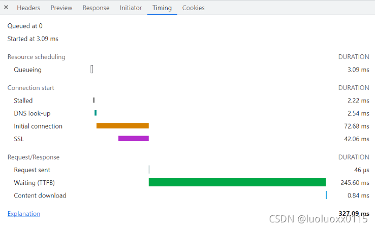
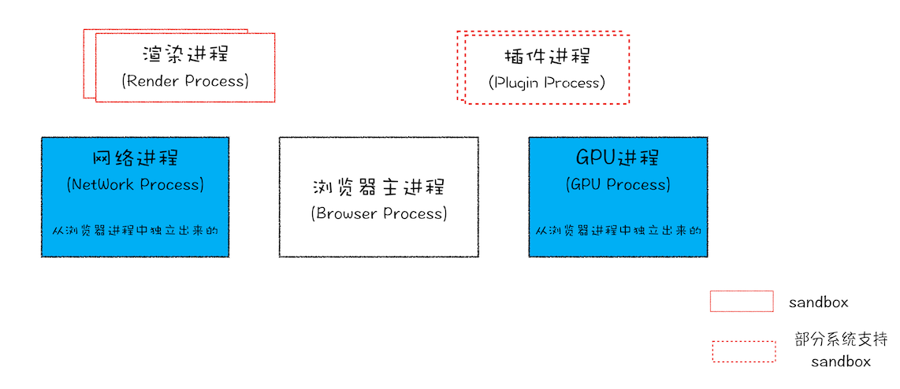
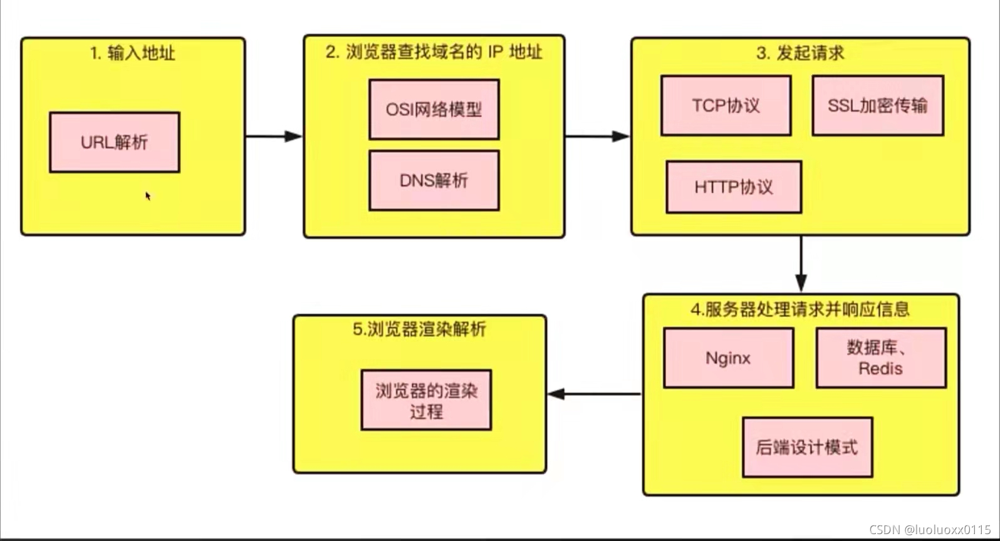
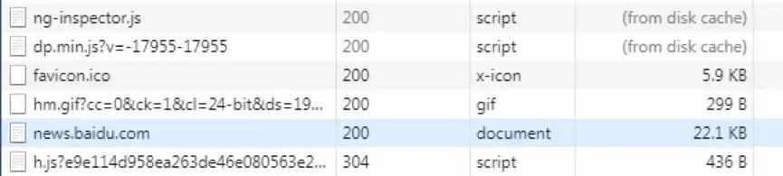
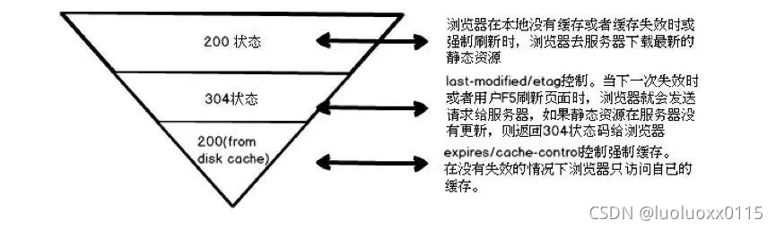

# 从输入URL到页面加载完成中间都经历了什么

参考地址：[https://blog.csdn.net/luoluoxx0115/article/details/121212371](https://blog.csdn.net/luoluoxx0115/article/details/121212371)

## 1、chrome浏览器资源加载时序分析

当我们访问网页时，打开chrome浏览器的开发者工具DevTools，在Network(网络)面版我们可以看到访问当前页面所发出的所有请求，鼠标移到任一请求的Waitfull列，或者选中任一请求，点击Timing，我们就可以看到chrome浏览器资源加载时序信息，见下图：



由图可得知，从资源加载时序的角度分析，浏览器发起请求到页面渲染完成会经历如下几个阶段：

* 预处理-Resource Scheduling

* DNS解析-Stalled/DNS Lookup

* 建立连接-Inital connection/SSL

* 发起HTTP请求-Request sent

* 等待响应-Waiting:TTFB

* 接收数据-Content Download

* 处理元素

* 布局渲染

时序分解阶段说明（内容翻译自官方文档 [Chrome 开发者工具-网络功能参考](https://developer.chrome.com/docs/devtools/network/reference/#timing)）

**排队**：浏览器在以下情况下对请求进行排队：

-有更高优先级的请求。

-已经为此源打开了六个 TCP 连接，这是限制。仅适用于 HTTP/1.0和 HTTP/1.1。

-浏览器在磁盘缓存中短暂分配空间：

**停滞不前**：请求可能因排队中描述的任何原因而停止。

**DNS查找**：浏览器正在解析请求的 IP 地址。

**初始连接**：浏览器正在建立连接，包括TCP握手/重试和协商SSL。

**代理协商**：浏览器正在与代理服务器协商请求。

**请求已发送**：正在发送请求。

**ServiceWorker 准备**：浏览器正在启动服务工作者。

**对ServiceWorker 的请求**：请求正在发送给服务工作者

**等待（TTFB）**：浏览器正在等待响应的第一个字节。TTFB 代表 Time To First Byte。此时间包括 1 次往返延迟和服务器准备响应所用的时间。

**内容下载**：浏览器正在接收响应。

**接收推送**：浏览器正在通过 HTTP/2 服务器推送接收此响应的数据。

**阅读推送**：浏览器正在读取之前接收到的本地数据。

# 2、w3c提供的接口performance.timing分析



上图的过程大致可以分为三个大的阶段：

**缓存相关**：主要包括Prompt for unload,redirect和App cache3个过程

**网络相关**：主要包括DNS,TCP和HTTP(Request,Response)3个过程

**浏览器相关**：主要包括Processing和onload两个过程

## 3、一个完整的URL 解析过程细分介绍



一个完整的URL解析过程大致分为以下7个步骤：

* 1、URL解析：地址栏输入地址，浏览器对输入内容进行解析，判断URL的合法性，和是否有可用缓存

* 2、DNS解析：域名解析系统（DNS）查找对应的IP地址

* 3、建立TCP连接（三次握手）：浏览器向服务器发起TCP连接，与浏览器建立TCP三次握手

* 4、HTTP请求：浏览器将http请求数据发给服务器（客户端–>服务器）

* 5、HTTP响应：服务器处理收到的请求，返回响应结果至浏览器（服务器–>客户端）

* 6、关闭TCP连接（四次挥手）：数据传输完成后，还要经过四次握手以终止连接

* 7、页面渲染：浏览器解析响应结果，进行页面渲染

以上步骤中，1为缓存相关，2、3、4、5、6为网络相关，7为浏览器相关

## 3.1、缓存相关

### 3.1.1、URL解析

1、当用户在浏览器地址栏输入内容时，浏览器会去解析输入的字符串,判断是URL还是搜索关键字，要是解析为URL则开始寻求URL对应的IP地址，否则按照搜索关键字处理交给默认搜索引擎搜索。

2、卸载已有的页面(Prompt for unload)

我们在页面中输入URL时，首先会卸载掉原来的页面。这是为了释放页面占据的内存，否则每请求一次URL都占据一份内存，会导致浏览器占据内存越来越大。

3、重定向(redirect)

所谓的重定向实际上就是先从本地缓存中去查找请求的内容，如果本地缓存中有则直接使用，如果没有则向服务器进行请求(这只是简单的理解，实际上如何获取数据是存在缓存策略的)。事实上，每次从服务器获取到文件，文件会被暂时存放到一个指定区域，当我们下次再次请求这个文件时，浏览器会首先从这个区域查看是否已经存在过这个文件，如果已经存在，则不需要再次进行请求数据。

4、App cache

相关应用程序缓存，资源是从相关应用缓存或本地资源（包括 HTTP缓存）中获取的。

**浏览器缓存相关问题：**

* 浏览器的缓存策略有哪些？

浏览器每次发起请求时，先在本地缓存中查找结果以及缓存标识，根据缓存标识来判断是否使用本地缓存。如果缓存有效，则使用本地缓存；否则，则向服务器发起请求并携带缓存标识。

根据是否需向服务器发起HTTP请求，将缓存过程划分为两个部分：**强缓存**和**协商缓存**，强缓存优先于协商缓存。

**强缓存**：服务器通知浏览器一个缓存时间，在缓存时间内，下次请求，直接用缓存，不在时间内，执行比较缓存策略。

**协商缓存**：让客户端与服务器之间能实现缓存文件是否更新的验证、提升缓存的复用率，将缓存信息中的Etag和Last-Modified通过请求发送给服务器，由服务器校验，返回304状态码时，浏览器直接使用缓存。

HTTP缓存都是从第二次请求开始的：

第一次请求资源时，服务器返回资源，并在response header中回传资源的缓存策略；

第二次请求时，浏览器判断这些请求参数，击中强缓存就直接200，否则就把请求参数加到request header头中传给服务器，看是否击中协商缓存，击中则返回304，否则服务器会返回新的资源。

参考内容：[Http 缓存策略，有什么区别，分别解决了什么问题](https://blog.csdn.net/weixin_28432777/article/details/112532986)

* 浏览器缓存控制机制有哪些？

浏览器缓存控制机制有两种：HTML Meta标签 和HTTP头信息

**使用HTML Meta 标签**：HTML Meta标签是应用在HTML文件中的head头部分。主要作用就是告诉浏览器此HTML页面不被缓存，每次访问都去服务器上下载。使用上很简单，但只有部分浏览器可以支持，而且所有缓存代理服务器都不支持，因为代理不解析HTML内容本身。所以常说的浏览器缓存还是通过http头信息来控制缓存

**使用HTTP头信息控制缓存**：



通过浏览器开发者工具我们可以看到，浏览器请求服务器静态资源的响应状态码主要就是下图的三种：



页面的缓存状态是由HTTP协议中关于缓存的信息头决定的，主要的控制关键字有4种：Last-Modified、Etag、Cache-Control、Expires

Cache-Control 和 Expires首部用于指定缓存时间，Last-Modified和ETag 首部提供验证机制

更多详细内容参考：[彻底理解浏览器的缓存机制（http缓存机制）](https://www.cnblogs.com/chengxs/p/10396066.html)

* 哪些请求不能被缓存？

1、HTTP 信息头中包含 Cache-Control:no-cache，pragma:no-cache，或 Cache-Control:max-age=0 等告诉浏览器不用缓存的请求

2、需要根据 Cookie，认证信息等决定输入内容的动态请求是不能被缓存的

3、经过 HTTPS 安全加密的请求（有人也经过测试发现，ie 其实在头部加入 Cache-Control：max-age 信息，firefox 在头部加入 Cache-Control:Public 之后，能够对 HTTPS 的资源进行缓存，参考《HTTPS 的七个误解》）

4、POST 请求无法被缓存

5、HTTP 响应头中不包含 Last-Modified/Etag，也不包含 Cache-Control/Expires 的请求无法被缓存

* 部署时缓存的问题：我们不仅要缓存代码，还需要更新代码。如果静态资源名字不变，怎么让浏览器即能缓存又能在有新代码时更新？

简单的解决方式就是静态资源路径添加一个版本值，版本不变就走缓存策略，版本变了就加载新资源。如下：

```js
<script src="xx/xx.js?v=24334452"></script>
```

然而这种处理方式在部署时有问题。 

解决方法：静态资源和页面是分开部署

先部署页面再部署静态资源，会出现用户访问到旧的资源

先部署静态资源再部署页面，会出现没有缓存用户加载到新资源而报错

这些问题的本质是以上的部署方式是“覆盖式发布”，解决方式是“非覆盖式发布”。即用静态资源的文件摘要信息给文件命名，这样每次更新资源不会覆盖原来的资源，先将资源发布上去。这时候存在两种资源，用户用旧页面访问旧资源，然后再更新页面，用户变成新页面访问新资源，就能做到无缝切换。简单来说就是给静态文件名加hash值。
那
如何实现呢？使用webpack持久化缓存

现在前端代码都用webpack之类的构建工具打包，浏览器有其缓存机制，想要既能缓存又能在部署时没有问题，需要给静态文件名添加hash值。在webpack中，有些配置能让我们实现持久化缓存。

更多详细内容参考：[webpack持久化缓存](https://zhuanlan.zhihu.com/p/102923708)
