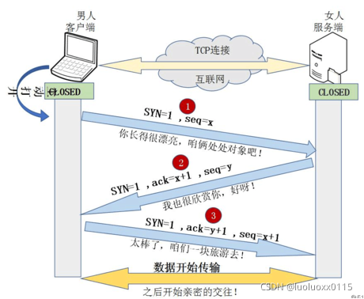

# 从输入URL到页面加载完成中间都经历了什么

参考地址：[https://blog.csdn.net/luoluoxx0115/article/details/121212371](https://blog.csdn.net/luoluoxx0115/article/details/121212371)

## 1、chrome浏览器资源加载时序分析

当我们访问网页时，打开chrome浏览器的开发者工具DevTools，在Network(网络)面版我们可以看到访问当前页面所发出的所有请求，鼠标移到任一请求的Waitfull列，或者选中任一请求，点击Timing，我们就可以看到chrome浏览器资源加载时序信息，见下图：


由图可得知，从资源加载时序的角度分析，浏览器发起请求到页面渲染完成会经历如下几个阶段：

* 预处理-Resource Scheduling

* DNS解析-Stalled/DNS Lookup

* 建立连接-Inital connection/SSL

* 发起HTTP请求-Request sent

* 等待响应-Waiting:TTFB

* 接收数据-Content Download

* 处理元素

* 布局渲染

时序分解阶段说明（内容翻译自官方文档 [Chrome 开发者工具-网络功能参考](https://developer.chrome.com/docs/devtools/network/reference/#timing)）

**排队**：浏览器在以下情况下对请求进行排队：

-有更高优先级的请求。

-已经为此源打开了六个 TCP 连接，这是限制。仅适用于 HTTP/1.0和 HTTP/1.1。

-浏览器在磁盘缓存中短暂分配空间：

**停滞不前**：请求可能因排队中描述的任何原因而停止。

**DNS查找**：浏览器正在解析请求的 IP 地址。

**初始连接**：浏览器正在建立连接，包括TCP握手/重试和协商SSL。

**代理协商**：浏览器正在与代理服务器协商请求。

**请求已发送**：正在发送请求。

**ServiceWorker 准备**：浏览器正在启动服务工作者。

**对ServiceWorker 的请求**：请求正在发送给服务工作者

**等待（TTFB）**：浏览器正在等待响应的第一个字节。TTFB 代表 Time To First Byte。此时间包括 1 次往返延迟和服务器准备响应所用的时间。

**内容下载**：浏览器正在接收响应。

**接收推送**：浏览器正在通过 HTTP/2 服务器推送接收此响应的数据。

**阅读推送**：浏览器正在读取之前接收到的本地数据。

# 2、w3c提供的接口performance.timing分析


上图的过程大致可以分为三个大的阶段：

**缓存相关**：主要包括Prompt for unload,redirect和App cache3个过程

**网络相关**：主要包括DNS,TCP和HTTP(Request,Response)3个过程

**浏览器相关**：主要包括Processing和onload两个过程

## 3、一个完整的URL 解析过程细分介绍


一个完整的URL解析过程大致分为以下7个步骤：

* 1、URL解析：地址栏输入地址，浏览器对输入内容进行解析，判断URL的合法性，和是否有可用缓存

* 2、DNS解析：域名解析系统（DNS）查找对应的IP地址

* 3、建立TCP连接（三次握手）：浏览器向服务器发起TCP连接，与浏览器建立TCP三次握手

* 4、HTTP请求：浏览器将http请求数据发给服务器（客户端–>服务器）

* 5、HTTP响应：服务器处理收到的请求，返回响应结果至浏览器（服务器–>客户端）

* 6、关闭TCP连接（四次挥手）：数据传输完成后，还要经过四次握手以终止连接

* 7、页面渲染：浏览器解析响应结果，进行页面渲染

以上步骤中，1为缓存相关，2、3、4、5、6为网络相关，7为浏览器相关

## 3.1、缓存相关

### 3.1.1、URL解析

1、当用户在浏览器地址栏输入内容时，浏览器会去解析输入的字符串,判断是URL还是搜索关键字，要是解析为URL则开始寻求URL对应的IP地址，否则按照搜索关键字处理交给默认搜索引擎搜索。

2、卸载已有的页面(Prompt for unload)

我们在页面中输入URL时，首先会卸载掉原来的页面。这是为了释放页面占据的内存，否则每请求一次URL都占据一份内存，会导致浏览器占据内存越来越大。

3、重定向(redirect)

所谓的重定向实际上就是先从本地缓存中去查找请求的内容，如果本地缓存中有则直接使用，如果没有则向服务器进行请求(这只是简单的理解，实际上如何获取数据是存在缓存策略的)。事实上，每次从服务器获取到文件，文件会被暂时存放到一个指定区域，当我们下次再次请求这个文件时，浏览器会首先从这个区域查看是否已经存在过这个文件，如果已经存在，则不需要再次进行请求数据。

4、App cache

相关应用程序缓存，资源是从相关应用缓存或本地资源（包括 HTTP缓存）中获取的。

**浏览器缓存相关问题：**

* 浏览器的缓存策略有哪些？

浏览器每次发起请求时，先在本地缓存中查找结果以及缓存标识，根据缓存标识来判断是否使用本地缓存。如果缓存有效，则使用本地缓存；否则，则向服务器发起请求并携带缓存标识。

根据是否需向服务器发起HTTP请求，将缓存过程划分为两个部分：**强缓存**和**协商缓存**，强缓存优先于协商缓存。

**强缓存**：服务器通知浏览器一个缓存时间，在缓存时间内，下次请求，直接用缓存，不在时间内，执行比较缓存策略。

**协商缓存**：让客户端与服务器之间能实现缓存文件是否更新的验证、提升缓存的复用率，将缓存信息中的Etag和Last-Modified通过请求发送给服务器，由服务器校验，返回304状态码时，浏览器直接使用缓存。

HTTP缓存都是从第二次请求开始的：

第一次请求资源时，服务器返回资源，并在response header中回传资源的缓存策略；

第二次请求时，浏览器判断这些请求参数，击中强缓存就直接200，否则就把请求参数加到request header头中传给服务器，看是否击中协商缓存，击中则返回304，否则服务器会返回新的资源。

参考内容：[Http 缓存策略，有什么区别，分别解决了什么问题](https://blog.csdn.net/weixin_28432777/article/details/112532986)

* 浏览器缓存控制机制有哪些？

浏览器缓存控制机制有两种：HTML Meta标签 和HTTP头信息

**使用HTML Meta 标签**：HTML Meta标签是应用在HTML文件中的head头部分。主要作用就是告诉浏览器此HTML页面不被缓存，每次访问都去服务器上下载。使用上很简单，但只有部分浏览器可以支持，而且所有缓存代理服务器都不支持，因为代理不解析HTML内容本身。所以常说的浏览器缓存还是通过http头信息来控制缓存

**使用HTTP头信息控制缓存**：


通过浏览器开发者工具我们可以看到，浏览器请求服务器静态资源的响应状态码主要就是下图的三种：


页面的缓存状态是由HTTP协议中关于缓存的信息头决定的，主要的控制关键字有4种：Last-Modified、Etag、Cache-Control、Expires

Cache-Control 和 Expires首部用于指定缓存时间，Last-Modified和ETag 首部提供验证机制

更多详细内容参考：[彻底理解浏览器的缓存机制（http缓存机制）](https://www.cnblogs.com/chengxs/p/10396066.html)

* 哪些请求不能被缓存？

1、HTTP 信息头中包含 Cache-Control:no-cache，pragma:no-cache，或 Cache-Control:max-age=0 等告诉浏览器不用缓存的请求

2、需要根据 Cookie，认证信息等决定输入内容的动态请求是不能被缓存的

3、经过 HTTPS 安全加密的请求（有人也经过测试发现，ie 其实在头部加入 Cache-Control：max-age 信息，firefox 在头部加入 Cache-Control:Public 之后，能够对 HTTPS 的资源进行缓存，参考《HTTPS 的七个误解》）

4、POST 请求无法被缓存

5、HTTP 响应头中不包含 Last-Modified/Etag，也不包含 Cache-Control/Expires 的请求无法被缓存

* 部署时缓存的问题：我们不仅要缓存代码，还需要更新代码。如果静态资源名字不变，怎么让浏览器即能缓存又能在有新代码时更新？

简单的解决方式就是静态资源路径添加一个版本值，版本不变就走缓存策略，版本变了就加载新资源。如下：

```js
<script src="xx/xx.js?v=24334452"></script>
```

然而这种处理方式在部署时有问题。 

解决方法：静态资源和页面是分开部署

先部署页面再部署静态资源，会出现用户访问到旧的资源

先部署静态资源再部署页面，会出现没有缓存用户加载到新资源而报错

这些问题的本质是以上的部署方式是“覆盖式发布”，解决方式是“非覆盖式发布”。即用静态资源的文件摘要信息给文件命名，这样每次更新资源不会覆盖原来的资源，先将资源发布上去。这时候存在两种资源，用户用旧页面访问旧资源，然后再更新页面，用户变成新页面访问新资源，就能做到无缝切换。简单来说就是给静态文件名加hash值。
那
如何实现呢？使用webpack持久化缓存

现在前端代码都用webpack之类的构建工具打包，浏览器有其缓存机制，想要既能缓存又能在部署时没有问题，需要给静态文件名添加hash值。在webpack中，有些配置能让我们实现持久化缓存。

更多详细内容参考：[webpack持久化缓存](https://zhuanlan.zhihu.com/p/102923708)

## 3.2、网络相关

整个网络相关部分，其实中间经历了五层网络协议栈，即：客户端发出http请求到服务器接收，中间会经过一系列的流程。

客户端发送请求流程：从应用层发动http请求，到传输层通过三次握手建立tcp/ip连接，再到网络层的ip寻址，再到数据链路层的封装成帧，最后在物理层通过物理介质传输。

服务端接收请求流程：反过来。

五层网络协议：


### 3.2.1、DNS解析

**用户访问网页，DNS服务器（域名解析系统）会根据用户提供的域名查找对应的IP地址。**

域名解析服务器是基于UDP协议实现的一个应用程序，通常通过监听53端口来获取客户端的域名解析请求。

**DNS(Domain Name System)域名系统**，顾名思义是用来解析域名系统的。在网络中，我们人适合于记忆文本，因此我们输入的都是www.baidu.com这种字符串，但是计算机适合于处理数字，每一台计算机对应的是一个IP地址。因此，如果我们要访问一个指定的资源，必须先找到对应的服务器，而找到服务器需要先将域名转换为对应的IP地址。而DNS就是帮助我们实现这个过程。

DNS查找过程如下：

1、浏览器首先搜索浏览器自身缓存的DNS记录。 浏览器自身也带有一层DNS缓存，Chrome 缓存1000条DNS解析结果，缓存时间大概在一分钟左右。（Chrome浏览器通过输入：chrome://net-internals/#dns打开DNS缓存页面）

2、如果浏览器缓存中没有找到需要的记录或记录已经过期，则搜索hosts文件和操作系统缓存。

在Windows操作系统中，可以通过 ipconfig /displaydns命令查看本机当前的DNS缓存。

通过hosts文件，你可以手动指定一个域名和其对应的IP解析结果，并且该结果一旦被使用，同样会被`缓存到操作系统缓存中。

Windows系统的hosts文件在C:\Windows\System32\drivers\etc下，linux系统的hosts文件在/etc/hosts下。

3、如果在hosts文件和操作系统缓存中没有找到需要的记录或记录已经过期，则向域名解析服务器发送解析请求。

其实第一台被访问的域名解析服务器就是我们平时在设置中填写的DNS服务器一项，当操作系统缓存中也没有命中的时候，系统会向DNS服务器正式发出解析请求。这里是真正意义上开始解析一个未知的域名。

一般一台域名解析服务器会被地理位置临近的大量用户使用（特别是ISP的DNS），一般常见的网站域名解析都能在这里命中。

4、如果域名解析服务器也没有该域名的记录，则开始递归+迭代解析。

5、获取域名对应的IP后，一步步向上返回，直到返回给浏览器。

关于DNS的详细介绍可参考：[DNS解析的过程是什么，求详细的?](https://www.zhihu.com/question/23042131)

### 3.2.2、建立TCP连接（三次握手）

**浏览器通过DNS获取到web服务器真实IP地址后，便向服务器发起TCP连接请求，通过TCP的三次握手建立连接后，浏览器便可以将http请求数据发送给服务器了**

**三次握手：**

第一次握手：建立连接。客户端发送连接请求报文段，将SYN位置为1，Sequence Number为x；然后，客户端进入SYN_SEND状态，等待服务器的确认；

第二次握手：服务器收到SYN报文段。服务器收到客户端的SYN报文段，需要对这个SYN报文段进行确认，设置Acknowledgment Number为x+1(Sequence Number+1)；同时，自己还要发送SYN请求信息，将SYN位置为1，Sequence Number为y；服务器端将上述所有信息放到一个报文段（即SYN+ACK报文段）中，一并发送给客户端，此时服务器进入SYN_RECV状态；

第三次握手：客户端收到服务器的SYN+ACK报文段。然后将Acknowledgment Number设置为y+1，向服务器发送ACK报文段，这个报文段发送完毕以后，客户端和服务器端都进入ESTABLISHED状态，完成TCP三次握手。

三次握手动态过程：


三次握手通俗解释：



把客户端比作男孩，服务器比作女孩，用他们的交往来说明“三次握手”过程：

（1）男孩喜欢女孩，于是写了一封信告诉女孩：我爱你，请和我交往吧！（写完信之后，男孩焦急地等待，因为不知道信能否顺利传达给女孩）

（2）女孩收到男孩的情书后，心花怒放，原来我们是两情相悦呀！于是给男孩写了一封回信：我收到你的情书了，也明白了你的心意，其实，我也喜欢你！我愿意和你交往！（写完信之后，女孩也焦急地等待，因为不知道回信能否能顺利传达给男孩）

（3）男孩收到回信之后很开心，因为发出的情书女孩收到了，并且从回信中知道了女孩喜欢自己，并且愿意和自己交往。然后男孩又写了一封信告诉女孩：你的心意和信我都收到了，谢谢你，还有我爱你！

（女孩收到男孩的回信之后，也很开心，因为发出的情书男孩收到了。由此男孩女孩双方都知道了彼此的心意，之后就快乐地交流起来了~~）

这就是通俗版的“三次握手”，期间一共往来了三封信也就是“三次握手”，以此确认两个方向上的数据传输通道是否正常。

### 3.2.3、HTTP请求

数据传输：完成了三次握手，客户端和服务器端就可以开始传输数据了

发送HTTP请求的过程就是构建HTTP请求报文并通过TCP协议发送到服务器指定端口(HTTP协议80/8080, HTTPS协议443)

HTTP协议：超文本传输协议（HTTP，HyperText Transfer Protocol)是互联网上应用最为广泛的一种网络协议，所有的WWW文件都必须遵守这个标准

HTTP是应用层协议，也是一个无状态的协议，它的任务是与服务器交换信息，至于怎么连到服务器，怎么保证数据正确，HTTP不管（连接是否可靠，数据是否正确，是否丢包的任务是由TCP协议负责的），它总是假设数据是正确地传输的

HTTP协议通常承载于TCP协议之上，有时也承载于TLS或SSL协议层之上，这个时候，就成了我们常说的HTTPS

HTTPS 的全称是 Hypertext Transfer Protocol Secure，从名称我们可以看出 HTTPS 要比 HTTPS 多了 secure 安全性这个概念，实际上， HTTPS 并不是一个新的应用层协议，它其实就是 HTTP + TLS/SSL 协议组合而成，而安全性的保证正是 TLS/SSL 所做的工作。也就是说，HTTPS 就是身披了一层 SSL 的 HTTP

HTTP请求报文是由三部分组成:：请求行、请求头和请求体

下面是一个实际的请求报文：


①是请求方法，GET和POST是最常见的HTTP方法，除此以外还包括DELETE、HEAD、OPTIONS、PUT、TRACE

②为请求对应的URL地址，它和报文头的Host属性组成完整的请求URL

③是协议名称及版本号

④是HTTP的报文头，报文头包含若干个属性，格式为“属性名:属性值”，服务端据此获取客户端的信息

⑤是报文体，它将一个页面表单中的组件值通过param1=value1¶m2=value2的键值对形式编码成一个格式化串，它承载多个请求参数的数据。不但报文体可以传递请求参数，请求URL也可以通过类似于“/chapter15/user.html? param1=value1¶m2=value2”的方式传递请求参数。

**请求行**

请求行以一个方法符号开头，以空格分开，后面跟着请求的URI和协议的版本

格式：Method Request-URL HTTP-Version CRLF

例子：GET /index.html HTTP/1.1

**请求头**

请求报头允许客户端向服务器传递请求的附加信息和客户端自身的信息。

PS: 客户端不一定特指浏览器，有时候也可使用Linux下的CURL命令以及HTTP客户端测试工具等。

常见的请求报头有: Accept, Accept-Charset, Accept-Encoding, Accept-Language, Content-Type, Authorization, Cookie, User-Agent等，如下图示例：


常用的请求头名称和解释：


**请求体**

将一些需要的参数都放入请求体(body)中进行传入的方式，常用于post请求

常见的post请求body的参数形式（Content-Type）:


### 3.2.4、HTTP响应

**从服务器接收请求到对应后台接收到请求，内部会有很多处理，包括：负载均衡和后台处理**

**负载均衡**

对于大型项目，并发访问很大，一台服务器吃不消，一般会有若干台服务器组成一个集群，然后配合反向代理实现均衡负载。均衡负载不止一种实现方式。

概括的说：用户发送的请求指向调度服务器（反向代理服务器，比如nginx的均衡负载），然后调度服务器根据实际的调度算法，分配不同的请求给对应的集群中的服务器执行，然后调度服务器等待实际服务器的HTTP响应，并且反馈给用户。

**后台处理**

一般后台都部署到容器中。过程如下：

（1）先是容器接收到请求（比如tomcat容器）

（2）然后对应容器中的后台程序接收到请求（比如java程序）

（3）然后就是后台自己的统一处理，处理完毕后响应结果
具体概括一下：

（1）一般后端有统一的验证，比如安全拦截，跨域验证

（2）如果不符合验证规则，就直接返回相应的http报文（拒绝请求等）

（3）如果验证通过了，才会进入到实际的后台代码，此时程序接收到请求，然后执行查询数据库，大量计算等等

（4）等程序执行完毕后，会返回一个http响应包（一般这一步会经过多层封装）

（5）然后将这个数据包从服务端返回到客户端，完成交互


下面是一个实际的响应报文：


①是报文协议及版本

②是状态码及描述

③和请求头一样，由属性组成

④是服务器返回给客户端的文本信息

**响应行**

响应行由报文协议及版本和状态码及描述组成，如：HTTP/1.1 200 OK

**HTTP响应状态码**由三个十进制数字组成，第一个十进制数字定义了状态码的类型，后两个数字没有分类的作用

HTTP状态码共分为5种类型：


**响应头**

如下图示例：


常用的响应头名称和解释：


**响应体**

响应头之后紧跟着一个空行，然后接响应体。响应体就是Web服务器发送到客户端的实际内容。除网页外，响应体还可以是诸如Word、Excel或PDF等其他类型的文档，具体是哪种文档类型由Content-Type指定的MIME类型决定。

http请求常见问题：

* GET请求和POST请求的区别

1、GET在浏览器回退时是无害的，而POST会再次提交请求

2、GET产生的URL地址可以被Bookmark，而POST不可以。

3、GET请求会被浏览器主动cache，而POST不会，除非手动设置。

4、GET请求只能进行url编码，而POST支持多种编码方式。

5、GET请求参数会被完整保留在浏览器历史记录里，而POST中的参数不会被保留。

6、GET请求在URL中传送的参数是有长度限制的，而POST么有。

7、对参数的数据类型，GET只接受ASCII字符，而POST没有限制。

8、GET比POST更不安全，因为参数直接暴露在URL上，所以不能用来传递敏感信息。

9、GET参数通过URL传递，POST放在Request body中。

以上为标准答案参考自w3schools，可以理解为是基于http层面的对比
但GET和POST本质都是tcp/ip，除了http外层外，在tcp/ip层面也有区别：

**GET请求产生1个tcp数据，POST请求产生2个tcp数据包**

具体就是：

1、GET请求时，浏览器会把header和data一起发送出去，服务器响应200（返回数据）

2、POST请求时，浏览器首先发送headers，服务器响应100 continue，浏览器再发送data，服务器响应200（返回数据）

如果把TCP传输比作汽车运输，那么GET只需要汽车跑一趟就把货送到了，而POST得跑两趟，第一趟，先去和服务器打个招呼“嗨，我等下要送一批货来，你们打开门迎接我”，然后再回头把货送过去

* HTTP 与 HTTPS 区别


1、安全性不同：HTTP明文传输，数据都是未加密的，安全性较差，HTTPS（SSL+HTTP） 数据传输过程是加密的，安全性较好。

2、网站申请流程不同：使用HTTPS协议需要到 CA（Certificate Authority，数字证书认证机构） 申请证书，一般免费证书较少，因而需要一定费用。证书颁发机构如：Symantec、Comodo、GoDaddy 和 GlobalSign 等。

3、响应速度不同：HTTP页面响应速度比 HTTPS 快，主要是因为 HTTP 使用 TCP 三次握手建立连接，客户端和服务器需要交换 3 个包，而 HTTPS 除了 TCP 的三个包，还要加上 ssl 握手需要的 9 个包，所以一共是 12 个包。

4、资源消耗不同：HTTPS其实就是建构在 SSL/TLS 之上的 HTTP 协议，所以，要比较 HTTPS 比 HTTP 要更耗费服务器资源。

5、默认端口不同：HTTP和HTTPS使用的是完全不同的连接方式，用的端口也不一样，前者是 80，后者是 443。在网络模型中，HTTP工作于应用层，而HTTPS工作在传输层

6、对搜索排名的提升：百度和谷歌两大搜索引擎都已经明确表示，HTTPS网站将会作为搜索排名的一个重要权重指标。也就是说HTTPS网站比起HTTP网站在搜索排名中更有优势。

### 3.2.5、关闭TCP连接（四次挥手）

**当数据传输完成后，由于TCP是半关闭（half-close）的，因此终止一个连接还要经过四次握手**

一个TCP连接是全双工（即数据在两个方向上能同时传递，可理解为两个方向相反的独立通道），因此每个方向必须单独地进行关闭。这原则就是当一方完成它的数据发送任务后就能发送一个FIN来终止这个方向连接。

**四次挥手：**

当客户端和服务器通过三次握手建立了TCP连接以后，数据已传送完毕，是要断开TCP连接的，那对于TCP的断开连接，这里就有了神秘的“四次分手”：

第一次挥手：主机1（可以是客户端，也可以是服务器端），设置Sequence Number和Acknowledgment Number，向主机2发送一个FIN报文段；此时，主机1进入FIN_WAIT_1状态；这表示主机1没有数据要发送给主机2了；

第二次挥手：主机2收到了主机1发送的FIN报文段，向主机1回一个ACK报文段，Acknowledgment Number为Sequence Number加1；主机1进入FIN_WAIT_2状态；主机2告诉主机1，我“同意”你的关闭请求；

第三次挥手：主机2向主机1发送FIN报文段，请求关闭连接，同时主机2进入LAST_ACK状态；

第四次挥手：主机1收到主机2发送的FIN报文段，向主机2发送ACK报文段，然后主机1进入TIME_WAIT状态；主机2收到主机1的ACK报文段以后，就关闭连接；此时，主机1等待2MSL后依然没有收到回复，则证明Server端已正常关闭，那好，主机1也可以关闭连接了。

四次挥手动态过程：


四次挥手通俗解释：


把客户端比作男孩，服务器比作女孩，通过他们的分手来说明“四次挥手”过程：

（1）“第一次挥手”：日久见人心，男孩发现女孩变成了自己讨厌的样子，忍无可忍，于是决定分手，随即写了一封信告诉女孩。

（2）“第二次挥手”：女孩收到信之后，知道了男孩要和自己分手，怒火中烧，心中暗骂：你算什么东西，当初你可不是这个样子的！于是立马给男孩写了一封回信：分手就分手，给我点时间，我要把你的东西整理好，全部还给你！（男孩收到女孩的第一封信之后，明白了女孩知道自己要和她分手。随后等待女孩把自己的东西收拾好）

（3）“第三次挥手”：过了几天，女孩把男孩送的东西都整理好了，于是再次写信给男孩：你的东西我整理好了，快把它们拿走，从此你我恩断义绝！

（4）“第四次挥手”：男孩收到女孩第二封信之后，知道了女孩收拾好东西了，可以正式分手了，于是再次写信告诉女孩：我知道了，这就去拿回来！

这里双方都有各自的坚持:

女孩自发出第二封信开始，限定一天内收不到男孩回信，就会再发一封信催促男孩来取东西！

男孩自发出第二封信开始，限定两天内没有再次收到女孩的信就认为，女孩收到了自己的第二封信；若两天内再次收到女孩的来信，就认为自己的第二封信女孩没收到，需要再写一封信，再等两天…

倘若双方信都能正常收到，最少只用四封信就能彻底分手！这就是“四次挥手”。

**TCP连接常见问题：**

*为什么TCP连接的时候是3次？2次不可以吗？

因为需要考虑连接时丢包的问题，如果只握手2次，第二次握手时如果服务端发给客户端的确认报文段丢失，此时服务端已经准备好了收发数(可以理解服务端已经连接成功)据，而客户端一直没收到服务端的确认报文，所以客户端就不知道服务端是否已经准备好了(可以理解为客户端未连接成功)，这种情况下客户端不会给服务端发数据，也会忽略服务端发过来的数据。

如果是三次握手，即便发生丢包也不会有问题，比如如果第三次握手客户端发的确认ack报文丢失，服务端在一段时间内没有收到确认ack报文的话就会重新进行第二次握手，也就是服务端会重发SYN报文段，客户端收到重发的报文段后会再次给服务端发送确认ack报文。

* 为什么TCP连接的时候是3次，关闭的时候却是4次？

* 因为只有在客户端和服务端都没有数据要发送的时候才能断开TCP。而客户端发出FIN报文时只能保证客户端没有数据发了，服务端还有没有数据发客户端是不知道的。而服务端收到客户端的FIN报文后只能先回复客户端一个确认报文来告诉客户端我服务端已经收到你的FIN报文了，但我服务端还有一些数据没发完，等这些数据发完了服务端才能给客户端发FIN报文(所以不能一次性将确认报文和FIN报文发给客户端，就是这里多出来了一次)。

* 为什么客户端发出第四次挥手的确认报文后要等2MSL的时间才能释放TCP连接？

* 这里同样是要考虑丢包的问题，如果第四次挥手的报文丢失，服务端没收到确认ack报文就会重发第三次挥手的报文，这样报文一去一回最长时间就是2MSL，所以需要等这么长时间来确认服务端确实已经收到了。

* TCP/IP的并发限制

* 其实浏览器对同一域名下并发的 TCP 连接是有限制的（2-10个不等）

* 而且在 HTTP1.0 中往往一个资源下载就需要对应一个 TCP/IP 请求

* TCP协议特点

**面向连接**：面向连接，是指发送数据之前必须在两端建立连接，建立连接的方法就是 三次握手，这样能建立可靠的连接，为数据的可靠传输打下了基础

仅支持单播传输：每条TCP传输连接只能有两个端点，只能进行点对点的数据传输，不支持多播和广播传输方式

**面向字节流**：TCP不像UDP一样那样一个个报文独立传输，而是在不保留报文边界的情况下以字节流方式进行传输

**可靠传输**：对于可靠传输，判断丢包，误码靠的是TCP的段编号以及确认号，TCP为了保证报文传输的可靠，就给每个包一个序号，同时序号也保证了传送到接收端实体的包的按序接收。然后接收端实体对已成功收到的字节发回一个相应的确认(ACK)，如果发送端实体在合理的往返时延(RTT)内未收到确认，那么对应的数据（假设丢失了）将会被重传

**提供拥塞控制**：当网络出现拥塞的时候，TCP 能够减小向网络注入数据的速率和数量，缓解拥塞

TCP提供全双工通信：TCP允许通信双方的应用程序在任何时候都能发送数据，因为TCP连接的两端都设有缓存，用来临时存放双向通信的数据。当然，TCP可以立即发送一个数据段，也可以缓存一段时间以便一次发送更多的数据段（最大的数据段大小取决于MSS）

* UDP协议和TCP协议区别


## 3.3、浏览器相关

**浏览器接收到响应成功的报文后便开始下载网页，进行页面渲染**

### 3.3.1、页面渲染

当浏览器收到html文件后，尽管html文件还未传输完成，仍然开始解析html。解析的过程是从上而下，顺序解析。HTML对应于DOM的生成，CSS对应于CSSOM的生成，最终生成渲染树render-tree。再根据布局进行计算，最后GPU进行绘制。

ps：构建DOM树期间，如果遇到JS，阻塞DOM树及CSSOM树的构建，优先加载JS文件，加载完毕，再继续构建DOM树及CSSOM树。

渲染步骤如下：

**根据 HTML 解析出 DOM 树**

DOM 树解析的过程是一个深度优先遍历。即先构建当前节点的所有子节点，再构建下一个兄弟节点。

**根据 CSS 解析生成 CSS 规则树**

**结合DOM树和CSS规则树，生成渲染树**

DOM 树和 CSS 规则树全部准备好了以后，浏览器才会开始构建渲染树。

**布局计算**

通过渲染树中渲染对象的信息，计算出每一个渲染对象的位置和尺寸

**根据计算好的信息绘制页面**

布局计算完成后，浏览器在页面渲染元素。经过渲染引擎处理后，整个页面就显示出来

重绘：某个元素的背景颜色，文字颜色等，不影响元素周围或内部布局的属性，将只会引起浏览器的重绘。

回流：某个元素的尺寸发生了变化，则需重新计算渲染树，重新渲染

**解析HTML构建DOM Tree**

拿到服务器返回的网页后，首先，根据顶部定义的DTD类型进行对应的解析方式，网页的解析将会被交给内部的GUI渲染线程处理
渲染线程中的HTML解释器，将HTML网页和资源从字节流解释转换成字符流，再通过词法分析器将字符流解释成词，之后经过语法分析器根据词构建成节点，最后通过这些节点组建一个DOM树

这个过程中，如果遇到的节点是 JS 代码，就会调用 JS引擎 对 JS代码进行解释执行，此时由于 JS引擎 和 GUI渲染线程 的互斥，GUI渲染线程 就会被挂起，渲染过程停止，如果 JS 代码的运行中对DOM树进行了修改，那么DOM的构建需要从新开始

如果节点需要依赖其他资源，图片/CSS等等，就会调用网络模块的资源加载器来加载它们，它们是异步的，不会阻塞当前DOM树的构建

如果遇到的是 JS 资源URL（没有标记异步），则需要停止当前DOM的构建，直到 JS 的资源加载并被 JS引擎 执行后才继续构建DOM

**解析CSS构建CSSOM Tree**

CSS解释器会将CSS文件解释成内部表示结构，生成CSS规则树，这个过程也是和DOM解析类似的，CSS 字节转换成字符，接着词法解析与法解析，最后构成 CSS对象模型(CSSOM) 的树结构

构建的过程中浏览器得递归 DOM 树来确定元素到底是什么样式，为了 CSSOM 的完整性，只有等构建完毕才能进入到下一个阶段，所以就算 DOM 已经构建完了，也得等 CSSOM，然后才能进入下一个阶段

**构建渲染树 (Render Tree)**

接着 CSSOM 树和 DOM 树 合并成渲染树，也叫呈现树，渲染树 只包含渲染网页所需的节点，然后用于计算每个可见元素的布局，并输出给绘制流程，将像素渲染到屏幕上

**布局 (Layout)**

渲染树 同时包含了屏幕上的所有可见内容及其样式信息，有了渲染树，再接着就会进入布局 ( layout ) 阶段了，到目前为止，浏览器计算了哪些节点应该是可见的以及它们的计算样式，但还没有计算它们在设备视口内的确切位置和大小，这就是 布局 ( Layout ) 阶段，也称为 自动重排 或 回流 ( Reflow )

此阶段一般意味着元素的内容、结构、位置或尺寸发生了变化，需要重新计算样式和渲染树

**绘制 (Painting)**

经由前几步我们知道了哪些节点可见、它们的计算样式以及几何信息，将这些信息及渲染树中的每个节点转换成屏幕上的实际像素，也就是俗称的 绘制 或 栅格化 阶段

**合成(Composite)**

最后一步合成( composite )，这一步骤浏览器会将各层信息发送给GPU，GPU将各层合成，显示在屏幕上

**页面渲染常见问题：**

*页面渲染优化策略

HTML文档结构层次尽量少，最好不深于六层

JS 脚本尽量后放

样式结构层次尽量简单

少量首屏样式使用内联方式放在标签内

在脚本中尽量减少DOM操作，尽量访问离线DOM样式信息，避免过度触发回流

减少通过 JS 代码修改元素样式，尽量使用修改 class 名方式操作样式或动画

尽量减少浏览器重排和重绘的一些情况发生

2020年了！就不要使用 table 布局了

CSS 动画中尽量只使用 transform 和 opacity ，不会发生重排和重绘

隐藏在屏幕外，或在页面滚动时，尽量停止动画

尽可能只使用 CSS 做动画，CSS动画肯定比 JS 动画要好很多

避免浏览器的隐式合成

改变复合层的尺寸

* JS脚本为什么要尽量后放

* 解析 JS 的步骤是不固定的，因为在构建DOM 树的过程中，当 HTML 解析器遇到一个 script 标记时，即遇到了js，立即阻塞DOM树的构建，就会将控制权移交给 JavaScript 引擎，等到 JavaScript 引擎运行完毕，浏览器才会从中断的地方恢复DOM树的构建。若在 HTML 头部加载 JS 文件，由于 JS 阻塞，会推迟页面的首绘，所以为了加快页面渲染，一般将 JS 文件放到HTML 底部进行加载，或是对 JS 文件执行 async （异步执行）或 defer （延迟执行）加载。
