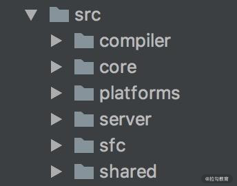
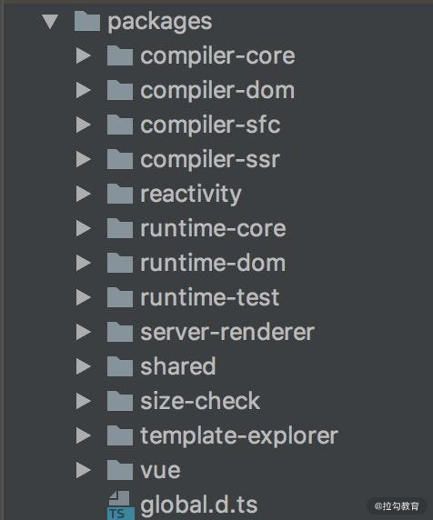

# Vue.js 3.0 的优化

## 源码优化

### 1. 更好的代码管理方式：monorepo

首先，源码的优化体现在代码管理方式上。Vue.js 2.x 的源码托管在 src 目录，然后依据功能拆分出了 compiler（模板编译的相关代码）、core（与平台无关的通用运行时代码）、platforms（平台专有代码）、server（服务端渲染的相关代码）、sfc（.vue 单文件解析相关代码）、shared（共享工具代码） 等目录：



而到了 Vue.js 3.0 ，整个源码是通过 monorepo 的方式维护的，根据功能将不同的模块拆分到 packages 目录下面不同的子目录中：



可以看出相对于 Vue.js 2.x 的源码组织方式，monorepo 把这些模块拆分到不同的 package 中，每个 package 有各自的 API、类型定义和测试。这样使得模块拆分更细化，职责划分更明确，模块之间的依赖关系也更加明确，开发人员也更容易阅读、理解和更改所有模块源码，提高代码的可维护性。

另外一些 package（比如 reactivity 响应式库）是可以独立于 Vue.js 使用的，这样用户如果只想使用 Vue.js 3.0 的响应式能力，可以单独依赖这个响应式库而不用去依赖整个 Vue.js，减小了引用包的体积大小，而 Vue.js 2 .x 是做不到这一点的。

### 2. 有类型的 JavaScript：TypeScript

其次，源码的优化还体现在 Vue.js 3.0 自身采用了 TypeScript 开发。Vue.js 1.x 版本的源码是没有用类型语言的，小右用 JavaScript 开发了整个框架，但对于复杂的框架项目开发，使用类型语言非常有利于代码的维护，因为它可以在编码期间帮你做类型检查，避免一些因类型问题导致的错误；也可以利于它去定义接口的类型，利于 IDE 对变量类型的推导。

因此在重构 2.0 的时候，小右选型了 Flow，但是在 Vue.js 3.0 的时候抛弃 Flow 转而采用 TypeScript 重构了整个项目，这里有两方面原因，接下来我们具体说一下。

首先，Flow 是 Facebook 出品的 JavaScript 静态类型检查工具，它可以以非常小的成本对已有的 JavaScript 代码迁入，非常灵活，这也是 Vue.js 2.0 当初选型它时一方面的考量。但是 Flow 对于一些复杂场景类型的检查，支持得并不好。记得在看 Vue.js 2.x 源码的时候，在某行代码的注释中看到了对 Flow 的吐槽，比如在组件更新 props 的地方出现了：

什么意思呢？其实是由于这里 Flow 并没有正确推导出 vm.$options.props 的类型 ，开发人员不得不强制申明 propsOptions 的类型为 any，显得很不合理；另外他也在社区平台吐槽过 Flow 团队的烂尾。

其次，Vue.js 3.0 抛弃 Flow 后，使用 TypeScript 重构了整个项目。 TypeScript提供了更好的类型检查，能支持复杂的类型推导；由于源码就使用 TypeScript 编写，也省去了单独维护 d.ts 文件的麻烦；就整个 TypeScript 的生态来看，TypeScript 团队也是越做越好，TypeScript 本身保持着一定频率的迭代和更新，支持的 feature 也越来越多。

此外，小右和 TypeScript 团队也一直保持了良好的沟通，我们可以期待 TypeScript 对 Vue.js 的支持会越来越好。

```js
const propOptions: any = vm.$options.props // wtf flow?
```

## 性能优化

性能优化一直是前端老生常谈的问题。那么对于 Vue.js 2.x 已经足够优秀的前端框架，它的性能优化可以从哪些方面进行突破呢？

### 1. 源码体积优化

首先是源码体积优化，我们在平时工作中也经常会尝试优化静态资源的体积，因为 JavaScript 包体积越小，意味着网络传输时间越短，JavaScript 引擎解析包的速度也越快。

那么，Vue.js 3.0 在源码体积的减少方面做了哪些工作呢？

* 首先，移除一些冷门的 feature（比如 filter、inline-template 等）；

* 其次，引入 tree-shaking 的技术，减少打包体积。

第一点很好理解，所以这里我们来看看 tree-shaking，它的原理很简单，tree-shaking 依赖 ES2015 模块语法的静态结构（即 import 和 export），通过编译阶段的静态分析，找到没有引入的模块并打上标记。

举个例子，一个 math 模块定义了 2 个方法 square(x) 和 cube(x) ：

```js
export function square(x) {

  return x * x

}

export function cube(x) {

  return x * x * x

}
```

我们在这个模块外面只引入了 cube 方法：

```js
import { cube } from './math.js'

// do something with cube
```

最终 math 模块会被 webpack 打包生成如下代码：

```js
/* 1 */

/***/ (function(module, __webpack_exports__, __webpack_require__) {

  'use strict';

  /* unused harmony export square */

  /* harmony export (immutable) */ __webpack_exports__['a'] = cube;

  function square(x) {

    return x * x;

  }

  function cube(x) {

    return x * x * x;

  }

});
```

可以看到，未被引入的 square 模块被标记了， 然后压缩阶段会利用例如 uglify-js、terser 等压缩工具真正地删除这些没有用到的代码。

也就是说，利用 tree-shaking 技术，如果你在项目中没有引入 Transition、KeepAlive 等组件，那么它们对应的代码就不会打包，这样也就间接达到了减少项目引入的 Vue.js 包体积的目的。

### 2. 数据劫持优化

其次是数据劫持优化。Vue.js 区别于 React 的一大特色是它的数据是响应式的，这个特性从 Vue.js 1.x 版本就一直伴随着，这也是 Vue.js 粉喜欢 Vue.js 的原因之一，DOM 是数据的一种映射，数据发生变化后可以自动更新 DOM，用户只需要专注于数据的修改，没有其余的心智负担。

在 Vue.js 内部，想实现这个功能是要付出一定代价的，那就是必须劫持数据的访问和更新。其实这点很好理解，当数据改变后，为了自动更新 DOM，那么就必须劫持数据的更新，也就是说当数据发生改变后能自动执行一些代码去更新 DOM，那么问题来了，Vue.js 怎么知道更新哪一片 DOM 呢？因为在渲染 DOM 的时候访问了数据，我们可以对它进行访问劫持，这样就在内部建立了依赖关系，也就知道数据对应的 DOM 是什么了。以上只是大体的思路，具体实现要比这更复杂，内部还依赖了一个 watcher 的数据结构做依赖管理，参考下图：

