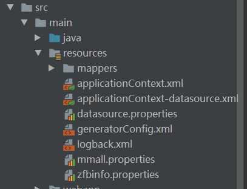
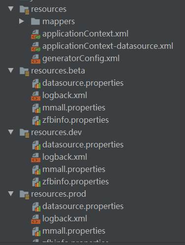
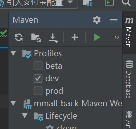

# 环境隔离

maven环境隔离就是不同环境进行不同的配置，打包的时候，调用对应的配置

## 为什么

在项目开发中，开发、测试、生产环境的配置都不一样，如果每次都手动改变配置，容易改错，这时我们可以使用Maven

## spring MVC

[地址链接](https://coding.imooc.com/lesson/162.html#mid=9001)

## 旧项目结构


以下文件是不同环境单独配置的：

datasource.properties  数据库配置文件

logback.xml  logback配置文件

mmall.properties  ftp服务器配置

zfbinfo.properties  支付宝支付功能配置

## 步骤

一、创建不同的配置文件



二、修改pom.xml文件

```xml
<resources>
      <resource>
        <directory>src/main/resources.${deploy.type}</directory>
        <excludes>
          <exclude>*.jsp</exclude>
        </excludes>
      </resource>
      <resource>
        <directory>src/main/resources</directory>
      </resource>
    </resources>
```
包裹在build中

这里的directory中配置了隔离文件的路径，${deploy.type}指的是将要隔离出来的文件的名称，将会在profiles结点中配置

```xml
<profiles>
    <profile>
        <id>dev</id>
        <activation>
            <activeByDefault>true</activeByDefault>
        </activation>
        <properties>
            <deploy.type>dev</deploy.type>
        </properties>
    </profile>
    <profile>
        <id>beta</id>
        <properties>
            <deploy.type>beta</deploy.type>
        </properties>
    </profile>
    <profile>
        <id>prod</id>
        <properties>
            <deploy.type>prod</deploy.type>
        </properties>
    </profile>
</profiles>
```
和build同级

配置了activeByDefault结点为true，表示当不选择编译环境时，默认使用dev（开发）环境，这也是推荐的配置。上述提到的deploy.type将会直接从这里的deploy.type中拿值，来表示是哪个编译环境。

三、打包

（一）、使用maven命令打包

```js
mvn clean package -Dmaven.test.skip=true -Pdev
```
-Pdev 表示dev环境

-Dmaven.test.skip=true 表示不执行测试用例，也不编译测试用例类


## spring-boot

[地址链接](https://class.imooc.com/lesson/1203#mid=30856)

新建dev和prod文件，存放开发环境和生产环境的配置



application-dev.yml

```yml
server:
  port: 8081

spring:
  datasource:
    url: jdbc:mysql://localhost:3306/foodie-shop-dev?characterEncoding=UTF-8&serverTimezone=GMT%2B8
    username: root
    password: x5219438
```

application.yml 通过active来切换当前环境的配置

```yml
#环境配置 dev就是新建的application-dev.yml
spring:
  profiles:
    active: dev
```
