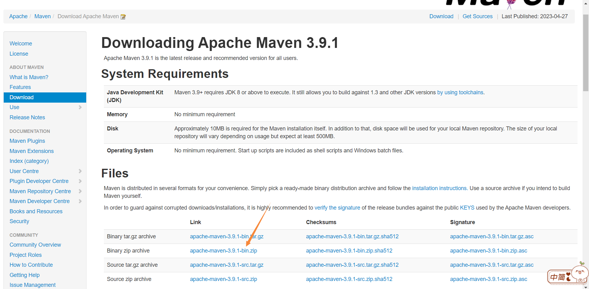
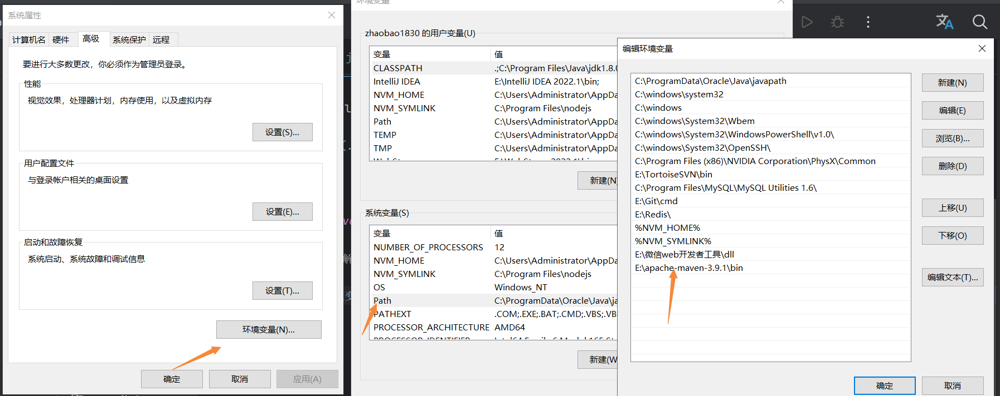
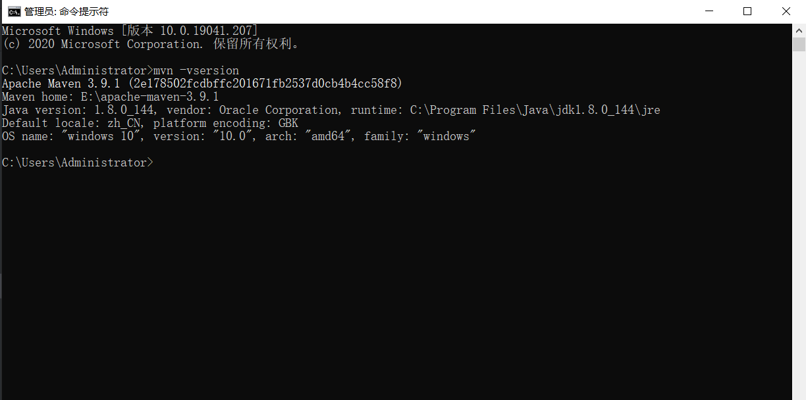
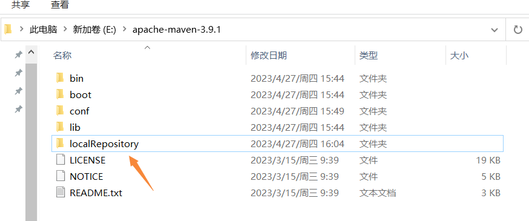
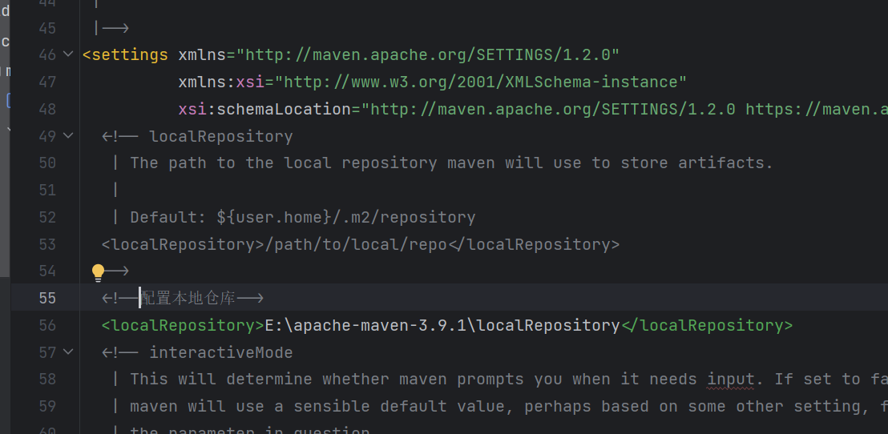
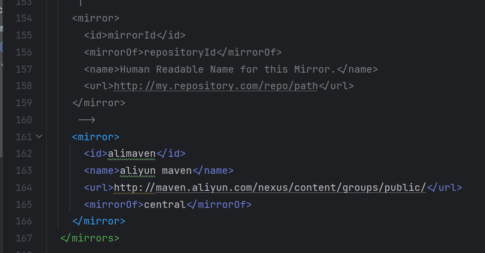
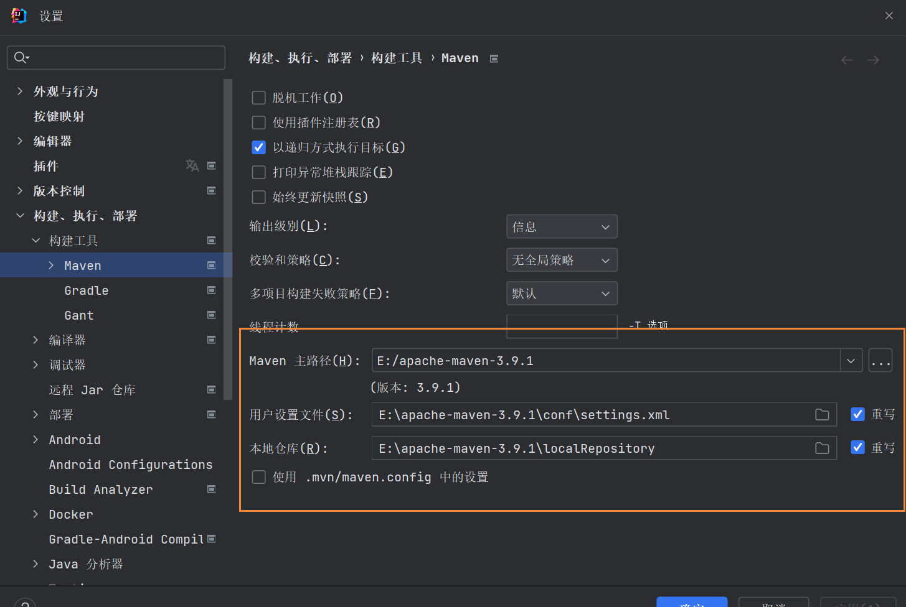
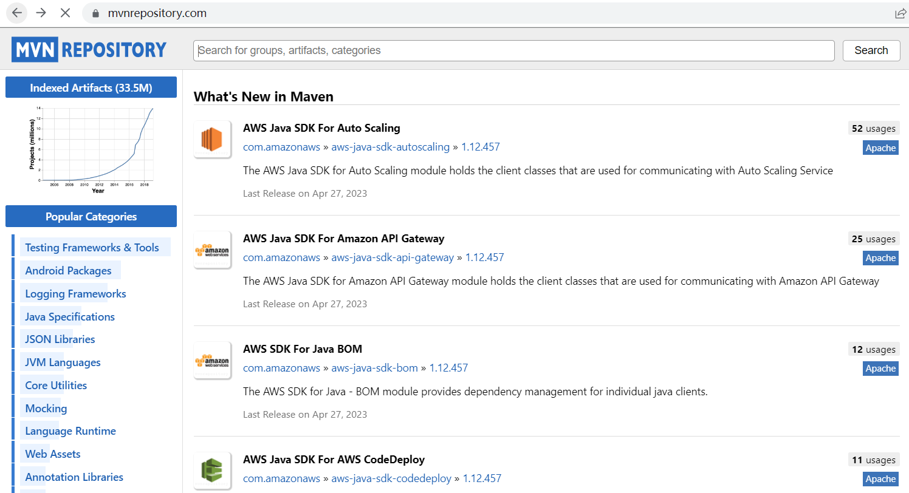
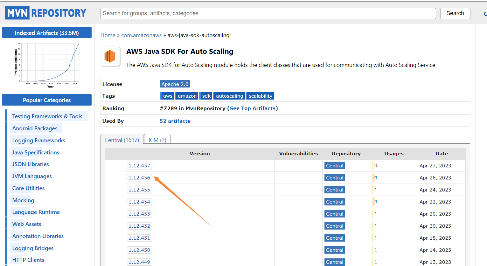
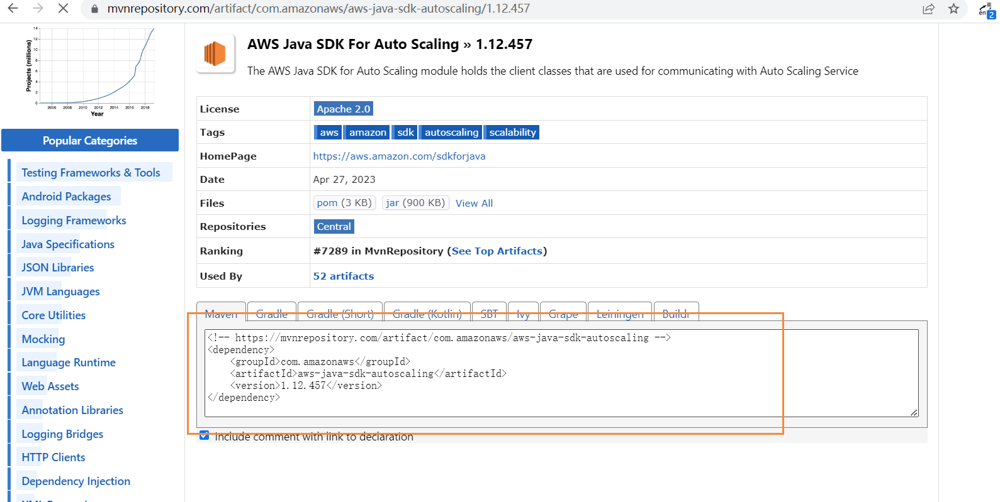

# maven下载、安装和配置

## 简介

[Maven](https://maven.apache.org/) 是 Apache 软件基金会的一个开源项目,是一个优秀的项目构建工具,它用来帮助开发者管理项目中的 jar,以及 jar 之间的依赖关系、完成项目的编译、测试、打包和发布等工作。

## 下载

地址：[https://maven.apache.org/download.cgi](https://maven.apache.org/download.cgi)

历史版本可以在Releases Notes中找到



点击下载

## 安装、配置maven

解压压缩包，我是解压到E盘中：E:\apache-maven-3.9.1

在环境变量--系统变量中的path中配置E:\apache-maven-3.9.1/bin



在cmd中执行mvn -version，输出以下信息表示配置成功



## 配置本地仓库

maven默认本地仓库是在C盘中，为了避免C盘占用，在E盘中新建本地仓库

在E:\apache-maven-3.9.1下新建localRepository文件夹



打开conf 文件夹下的 settings.xml 文件，修改本地仓库



为了增加下载速度，还需要配置阿里源



```xml
   <mirror>
      <id>alimaven</id>
      <name>aliyun maven</name>
      <url>http://maven.aliyun.com/nexus/content/groups/public/</url>
      <mirrorOf>central</mirrorOf>
    </mirror>
```

## idea中配置maven

在idea中修改maven版本、设置文件、本的仓库



## pom.xml配置

maven 仓库官网[http://mvnrepository.com/](http://mvnrepository.com/)，可以在这里找到想要下载的jar包



选择jar包和对应的版本



将代码复制到pox.xml中，maven会自动下载jar包



# 仓库

maven仓库分为本地仓库和远程仓库

先从本地仓库找jar包，如果没有就去远程仓库找，找到就下载到本地仓库使用；找不到就报错
