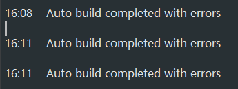
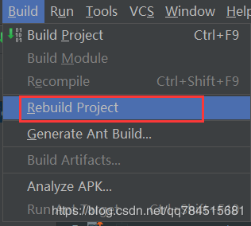

# 项目bug总结

1、新建maven项目时报错Error:Maven Resources Compiler: Maven project configuration required for module 'XX'解决方法

翻译：错误:Maven资源编译器:模块“项目名”所需的Maven项目配置不可用。只有从IDE启动外部构建时，才支持Maven项目的编译。

导致项目无法下载pom.xml文件中的架包，Auto build completed with errors如下图：

解决方法：在IDEA中，点击Build然后选择Rebuild Project即可，如下图。

造成报错的原因尚不清楚。
