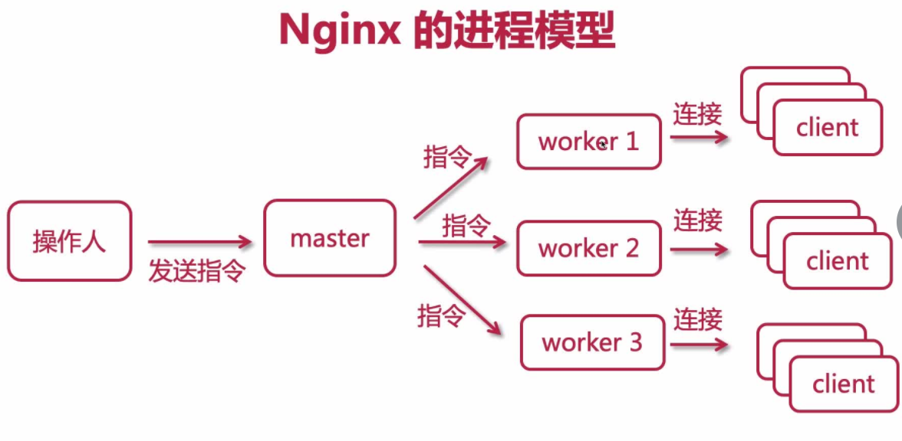
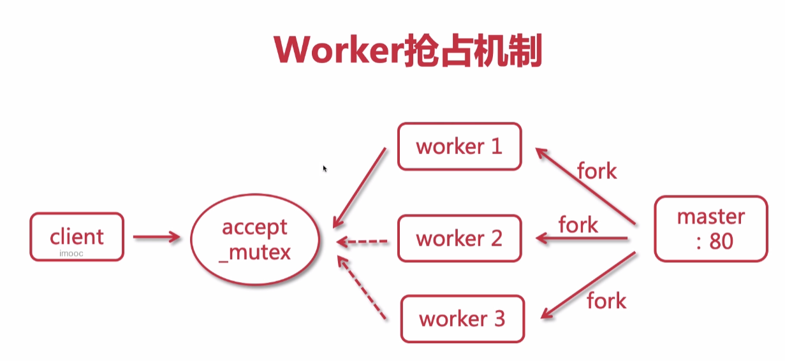
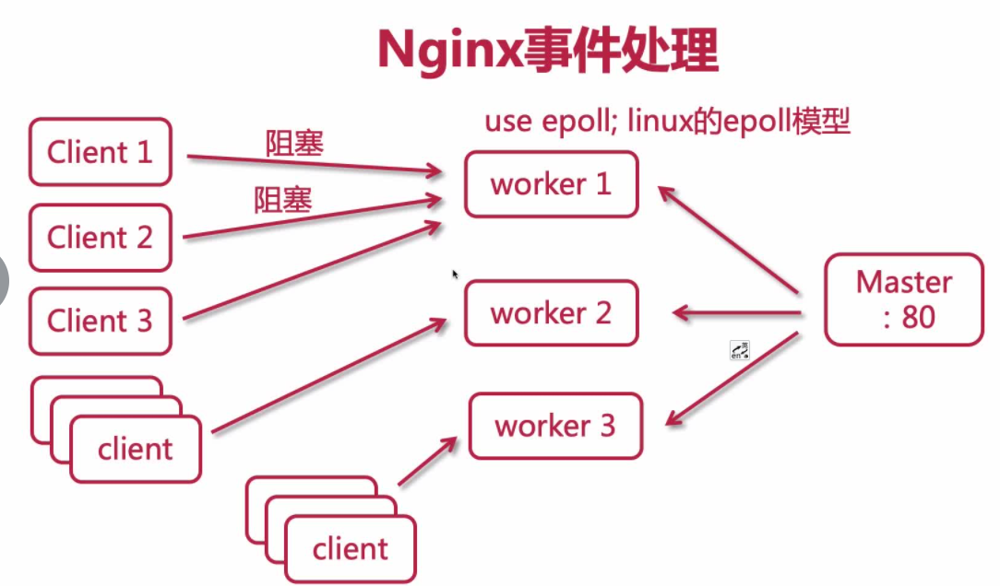
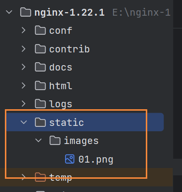

# 概念

## nginx是什么？

1、是一款高性能的http和反向代理web服务器，同时也提供IMAP/POP3/SMTP服务

2、主要功能是反向代理

3、通过配置文件可以实现集群和负载均衡

4、静态资源虚拟化（将静态资源虚拟化成服务，之后便可以通过浏览URL访问，比如图片、css、html等）

特点：高稳定、高性能、资源占用少、功能丰富、模块化结构、支持热部署

## 常见的服务器


## 正向代理


客户端请求目标服务器之间的一个代理服务器，请求会先经过代理服务器，然后再转发请求到目标服务器，获得内容后最后响应给客户端

## 反向代理


用户请求目标服务器，有dialing服务器决定访问哪个IP

例子：ping www.taobao.com  显示的ip地址是不一样的，这就是代理服务器分发到不同的服务器

负载均衡就是通过反向代理实现的

## 反向代理之路由


不同的请求url，由代理服务器转发到不同的tomcat或者静态资源服务器

## 下载和安装

官网：[http://nginx.org/en/download.html](http://nginx.org/en/download.html)

选择Stable version里的下载，然后解压就可以使用

## 命令

启动

cmd切换到在nginx安装目录下，执行start nginx

关闭

nginx -s stop 暴力关闭，如果现在有用户正在和nginx通信，也会强制断开连接，关闭nginx（如果确定是黑客进行访问，可以用这个命令）

nginx -s quit 优雅关闭，如果现在有用户正在和nginx通信，会等通信结束才会关闭nginx（针对http请求的，如果不是http请求，不能关闭）

taskkill /f /t /im nginx.exe(window环境下)

重启

nginx -s reload 修改配置文件后，重新执行这个方法

检测配置文件

nginx -t 

查看版本号

nginx -v

nginx -V 显示详细信息

帮助信息

nginx -h

切换配置文件

nginx -c filename

## 配置

```text
server {
        listen       88;
        server_name  192.168.3.30;
				
        location / {
            root   html;
            index  index.html index.htm;
        }
        error_page   500 502 503 504  /50x.html;
        location = /50x.html {
            root   html;
        }
    }
```

server_name只能是localhost、本地的ip地址才行，其他的网址、ip都不能访问

## 进程模型解析

nginx采用单主进程，多子进程(nginx.conf  worker_processes  默认为1)的模型

master管理worker，master接收外部请求或指令，分配给worker去执行

worker关闭时，会等待当前客户端连接释放后，才会关闭

多进程虽然会带来额外的内存开销，采用多进程而不采用多线程的原因:

1. 进程之间相互独立，互不影响，某一个worker出问题不会影响其他worker

2. 不需要开发人员去额外关注线程安全性       



## 请求机制

nginx高效的原因：

1、抢占机制



有了新的client，worker会去进行抢占，抢到了才能去处理

2、采用epoll异步非阻塞模型（当一个client阻塞，因为是异步非阻塞的，会去执行另一个client）

nginx的一个worker可以处理6-8万个请求，而且它的处理能力与cpu有关，可以通过增加cpu和内存来增加处理能力

可以通过nginx.conf中的worker_connections配置每个worker进程的最大连接数，worker_connections要根据服务器的配置进行设置，不能设置的太大，防止服务器压力过大



## nginx.conf配置结构


## 文件配置

```text
#user  nobody;

# worker进程的数量，与cpu相关
worker_processes  2;

#设定日志格式，main为定义的格式名称，如此access_log就可以直接使用这个变量了
#error_log  logs/error.log;
#error_log  logs/error.log  notice;
#error_log  logs/error.log  info;

# 进程pid
#pid        logs/nginx.pid;


events {
    # 默认使用epoll
    # windows环境，这个要注释，不然会报错，因为windows环境下不是用的epoll
    #use epoll;
    # 每个worker允许连接的客户端最大连接数
    worker_connections  1024;
}


http {
    # 引入外部配置，提高可读性，避免单个配置文件过大
    include       mime.types;

    default_type  application/octet-stream;

    # 设定日志格式，main为定义的格式名称，如此access_log就可以直接使用这个变量了
    #log_format  main  '$remote_addr - $remote_user [$time_local] "$request" '
    #                  '$status $body_bytes_sent "$http_referer" '
    #                  '"$http_user_agent" "$http_x_forwarded_for"';

    #access_log  logs/access.log  main;

    # 使用高效文件传输，提升传输性能。启用后才能用tcp_nopush，是指当数据表累积到一定大小后才发送，提高了效率
    sendfile        on;
    #tcp_nopush     on;

    # 客户端与服务端请求的超时时间，保证客户端多次请求的时候不会重复建立新的连接，节约资源损耗
    keepalive_timeout  65;

    #启用gzip压缩，html/js/css压缩后传输更快，节约带宽
    #gzip  on;
    #	限制最小压缩，小于1字节文件不会被压缩
    #gzip_min_length 1;
    #	定义压缩比（值为1-9，压缩比越大(文件越大，压缩越多)，使用的cpu越多）
    #gzip_comp_level 3;
    #	定义压缩文件类型
    #gzip_types text/plain application/javascript application/x-javascript text/css application/xml text/javascript application/x-httpd-php image/jpeg  image/gif  image/png application/json;

    # server可以在http指令块中设置多个虚拟主机
    server {
        # 监听端口
        listen       80;
        #ip、备案过的域名、localhost
        server_name  localhost;

        #允许跨域请求的域，*代表所有
        add_header 'Access-Control-Allow-Origin' *;
        #允许带上cookie请求
        add_header 'Access-Control-Allow-Credentials' 'true';
        #允许请求的方法，比如 GET/POST/PUT/DELETE
        add_header 'Access-Control-Allow-Methods' *;
        #允许请求的header
        add_header 'Access-Control-Allow-Headers' *;
        
        #配置静态资源防盗链
        #对源站点验证
        valid_referers *.imooc.com; 
        #非法引入会进入下方判断
        if ($invalid_referer) {
            return 404;
        } 

        # 请求路由映射，匹配拦截
        location / {
            # 请求位置
            root   html;
            # 首页位置
            index  index.html index.htm;
        }

        error_page   500 502 503 504  /50x.html;
        location = /50x.html {
            root   html;
        }
    }
    
    server {
        # 监听端口
        listen       90;
        #ip、备案过的域名、localhost
        server_name  192.168.3.30;

        # 静态资源部署
        # 存储路径是E:/nginx-1.22.1/nginxRun/dist/
        # 请求路由映射，匹配拦截
        # 请求url为http://192.168.3.30:90/home 不用加dist
        # http://192.168.3.30:90为
        location / {
            # 解决history模式下，刷新报错的bug
            try_files $uri $uri/ /index.html;
            # 请求位置
            root   E:/nginx-1.22.1/nginxRun/dist;
            # 首页位置
            index  index.html;
        }
    }
}

```

::: tip 备注
如果想查看服务器里的文件，比如需要下载这个服务器里的文件，可以在nginx的server里加上:autoindex    on;
如果不加这个配置，访问文件会显示403错误（没有访问权限）
:::

## 静态资源部署

1、在nginx新建文件夹static/images



2、配置server

（1）、使用root

```text
server {
        # 监听端口
        listen       90;
        #ip、备案过的域名、localhost
        server_name  192.168.3.30;

        # 请求路由映射，匹配拦截
        location /images/ {
            # 请求位置
            root   E:/nginx-1.22.1/static/;
            # 首页位置
            index  index.html;
        }
    }
```

url：http://192.168.3.30:90/images/01.png

::: tip 备注
使用root定义请求位置，会将images拼在后面，组成新的url
:::

（2）、使用alias

```text
server {
        # 监听端口
        listen       90;
        #ip、备案过的域名、localhost
        server_name  192.168.3.30;

        # 请求路由映射，匹配拦截
        location /img/ {
            # 请求位置
            alias   E:/nginx-1.22.1/static/images/;
            # 首页位置
            index  index.html;
        }
    }
```

url：http://192.168.3.30:90/img/01.png

::: tip 备注
alias用来定义别名，可以隐藏服务器的目录结构，防止用户通过服务器目录结构攻击服务器
:::

## location的匹配规则

视频地址：[https://class.imooc.com/lesson/1227#mid=28692](https://class.imooc.com/lesson/1227#mid=28692)

* 空格：默认匹配，普通匹配

```text
location / {
     root /home;
}
```

* =：精确匹配

```text
location = /imooc/img/face1.png {
    root /home;
}
```

* ~*：匹配正则表达式，不区分大小写

```text
#符合图片的显示
location ~* .(GIF|jpg|png|jpeg) {
    root /home;
}
```

* ~：匹配正则表达式，区分大小写

```text
#GIF必须大写才能匹配到
location ~ .(GIF|jpg|png|jpeg) {
    root /home;
}
```

* ^~：以某个字符路径开头

```text
location ^~ /imooc/img {
    root /home;
}
```

## 跨域配置支持

```text
#允许跨域请求的域，*代表所有
add_header 'Access-Control-Allow-Origin' *;
#允许带上cookie请求
add_header 'Access-Control-Allow-Credentials' 'true';
#允许请求的方法，比如 GET/POST/PUT/DELETE
add_header 'Access-Control-Allow-Methods' *;
#允许请求的header
add_header 'Access-Control-Allow-Headers' *;

```

## 防盗链配置支持

```text
#对源站点验证
valid_referers *.imooc.com; 
#非法引入会进入下方判断
if ($invalid_referer) {
    return 404;
} 
```

## 实战

### 基本配置+转发+获取请求地址的IP

```conf
server {
        # 监听端口
        listen       97;
        #ip、备案过的域名、localhost
        server_name  192.168.3.30;

        # 静态资源部署
        # 存储路径是E:/nginx-1.22.1/nginxRun/dist/
        # 请求路由映射，匹配拦截
            location / {
              # 解决history模式下，刷新报错的bug
              try_files $uri $uri/ /index.html;
              # 请求位置
              root E:/nginx-1.22.1/nginxRun/dist;
              # 首页位置
              index  index.html;
            }
            #配置转发
            location ^~ /api/ {
                # 解决跨域
                add_header Access-Control-Allow-Origin *;
            	add_header Access-Control-Allow-Headers X-Requested-With;
            	add_header Access-Control-Allow-Methods GET,POST,OPTIONS;
            	# 请求的时候会携带请求电脑的IP
                proxy_set_header Host $host;
                proxy_set_header X-Real-IP $remote_addr;
                proxy_set_header REMOTE-HOST $remote_addr;
                proxy_set_header X-Forwarded-For $proxy_add_x_forwarded_for;
                # 转发地址
                proxy_pass http://192.168.0.61:9614/;
            }
    }
```

**说明：**

1、路由映射，最上面一定要是/，下面在配置转发

2、如果想获取请求的电脑的IP，可以使用下面的配置，之后java代码里通过HttpServletRequest request获取

```
proxy_set_header Host $host;
proxy_set_header X-Real-IP $remote_addr;
proxy_set_header REMOTE-HOST $remote_addr;
proxy_set_header X-Forwarded-For $proxy_add_x_forwarded_for;
```

