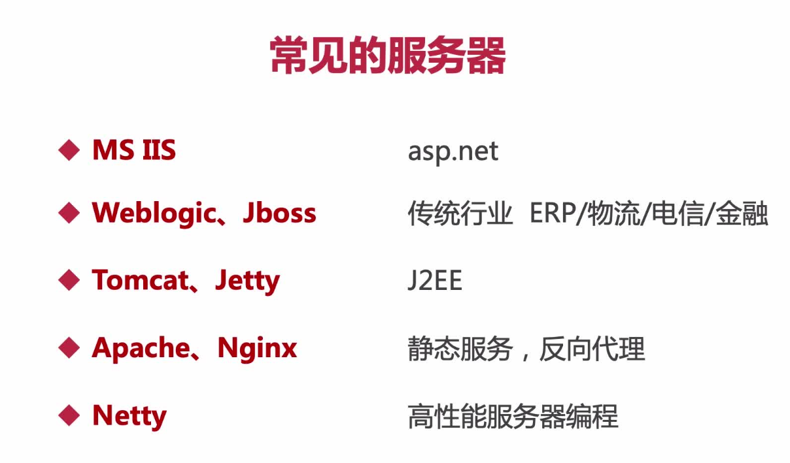
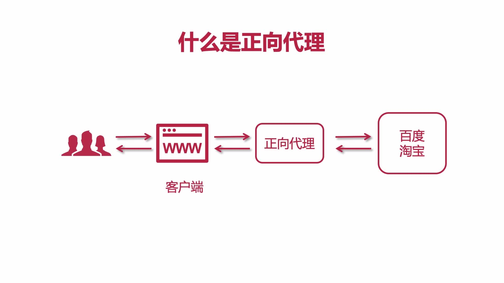
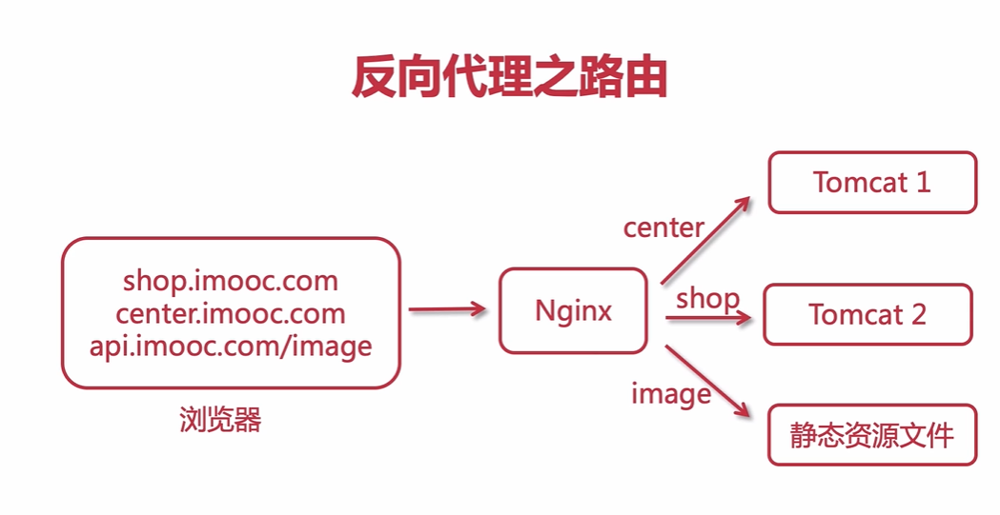
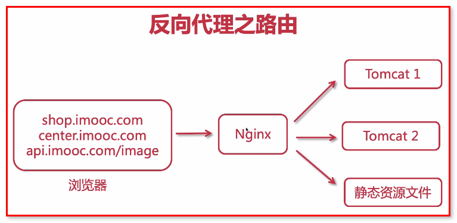

# 概念

## nginx是什么？

1、是一款高性能的http和反向代理web服务器，同时也提供IMAP/POP3/SMTP服务

2、主要功能是反向代理

3、通过配置文件可以实现集群和负载均衡

4、静态资源虚拟化（将静态资源虚拟化成服务，之后便可以通过浏览URL访问，比如图片、css、html等）

特点：高稳定、高性能、资源占用少、功能丰富、模块化结构、支持热部署

## 常见的服务器



## 正向代理



客户端请求目标服务器之间的一个代理服务器，请求会先经过代理服务器，然后再转发请求到目标服务器，获得内容后最后响应给客户端

## 反向代理



用户请求目标服务器，有dialing服务器决定访问哪个IP

例子：ping www.taobao.com  显示的ip地址是不一样的，这就是代理服务器分发到不同的服务器

负载均衡就是通过反向代理实现的

## 反向代理之路由



不同的请求url，由代理服务器转发到不同的tomcat或者静态资源服务器

## 下载和安装

官网：[http://nginx.org/en/download.html](http://nginx.org/en/download.html)

选择Stable version里的下载，然后解压就可以使用

## 命令

启动 cmd切换到在nginx安装目录下，执行start nginx

关闭 nginx -s stop  nginx -s quit  taskkill /f /t /im nginx.exe(window环境下)

重启 nginx.exe -s reload 修改配置文件后，重新执行这个方法

## 配置

```text
server {
        listen       88;
        server_name  192.168.3.30;
				
        location / {
            root   html;
            index  index.html index.htm;
        }
        error_page   500 502 503 504  /50x.html;
        location = /50x.html {
            root   html;
        }
    }
```

server_name只能是localhost、本地的ip地址才行，其他的网址、ip都不能访问
