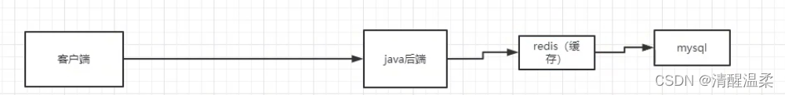
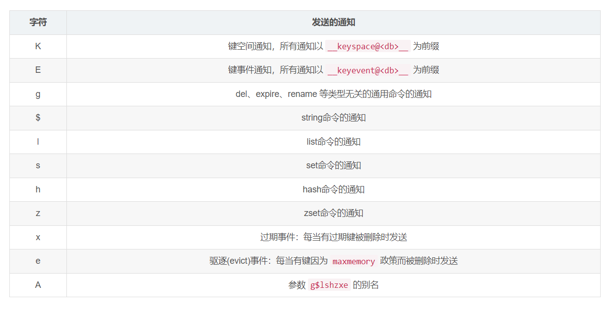
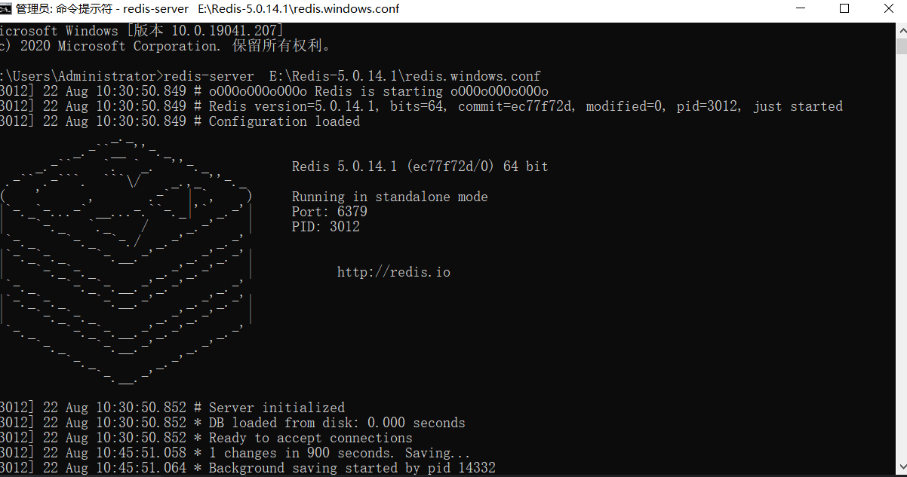
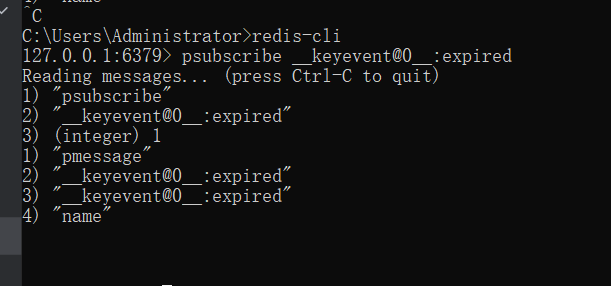
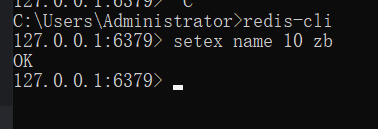

# redis

## 介绍

Redis是一个高速缓存数据库，是一种key-value（键值对）形式的存储系统，非关系型数据库。

Redis的数据 是放在内存里的，所以读写会很快

## 下载与安装

（一）、下载redis

下载地址：[https://github.com/tporadowski/redis/releases](https://github.com/tporadowski/redis/releases)

[https://github.com/MicrosoftArchive/redis/releases](https://github.com/MicrosoftArchive/redis/releases)

（二）、解压到文件夹

（三）、配置环境变量

在环境变量里配置redis

（四）、测试

在cmd中输入：redis-server

输入：redis-cli

::: tip 备注
redis-2.8版本配置了环境变量，在cmd中不能启动，只能通过点击文件夹中的redis-server.exe才行
:::

## 键空间通知（Keyspace notification）

### 概念

redis受事件的影响，比如del方法、expired时间过期就会发布一个通知，客户端监听这个通知

### 类型

key-space和key-event

举例：

我们给redis set一个key，为name: zb，然后执行del方法删除这个key

key-space会返回del

key-event会返回被删除的key，这里是name

### 监听的事件以及缩写

### key-event通知订阅

**开启订阅：**

在redis.windows.conf文件里，添加notify-keyspace-events Ex，表示开启keyspace-events，订阅的是Ex(E表示键事件通知，所有通知以 `__keyevent@<db>__` 为前缀，x表示过期事件：每当有过期键被删除时发送)

也可以在cmd执行`redis-cli`后，用`config set notify-keyspace-events Ex`开启订阅（关闭redis后，订阅会关闭，需要每次都开启）

**订阅：**

一、在cmd中输入`redis-server E:\Redis-5.0.14.1\redis.windows.conf`启动redis

::: tip 备注
如果在redis.windows.conf里修改了配置，启动的时候要在redis-server后面添加配置文件的路径
:::

二、上面的cmd不关闭，新打开cmd，执行`redis-cli`，输入`psubscribe __keyevent@0__:expired`，订阅（监听）keyevent里的expired（过期）事件

::: tip 备注
0表示第一个数据库，redis有16个数据，默认是第0个，如果想修改数据库，可以执行`select [index]`
:::

三、再重新打开cmd，执行`redis-cli`，输入`setex name 10 zb`，打开步骤二的cmd，就可以显示出当前输入的name

