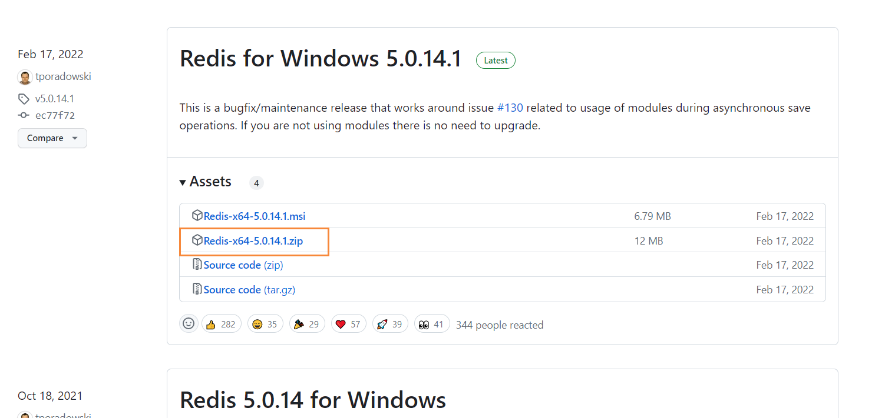
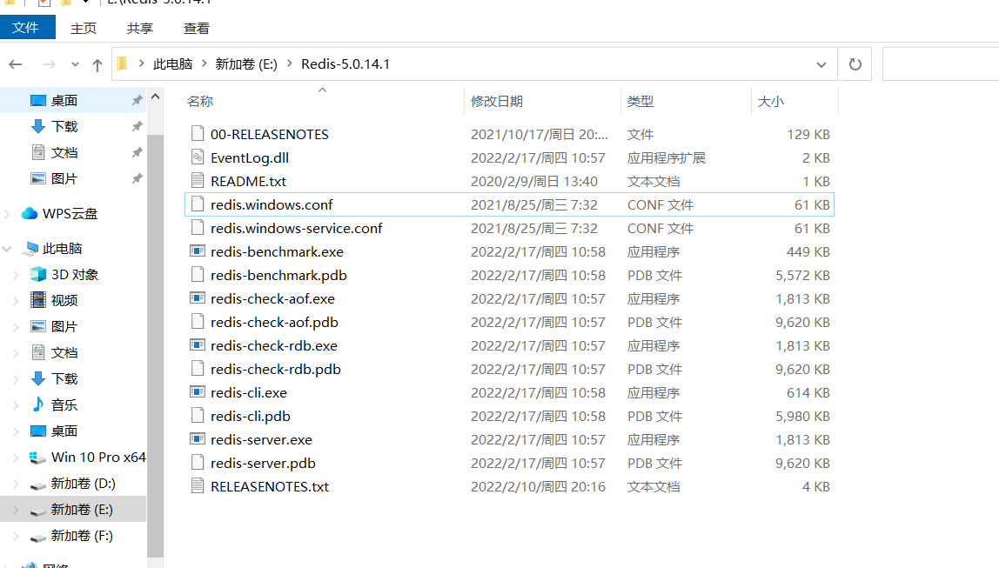
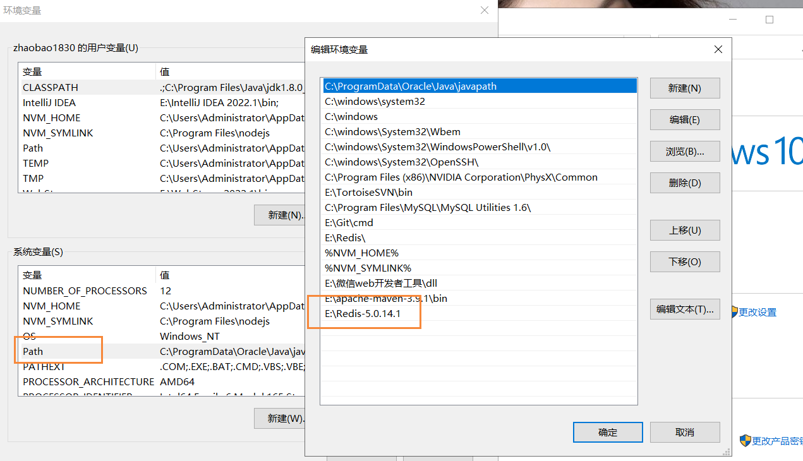
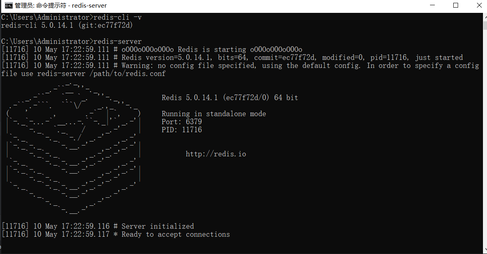
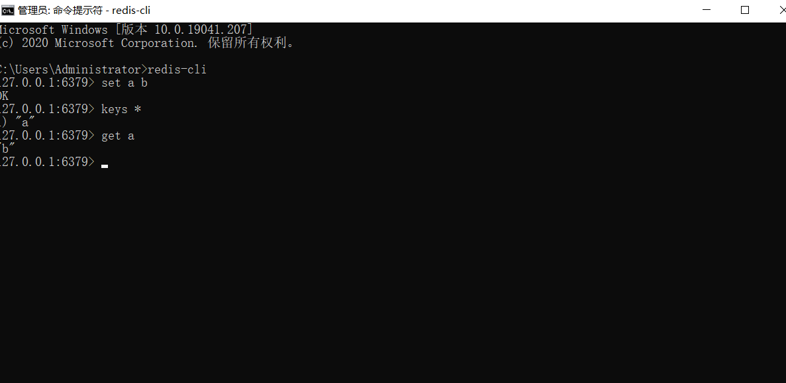

# redis

## 下载与安装

（一）、下载redis

下载地址：[https://github.com/tporadowski/redis/releases](https://github.com/tporadowski/redis/releases)

（二）、解压到文件夹

（三）、配置环境变量

在环境变量里配置redis

（四）、测试

在cmd中输入：redis-server

输入：redis-cli

