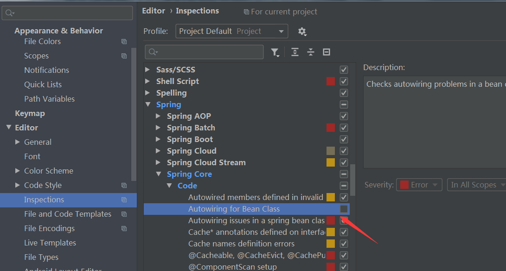

# 项目总结

spring-boot开发项目遇到的Bug

1、项目启动的时候，找不到mapper文件

```html
Description:

Field stuMapper in com.zb.service.impl.StuServiceImpl required a bean of type 'com.zb.mapper.StuMapper' that could not be found.

The injection point has the following annotations:
    - @org.springframework.beans.factory.annotation.Autowired(required=true)


Action:

Consider defining a bean of type 'com.zb.mapper.StuMapper' in your configuration.
```

原因是：mapper没有注入到容器中

解决办法是：在启动文件里，添加@MapperScan(basePackages = "com.zb.mapper")，basePackages 是mapper所在的文件夹

```js
@SpringBootApplication
@MapperScan(basePackages = "com.zb.mapper")
public class Application {

    public static void main(String[] args) {
        SpringApplication.run(Application.class, args);
    }
}
```

2、@Autowired

出现红色的下划线

<font color=red>private StuMapper stuMapper; </font> 

解决办法：

setting -> Editor -> Inspections -> Spring -> Spring Core -> Code -> Autowiring Bean Class 去掉选择


3、找不到mapper里的方法

<font color=red>org.apache.ibatis.binding.BindingException: Invalid bound statement (not found): com.zb.mmallzb.dao.UserMapper.checkUsername</font>

原因：缺少mybatis的相关配置

解决办法：在application.yml文件进行mybatis配置

```html
############################################################
#
# mybatis 配置
#
############################################################
mybatis:
  type-aliases-package: com.zb.mmallzb.pojo     # 所有POJO类所在包路径
  mapper-locations: classpath:mapper/*.xml      # mapper映射文件
```
