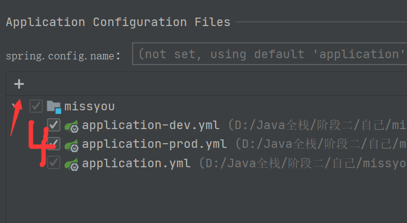

# spring-boot bug总结

spring-boot开发项目遇到的Bug

1、项目启动的时候，找不到mapper文件

```Java
Description:

Field stuMapper in com.zb.service.impl.StuServiceImpl required a bean of type 'com.zb.mapper.StuMapper' that could not be found.

The injection point has the following annotations:
    - @org.springframework.beans.factory.annotation.Autowired(required=true)


Action:

Consider defining a bean of type 'com.zb.mapper.StuMapper' in your configuration.
```

原因是：mapper没有注入到容器中

解决办法是：在启动文件里，添加@MapperScan(basePackages = "com.zb.mapper")，basePackages 是mapper所在的文件夹

```java
@SpringBootApplication
@MapperScan(basePackages = "com.zb.mapper")
public class Application {

    public static void main(String[] args) {
        SpringApplication.run(Application.class, args);
    }
}
```

2、@Autowired

出现红色的下划线

<div color=red>private StuMapper stuMapper; </div> 

解决办法：

setting -> Editor -> Inspections -> Spring -> Spring Core -> Code -> Autowiring Bean Class 去掉选择


3、找不到mapper里的方法

<div color=red>org.apache.ibatis.binding.BindingException: Invalid bound statement (not found): com.zb.mmallzb.dao.UserMapper.checkUsername</div>

原因：缺少mybatis的相关配置

解决办法：在application.yml文件进行mybatis配置

```yml
############################################################
#
# mybatis 配置
#
############################################################
mybatis:
  type-aliases-package: com.zb.mmallzb.pojo     # 所有POJO类所在包路径
  mapper-locations: classpath:mapper/*.xml      # mapper映射文件
```

4、spring-boot-maven-plugin插件下载失败，是红色的

解决办法：加上version，下载到本地仓库后，其他项目再使用这个插件，就不用添加version了

```xml
 <plugin>
     <groupId>org.springframework.boot</groupId>
     <artifactId>spring-boot-maven-plugin</artifactId>
     <version>2.3.4.RELEASE</version>
</plugin>
```

5、Spring Boot Configuration Annotation Processor not configured

spring默认使用yml中的配置，但有时候要用传统的xml或properties配置，就需要使用spring-boot-configuration-processor了

```xml
      <dependency>
          <groupId>org.springframework.boot</groupId>
          <artifactId>spring-boot-configuration-processor</artifactId>
          <optional>true</optional>
      </dependency>
```

6、新建的yml文件不是绿色的叶子

解决办法：

（1）、确保IDEA是旗舰版

（2）、确保IDEA安装了yaml插件

（3）、选中项目 File --> Poject Structure --> Modules --> Spring --> 点击右上角的绿叶子 --> 点击+ --> 选择yml文件 --> OK




7、SpringBoot启动报错java.nio.charset.MalformedInputException: Input length = 1解决方案

原因：文件编码不对

解决办法：修改文件编码为UTF-8


