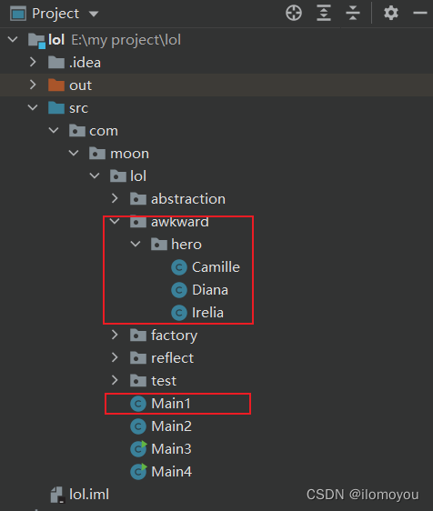
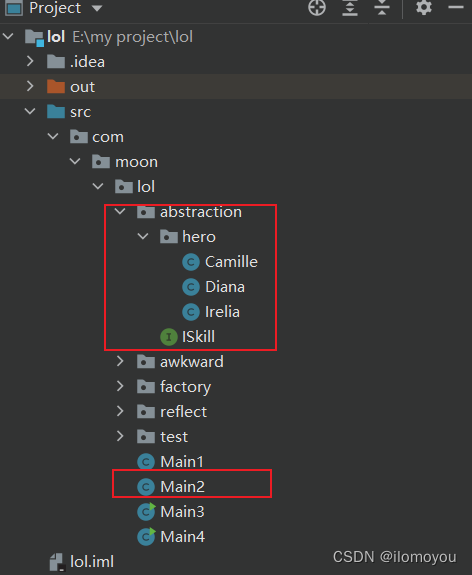
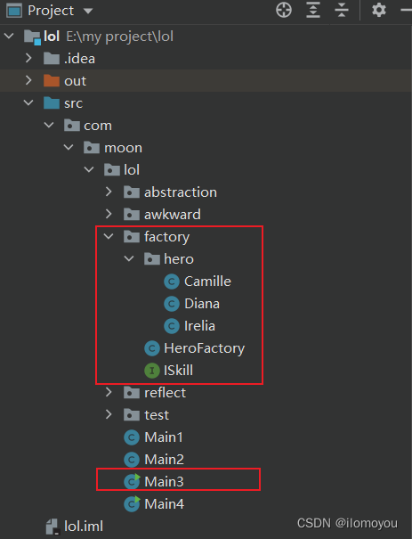
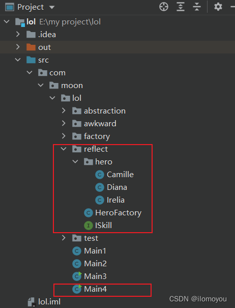
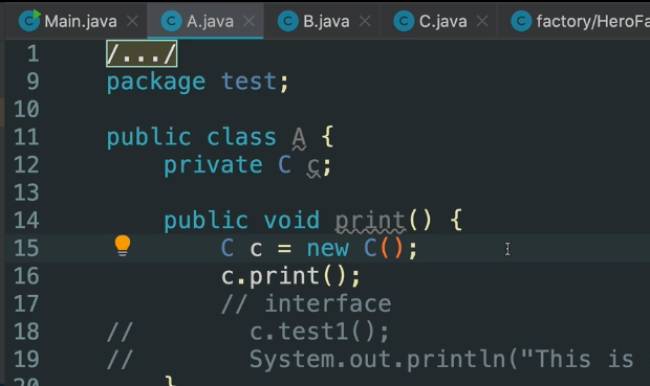
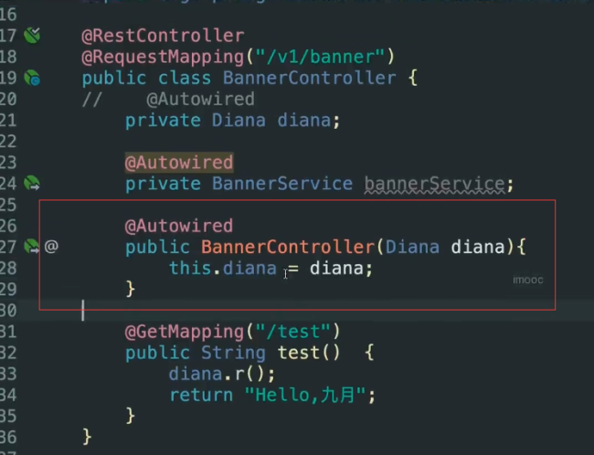
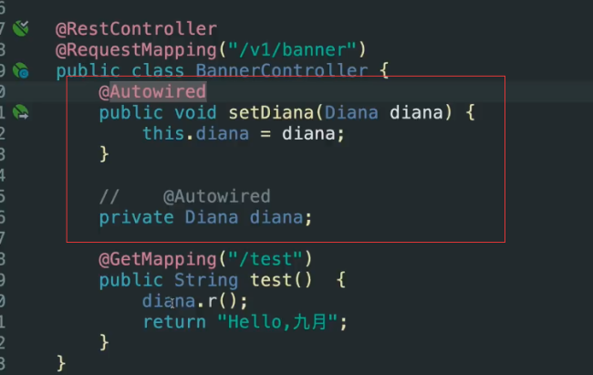
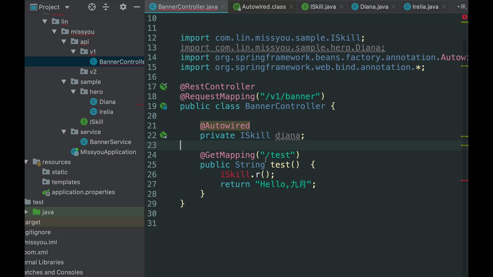

# Java知识点

## java web框架的发展历史

1、Servlet+Jsp+JavaBean MVC

2、struts

3、Spring：IOC(控制反转)、AOP（面向切面模式）

4、Hibernate ORM

5、ssh structs2+spring+hibernate

6、ssm springmvc+spring+mybatis

7、Springmvc升级成SpringBoot

## 为什么现在用SpringBoot不用Springmvc？

SpringBoot简化了SpringMvc的配置（约定大于配置）

## Java为什么很多公司用？

软件工程最重要的是项目的维护和迭代

动态语言比如js、python想写出可维护的代码难，因为太灵活了

java、c# 虽然笨重，但是强制你按照某种规则去做，让你写出好的可维护的代码

## OCP（开闭原则）

不管是软件，还是函数，还是类，都要对扩展是开放的，对修改是封闭的。

当要修改的时候，我们通过新增一业务模块或类，来代替原来的类。       

## 面向抽象编程

**面向抽象编程，是为了实现开闭原则，最终目标是为了写出可维护、稳定的代码**

面向抽象编程面临的问题有俩个：

* 统一方法的调用

* 统一对象的创建

实现面向抽象编程的方法有：

* interface

* 设计模式：工厂模式

* IOC/DI

这三种方法是逐渐递进的，不了解没关系，现在看下面的例子：

**英雄联盟 demo 推导**

由一个小型 demo 项目模拟英雄联盟用户选择英雄释放技能，推导 IOC 与 DI 的实现原理

将分别列举四个不同的版本演进这个推导过程，达到逐步理解 IOC 和 DI 的目的

**只有一段代码中没有new的出现，才能保证代码的相对稳定，换句话说，一段代码如果要保持稳定，就不应该负责对象的实例化**

### 第一版：烂大街的代码风格



Main1.java

选择英雄释放技能 main 函数

```java
package com.moon.lol;

import com.moon.lol.awkward.hero.Camille;
import com.moon.lol.awkward.hero.Diana;
import com.moon.lol.awkward.hero.Irelia;

import java.util.Scanner;

public class Main1 {

    // 第一版：烂大街的代码风格
    public static void main(String[] args) {
        String name = Main1.getPlayerInput();
        switch (name) {
            case "Diana":
                Diana diana = new Diana();
                diana.r();
                break;
            case "Irelia":
                Irelia irelia = new Irelia();
                irelia.r();
                break;
            case "Camille":
                Camille camille = new Camille();
                camille.r();
                break;
        }
    }

    /**
     * 接收玩家的输入（玩家输入英雄名字）
     * @return
     */
    private static String getPlayerInput() {
        System.out.println("Enter a Hero's Name");
        Scanner scanner = new Scanner(System.in);
        return scanner.nextLine();
    }
}

```

英雄类

```java
package com.moon.lol.awkward.hero;

/**
 * 戴安娜
 */
public class Diana {
    /**
     * 技能 Q
     */
    public void q() {
        System.out.println("Diana Q");
    }

    /**
     * 技能 W
     */
    public void w() {
        System.out.println("Diana W");
    }

    /**
     * 技能 E
     */
    public void e() {
        System.out.println("Diana E");
    }

    /**
     * 技能 R
     */
    public void r() {
        System.out.println("Diana R");
    }
}

```

```java
package com.moon.lol.awkward.hero;

/**
 * 艾瑞莉娅（刀妹）
 */
public class Irelia {
    /**
     * 技能 Q
     */
    public void q() {
        System.out.println("Irelia Q");
    }

    /**
     * 技能 W
     */
    public void w() {
        System.out.println("Irelia W");
    }

    /**
     * 技能 E
     */
    public void e() {
        System.out.println("Irelia E");
    }

    /**
     * 技能 R
     */
    public void r() {
        System.out.println("Irelia R");
    }
}

```

```java
package com.moon.lol.awkward.hero;

/**
 * 卡蜜尔（青钢影）
 */
public class Camille {
    /**
     * 技能 Q
     */
    public void q() {
        System.out.println("Camille Q");
    }

    /**
     * 技能 W
     */
    public void w() {
        System.out.println("Camille W");
    }

    /**
     * 技能 E
     */
    public void e() {
        System.out.println("Camille E");
    }

    /**
     * 技能 R
     */
    public void r() {
        System.out.println("Camille R");
    }
}

```

**评价：** 这版代码太烂，因为main方法里new 类的操作太多，代码不稳定，而且新增英雄的话，需要修改main方法，新增new 类

### 第二版：使用interface抽象风格



Main2.java

选择英雄释放技能 main 函数

```java
package com.moon.lol;

import com.moon.lol.abstraction.ISkill;
import com.moon.lol.abstraction.hero.Camille;
import com.moon.lol.abstraction.hero.Diana;
import com.moon.lol.abstraction.hero.Irelia;

import java.util.Scanner;

public class Main2 {

    /**
     * 第二版：interface抽象风格
     * 单纯interface可以统一方法的调用，但是它不能统一对象的实例化
     */
    public static void main(String[] args) throws Exception {
        String name = Main2.getPlayerInput();
        ISkill iSkill;
        switch (name) {
            case "Diana":
                iSkill = new Diana();
                break;
            case "Irelia":
                iSkill = new Irelia();
                break;
            case "Camille":
                iSkill = new Camille();
                break;
            default:
                throw new Exception();
        }
        iSkill.r();
    }

    /**
     * 接收玩家的输入（玩家输入英雄名字）
     * @return
     */
    private static String getPlayerInput() {
        System.out.println("Enter a Hero's Name");
        Scanner scanner = new Scanner(System.in);
        return scanner.nextLine();
    }
}

```

英雄技能接口类

ISkill.java

```java
package com.moon.lol.abstraction;

/**
 * 技能接口 Q W E R
 */
public interface ISkill {
    /**
     * 技能 Q
     */
    void q();

    /**
     * 技能 W
     */
    void w();

    /**
     * 技能 E
     */
    void e();

    /**
     * 技能 R
     */
    void r();
}

```

各英雄类

```java
package com.moon.lol.abstraction.hero;

import com.moon.lol.abstraction.ISkill;

/**
 * 戴安娜
 */
public class Diana implements ISkill {
    /**
     * 技能 Q
     */
    public void q() {
        System.out.println("Diana Q");
    }

    /**
     * 技能 W
     */
    public void w() {
        System.out.println("Diana W");
    }

    /**
     * 技能 E
     */
    public void e() {
        System.out.println("Diana E");
    }

    /**
     * 技能 R
     */
    public void r() {
        System.out.println("Diana R");
    }
}

```

```java
package com.moon.lol.abstraction.hero;

import com.moon.lol.abstraction.ISkill;

/**
 * 艾瑞莉娅（刀妹）
 */
public class Irelia implements ISkill {
    /**
     * 技能 Q
     */
    public void q() {
        System.out.println("Irelia Q");
    }

    /**
     * 技能 W
     */
    public void w() {
        System.out.println("Irelia W");
    }

    /**
     * 技能 E
     */
    public void e() {
        System.out.println("Irelia E");
    }

    /**
     * 技能 R
     */
    public void r() {
        System.out.println("Irelia R");
    }
}

```

```java
package com.moon.lol.abstraction.hero;

import com.moon.lol.abstraction.ISkill;

/**
 * 艾瑞莉娅（刀妹）
 */
public class Irelia implements ISkill {
    /**
     * 技能 Q
     */
    public void q() {
        System.out.println("Irelia Q");
    }

    /**
     * 技能 W
     */
    public void w() {
        System.out.println("Irelia W");
    }

    /**
     * 技能 E
     */
    public void e() {
        System.out.println("Irelia E");
    }

    /**
     * 技能 R
     */
    public void r() {
        System.out.println("Irelia R");
    }
}

```

**评价：** 这版代码将方法进行抽象，统一管理，但不能统一对象的实例化，如果有新的类，那就得在switch里新加new代码，这样会修改之前的主体代码

方法统一的意义在哪？

1、某方法被大量调用时很繁琐，方法统一后一行代码搞定；

2、事项功能的单一性，便于后面的提取封装。

### 第三版：工厂模式：分离对象实例化



Main3.java

选择英雄释放技能 main 函数

```java
package com.moon.lol;

import com.moon.lol.factory.HeroFactory;
import com.moon.lol.factory.ISkill;

import java.util.Scanner;

public class Main3 {
    /**
     * 第三版：工厂模式分离对象实例化
     * 把对象实例化的过程，转移到其他的代码片段里
     */
    public static void main(String[] args) throws Exception {
        String name = Main3.getPlayerInput();
        ISkill iSkill = HeroFactory.getHero(name);
        iSkill.r();
    }

    /**
     * 接收玩家的输入（玩家输入英雄名字）
     * @return
     */
    private static String getPlayerInput() {
        System.out.println("Enter a Hero's Name");
        Scanner scanner = new Scanner(System.in);
        return scanner.nextLine();
    }
}

```

HeroFactory.java

生产英雄的工厂类

```java
package com.moon.lol.factory;

import com.moon.lol.factory.hero.Camille;
import com.moon.lol.factory.hero.Diana;
import com.moon.lol.factory.hero.Irelia;

/**
 * 简单工厂模式
 * 生产或实例化英雄类，把对象实例化的过程隔离
 */
public class HeroFactory {
    public static ISkill getHero(String name) throws Exception {
        ISkill iSkill;
        switch (name) {
            case "Diana":
                iSkill = new Diana();
                break;
            case "Irelia":
                iSkill = new Irelia();
                break;
            case "Camille":
                iSkill = new Camille();
                break;
            default:
                throw new Exception();
        }
        return iSkill;
    }
}

```

ISkill 接口、Diana、Irelia、Camille 类与第二版基本相同

**评价：** 基本上实现了方法和对象实例化的统一

### 第四版：反射



HeroFactory.java

英雄工厂类

```java
package com.moon.lol.reflect;

/**
 * 简单工厂模式
 */
public class HeroFactory {
    /**
     * 第四版：通过反射机制消除所有的变化
     * 正向思维：工厂模式 + 反射并不是 IOC 和 DI
     */
    public static ISkill getHero(String name) throws Exception {
        // 元类、反射
        // 对象 类 元类
        String classStr = "com.moon.lol.reflect.hero." + name;
        Class<?> cla = Class.forName(classStr);
        Object obj = cla.newInstance();
        return (ISkill) obj;
    }
}

```

Main 类与第三版基本相同

ISkill 接口、Diana、Irelia、Camille 类与第二版基本相同

**评价：** 这一版每一次调用都需要重新反射生成对象，性能不好；而spring是可以把生成的对象加到缓存里面，就不再重复生成；

IOC就是利用反射实现的，但反射+工厂模式不是IOC和DI

**上面四版代码的总结**

* 单纯 interface 可以统一方法的调用，但是它不能统一对象的实例化

* 面向对象主要做两件事情：实例化对象 调用方法（完成业务逻辑）

* 只有一段代码中没有 new 的出现，才能保持代码的相对稳定，才能逐步实现 OCP

* 上面的这句话只是表象，实质是一段代码如果要保持稳定，就不应该负责对象的实例化

* 对象实例化是不可能消除的

* 把对象实例化的过程，转移到其他的代码片段里

* 代码中总是会存在不稳定，隔离这些不稳定，保证其他的代码是稳定的

* 变化造成了不稳定

* 配置文件属于系统外部的，可以理解为用户的输入，变化是无法消除的，所以把变化放到配置文件里

**问题**

上面第四版已经实现开闭原则了，但还是有缺点，需要调用HeroFactory的方法，那有没有一种机制，可以不需要调用HeroFactory创建iSkill，只要文件里引入iSkill就可以直接使用

现在就可以该最佳解决方法出现了：IOC和DI

在IOC和DI出现前很长一段时间，我们都是用工厂模式实现的开闭原则



这种写法最大的问题就是类与类之间的依赖性高，当类A使用类C中的方法，必须在类A中new 类C，如果new 类C的地方出现变化，那需要更改的地方太多

现在就有一个方法：代码里面不使用new生成对象，有一个容器将C这个对象给我们使用

对比：以前是我们自己new一个类生成对象，现在是容器直接给我们这个对象

### IOC和DI

IOC：控制反转

DI：依赖注入

**从DI的角度理解IOC：**

此处有两个类 A 与 B ，A类要使用B类的中的方法，则在A中实例化B，而后调用B中方法，依赖程度高，后期修改部分多。

将B抽象成一个接口，A只调用接口中的方法，B实现接口的方法。在A中对接口初始化，但是本质上也是对B类的初始化，不稳定。

因此A将控制B的权利转移给另外一个容器，容器将接口实例化后注入到A中，实例化的接口(即继承接口的类)可以是B，也可以是其他类，容器起到资源调配的作用。

A只关心接口中的方法，至于实例化的是哪一个类，A并不关心，只要接口方法不变，A调用的方法就不变，从而保持A中的代码稳定，降低A对B的依赖。

这体现了IOC 

**IOC反转的是控制权的反转**

程序员负责实现各种类，但如何使用，就交给用户（指产品经理或者项目负责人，决定用什么数据库）

以数据库为例，现在有mysql、oragle、mogodb三种数据库

程序员把这三种数据库需要的类都写好，但用哪个数据库的控制权交给用户

**IOC的具体意义**

IOC的具体意义： 有个容器，在需要的时候把容器中的对象加入代码中去

关键：容器，加入容器，注入

抽象：将控制权交给用户

目的：

1.实现灵活的ocp

2.将控制权交给用户

SpringBoot最核心的线路就是**如何把对象加入到容器中**，把握住这条线路，可以很好的学习SpringBoot

## 为什么引入容器后系统变的稳定？

因为它们每个类之间没有了依赖


A、B、C、D可以看做是四个类，耦合在一起，当其中一个出现问题，整个系统就不能使用，现在引入容器的概念


中间这个就是容器，四个类没有依赖，通过容器将它们带动起来，好处是如果A、B、C、D出现了变化，不会影响其他类，整个系统变成了松耦合

## Spring IOC的核心机制：实例化与注入

Spring 把对象加入到容器有俩种方法：XML和注解，有了SpringBoot后，最流行的就是注解了

最常用的是@Component，在SpringBoot中，当类上加上@Component，这个类就会被SpringBoot扫描后加入到容器里，在需要的时候注入到其他类中

### 常用注解

一、@Component 组件/类/bean 类的实例化

二、与@Component 作用相同

@Service          类如果是服务使用

@Controller     类如果是控制器使用

@Repository

三、@Configuration：把一组bean加入到容器

从Spring3.0，@Configuration用于定义配置类，可替换xml配置文件，被注解的类内部包含有一个或 多个 被@Bean注解的方法，这些方法将会被AnnotationConfigApplicationContext或AnnotationConfigWebApplicationContext类进行扫描，并用于构建bean定义，初始化Spring容器。 注意：@Configuration注解的配置类有如下要求： @Configuration不可以是final类型； @Configuration不可以是匿名类； 嵌套的configuration必须是静态类。

## DI注入的三种方式

**成员变量注入：** 我项目中最常用的是这种

@Autowired

private Diana diana

**构造注入：**



上面定义变量，下面通过构造方法注入并赋值

变量上不用加@Autowired

**方法注入：**



通过set方法给变量赋值

## @Autowired

@Autowired注入的两种方式

bytype 是默认注入方式

byname 多个接口实现类，通过byname方式注入，如果还用bytype会报错

比如现在有个接口ISkill，有irelia和diana俩个实现类

如果是

```java
@Autowired

private ISkill irelia // 这是注入的irelia对象

private ISkill diana // 这是注入的diana对象
```

这俩种写法是对的，SpringBoot通过名字注入不同的实现类的对象

```java
@Autowired

private ISkill iskill
```

这种写法是错误的，因为SpringBoot中的@Autowired默认是bytype注入方式，当ISkill 有俩个实现类时，不知道该注入哪个实现类

如果ISkill 只有一个实现类 那上面的写法是对的

### bytype

是Autowired注解的默认注入方式；可能会有以下几个情况：

* 找不到任何一个bean，直接报错；

* 找到一个，直接注入；

* 找到多个，并不一定会报错，后续spring还会有一个自动推断的行为，它会根据定义的变量名来寻找对应实现类；按照字段的名字推断选择哪个bean; byname

### byname



### @Qualifier

上面的写法都是Spring自动推导的

@Qualifier注解可以由我们主动指定选择哪个实现类；


