# Java知识点

## java web框架的发展历史

1、Servlet+Jsp+JavaBean MVC

2、struts

3、Spring：IOC(控制反转)、AOP（面向切面模式）

4、Hibernate ORM

5、ssh structs2+spring+hibernate

6、ssm springmvc+spring+mybatis

7、Springmvc升级成SpringBoot

## 为什么现在用SpringBoot不用Springmvc？

SpringBoot简化了SpringMvc的配置（约定大于配置）

## Java为什么很多公司用？

软件工程最重要的是项目的维护和迭代

动态语言比如js、python想写出可维护的代码难，因为太灵活了

java、c# 虽然笨重，但是强制你按照某种规则去做，让你写出好的可维护的代码

## OCP（开闭原则）

不管是软件，还是函数，还是类，都要对扩展是开放的，对修改是封闭的（这说的代码不能修改，但配置文件可以）。

当要修改的时候，我们通过新增一业务模块或类，来代替原来的类。       

## 面向抽象编程

**面向抽象编程，是为了实现开闭原则，最终目标是为了写出可维护、稳定的代码**

面向抽象编程面临的问题有俩个：

* 统一方法的调用

* 统一对象的创建

实现面向抽象编程的方法有：

* interface

* 设计模式：工厂模式

* IOC/DI

这三种方法是逐渐递进的，不了解没关系，现在看下面的例子：

**英雄联盟 demo 推导**

由一个小型 demo 项目模拟英雄联盟用户选择英雄释放技能，推导 IOC 与 DI 的实现原理

将分别列举四个不同的版本演进这个推导过程，达到逐步理解 IOC 和 DI 的目的

**只有一段代码中没有new的出现，才能保证代码的相对稳定，换句话说，一段代码如果要保持稳定，就不应该负责对象的实例化**

### 第一版：烂大街的代码风格


Main1.java

选择英雄释放技能 main 函数

```java
package com.moon.lol;

import com.moon.lol.awkward.hero.Camille;
import com.moon.lol.awkward.hero.Diana;
import com.moon.lol.awkward.hero.Irelia;

import java.util.Scanner;

public class Main1 {

    // 第一版：烂大街的代码风格
    public static void main(String[] args) {
        String name = Main1.getPlayerInput();
        switch (name) {
            case "Diana":
                Diana diana = new Diana();
                diana.r();
                break;
            case "Irelia":
                Irelia irelia = new Irelia();
                irelia.r();
                break;
            case "Camille":
                Camille camille = new Camille();
                camille.r();
                break;
        }
    }

    /**
     * 接收玩家的输入（玩家输入英雄名字）
     * @return
     */
    private static String getPlayerInput() {
        System.out.println("Enter a Hero's Name");
        Scanner scanner = new Scanner(System.in);
        return scanner.nextLine();
    }
}

```

英雄类

```java
package com.moon.lol.awkward.hero;

/**
 * 戴安娜
 */
public class Diana {
    /**
     * 技能 Q
     */
    public void q() {
        System.out.println("Diana Q");
    }

    /**
     * 技能 W
     */
    public void w() {
        System.out.println("Diana W");
    }

    /**
     * 技能 E
     */
    public void e() {
        System.out.println("Diana E");
    }

    /**
     * 技能 R
     */
    public void r() {
        System.out.println("Diana R");
    }
}

```

```java
package com.moon.lol.awkward.hero;

/**
 * 艾瑞莉娅（刀妹）
 */
public class Irelia {
    /**
     * 技能 Q
     */
    public void q() {
        System.out.println("Irelia Q");
    }

    /**
     * 技能 W
     */
    public void w() {
        System.out.println("Irelia W");
    }

    /**
     * 技能 E
     */
    public void e() {
        System.out.println("Irelia E");
    }

    /**
     * 技能 R
     */
    public void r() {
        System.out.println("Irelia R");
    }
}

```

```java
package com.moon.lol.awkward.hero;

/**
 * 卡蜜尔（青钢影）
 */
public class Camille {
    /**
     * 技能 Q
     */
    public void q() {
        System.out.println("Camille Q");
    }

    /**
     * 技能 W
     */
    public void w() {
        System.out.println("Camille W");
    }

    /**
     * 技能 E
     */
    public void e() {
        System.out.println("Camille E");
    }

    /**
     * 技能 R
     */
    public void r() {
        System.out.println("Camille R");
    }
}

```

**评价：** 这版代码太烂，因为main方法里new 类的操作太多，代码不稳定，而且新增英雄的话，需要修改main方法，新增new 类

### 第二版：使用interface抽象风格

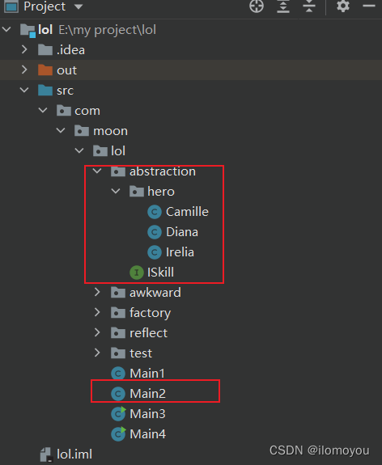

Main2.java

选择英雄释放技能 main 函数

```java
package com.moon.lol;

import com.moon.lol.abstraction.ISkill;
import com.moon.lol.abstraction.hero.Camille;
import com.moon.lol.abstraction.hero.Diana;
import com.moon.lol.abstraction.hero.Irelia;

import java.util.Scanner;

public class Main2 {

    /**
     * 第二版：interface抽象风格
     * 单纯interface可以统一方法的调用，但是它不能统一对象的实例化
     */
    public static void main(String[] args) throws Exception {
        String name = Main2.getPlayerInput();
        ISkill iSkill;
        switch (name) {
            case "Diana":
                iSkill = new Diana();
                break;
            case "Irelia":
                iSkill = new Irelia();
                break;
            case "Camille":
                iSkill = new Camille();
                break;
            default:
                throw new Exception();
        }
        iSkill.r();
    }

    /**
     * 接收玩家的输入（玩家输入英雄名字）
     * @return
     */
    private static String getPlayerInput() {
        System.out.println("Enter a Hero's Name");
        Scanner scanner = new Scanner(System.in);
        return scanner.nextLine();
    }
}

```

英雄技能接口类

ISkill.java

```java
package com.moon.lol.abstraction;

/**
 * 技能接口 Q W E R
 */
public interface ISkill {
    /**
     * 技能 Q
     */
    void q();

    /**
     * 技能 W
     */
    void w();

    /**
     * 技能 E
     */
    void e();

    /**
     * 技能 R
     */
    void r();
}

```

各英雄类

```java
package com.moon.lol.abstraction.hero;

import com.moon.lol.abstraction.ISkill;

/**
 * 戴安娜
 */
public class Diana implements ISkill {
    /**
     * 技能 Q
     */
    public void q() {
        System.out.println("Diana Q");
    }

    /**
     * 技能 W
     */
    public void w() {
        System.out.println("Diana W");
    }

    /**
     * 技能 E
     */
    public void e() {
        System.out.println("Diana E");
    }

    /**
     * 技能 R
     */
    public void r() {
        System.out.println("Diana R");
    }
}

```

```java
package com.moon.lol.abstraction.hero;

import com.moon.lol.abstraction.ISkill;

/**
 * 艾瑞莉娅（刀妹）
 */
public class Irelia implements ISkill {
    /**
     * 技能 Q
     */
    public void q() {
        System.out.println("Irelia Q");
    }

    /**
     * 技能 W
     */
    public void w() {
        System.out.println("Irelia W");
    }

    /**
     * 技能 E
     */
    public void e() {
        System.out.println("Irelia E");
    }

    /**
     * 技能 R
     */
    public void r() {
        System.out.println("Irelia R");
    }
}

```

```java
package com.moon.lol.abstraction.hero;

import com.moon.lol.abstraction.ISkill;

/**
 * 艾瑞莉娅（刀妹）
 */
public class Irelia implements ISkill {
    /**
     * 技能 Q
     */
    public void q() {
        System.out.println("Irelia Q");
    }

    /**
     * 技能 W
     */
    public void w() {
        System.out.println("Irelia W");
    }

    /**
     * 技能 E
     */
    public void e() {
        System.out.println("Irelia E");
    }

    /**
     * 技能 R
     */
    public void r() {
        System.out.println("Irelia R");
    }
}

```

**评价：** 这版代码将方法进行抽象，统一管理，但不能统一对象的实例化，如果有新的类，那就得在switch里新加new代码，这样会修改之前的主体代码

方法统一的意义在哪？

1、某方法被大量调用时很繁琐，方法统一后一行代码搞定；

2、事项功能的单一性，便于后面的提取封装。

### 第三版：工厂模式：分离对象实例化


Main3.java

选择英雄释放技能 main 函数

```java
package com.moon.lol;

import com.moon.lol.factory.HeroFactory;
import com.moon.lol.factory.ISkill;

import java.util.Scanner;

public class Main3 {
    /**
     * 第三版：工厂模式分离对象实例化
     * 把对象实例化的过程，转移到其他的代码片段里
     */
    public static void main(String[] args) throws Exception {
        String name = Main3.getPlayerInput();
        ISkill iSkill = HeroFactory.getHero(name);
        iSkill.r();
    }

    /**
     * 接收玩家的输入（玩家输入英雄名字）
     * @return
     */
    private static String getPlayerInput() {
        System.out.println("Enter a Hero's Name");
        Scanner scanner = new Scanner(System.in);
        return scanner.nextLine();
    }
}

```

HeroFactory.java

生产英雄的工厂类

```java
package com.moon.lol.factory;

import com.moon.lol.factory.hero.Camille;
import com.moon.lol.factory.hero.Diana;
import com.moon.lol.factory.hero.Irelia;

/**
 * 简单工厂模式
 * 生产或实例化英雄类，把对象实例化的过程隔离
 */
public class HeroFactory {
    public static ISkill getHero(String name) throws Exception {
        ISkill iSkill;
        switch (name) {
            case "Diana":
                iSkill = new Diana();
                break;
            case "Irelia":
                iSkill = new Irelia();
                break;
            case "Camille":
                iSkill = new Camille();
                break;
            default:
                throw new Exception();
        }
        return iSkill;
    }
}

```

ISkill 接口、Diana、Irelia、Camille 类与第二版基本相同

**评价：** 基本上实现了方法和对象实例化的统一

### 第四版：反射

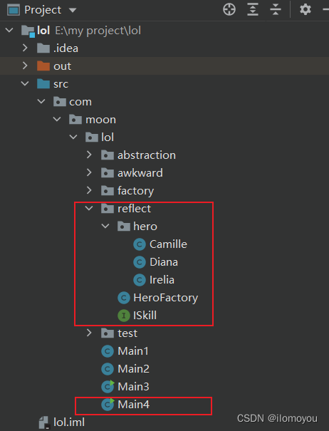

HeroFactory.java

英雄工厂类

```java
package com.moon.lol.reflect;

/**
 * 简单工厂模式
 */
public class HeroFactory {
    /**
     * 第四版：通过反射机制消除所有的变化
     * 正向思维：工厂模式 + 反射并不是 IOC 和 DI
     */
    public static ISkill getHero(String name) throws Exception {
        // 元类、反射
        // 对象 类 元类
        String classStr = "com.moon.lol.reflect.hero." + name;
        Class<?> cla = Class.forName(classStr);
        Object obj = cla.newInstance();
        return (ISkill) obj;
    }
}

```

Main 类与第三版基本相同

ISkill 接口、Diana、Irelia、Camille 类与第二版基本相同

**评价：** 这一版每一次调用都需要重新反射生成对象，性能不好；而spring是可以把生成的对象加到缓存里面，就不再重复生成；

IOC就是利用反射实现的，但反射+工厂模式不是IOC和DI

**上面四版代码的总结**

* 单纯 interface 可以统一方法的调用，但是它不能统一对象的实例化

* 面向对象主要做两件事情：实例化对象 调用方法（完成业务逻辑）

* 只有一段代码中没有 new 的出现，才能保持代码的相对稳定，才能逐步实现 OCP

* 上面的这句话只是表象，实质是一段代码如果要保持稳定，就不应该负责对象的实例化

* 对象实例化是不可能消除的

* 把对象实例化的过程，转移到其他的代码片段里

* 代码中总是会存在不稳定，隔离这些不稳定，保证其他的代码是稳定的

* 变化造成了不稳定

* 配置文件属于系统外部的，可以理解为用户的输入，变化是无法消除的，所以把变化放到配置文件里

**问题**

上面第四版已经实现开闭原则了，但还是有缺点，需要调用HeroFactory的方法，那有没有一种机制，可以不需要调用HeroFactory创建iSkill，只要文件里引入iSkill就可以直接使用

现在就可以该最佳解决方法出现了：IOC和DI

在IOC和DI出现前很长一段时间，我们都是用工厂模式实现的开闭原则

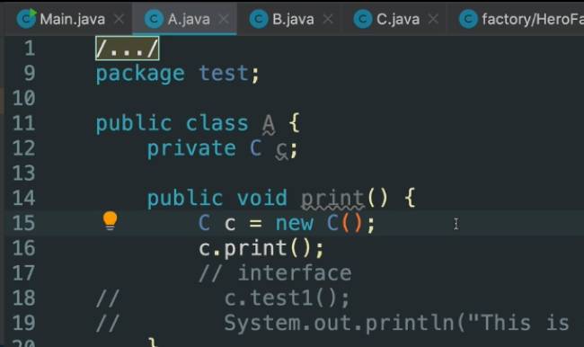

这种写法最大的问题就是类与类之间的依赖性高，当类A使用类C中的方法，必须在类A中new 类C，如果new 类C的地方出现变化，那需要更改的地方太多

现在就有一个方法：代码里面不使用new生成对象，有一个容器将C这个对象给我们使用

对比：以前是我们自己new一个类生成对象，现在是容器直接给我们这个对象

### IOC和DI

IOC：控制反转

DI：依赖注入

**从DI的角度理解IOC：**

此处有两个类 A 与 B ，A类要使用B类的中的方法，则在A中实例化B，而后调用B中方法，依赖程度高，后期修改部分多。

将B抽象成一个接口，A只调用接口中的方法，B实现接口的方法。在A中对接口初始化，但是本质上也是对B类的初始化，不稳定。

因此A将控制B的权利转移给另外一个容器，容器将接口实例化后注入到A中，实例化的接口(即继承接口的类)可以是B，也可以是其他类，容器起到资源调配的作用。

A只关心接口中的方法，至于实例化的是哪一个类，A并不关心，只要接口方法不变，A调用的方法就不变，从而保持A中的代码稳定，降低A对B的依赖。

这体现了IOC 

**IOC反转的是控制权的反转**

程序员负责实现各种类，但如何使用，就交给用户（指产品经理或者项目负责人，决定用什么数据库）

以数据库为例，现在有mysql、oragle、mogodb三种数据库

程序员把这三种数据库需要的类都写好，但用哪个数据库的控制权交给用户

**IOC的具体意义**

IOC的具体意义： 有个容器，在需要的时候把容器中的对象加入代码中去

关键：容器，加入容器，注入

抽象：将控制权交给用户

目的：

1.实现灵活的ocp

2.将控制权交给用户

SpringBoot最核心的线路就是**如何把对象加入到容器中**，把握住这条线路，可以很好的学习SpringBoot

## 为什么引入容器后系统变的稳定？

因为它们每个类之间没有了依赖

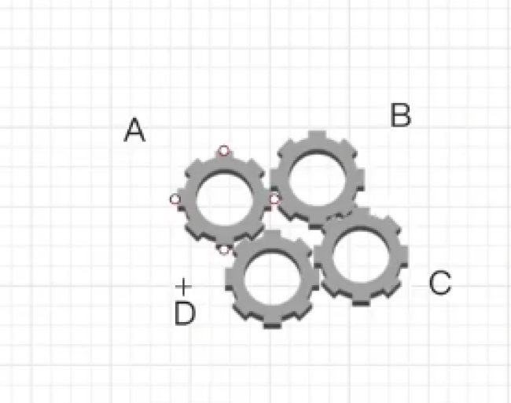

A、B、C、D可以看做是四个类，耦合在一起，当其中一个出现问题，整个系统就不能使用，现在引入容器的概念

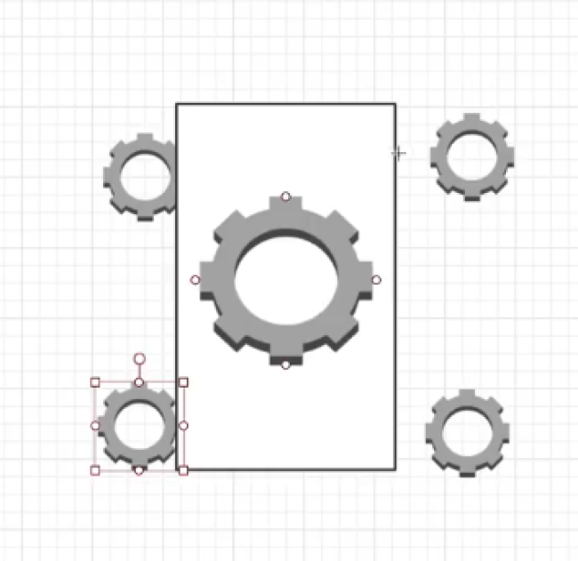

中间这个就是容器，四个类没有依赖，通过容器将它们带动起来，好处是如果A、B、C、D出现了变化，不会影响其他类，整个系统变成了松耦合

## Spring IOC的核心机制：实例化与注入

Spring 把对象加入到容器有俩种方法：XML和注解，有了SpringBoot后，最流行的就是注解了

最常用的是@Component，在SpringBoot中，当类上加上@Component，这个类就会被SpringBoot扫描后加入到容器里，在需要的时候注入到其他类中

### 常用注解

一、@Component 组件/类/bean 类的实例化

二、与@Component 作用相同

@Service          类如果是服务使用

@Controller     类如果是控制器使用

@Repository      用于标识一个类为数据访问层（dao）组件，通常与持久操作相关的类一起使用

下面的例子是用在[mapper](https://github.com/zhaobao1830/misscmszb)上

```java
@Repository
public interface FileMapper extends BaseMapper<FileDo> {
    FileDo selectByMd5(@Param("md5") String md5);
}
```

::: tip 备注
我做过测试，如果在启动来Application.java中使用@MapperScan注解，对mapper文件夹进行扫描了，@Repository注解加不加都不影响
:::

三、@Configuration：把一组bean加入到容器

从Spring3.0，@Configuration用于定义**配置类**，可替换xml配置文件，被注解的类内部包含有一个或 多个 被@Bean注解的方法，这些方法将会被AnnotationConfigApplicationContext或AnnotationConfigWebApplicationContext类进行扫描，并用于构建bean定义，初始化Spring容器。

**注意**：@Configuration注解的配置类有如下要求：

@Configuration不可以是final类型；

@Configuration不可以是匿名类；

嵌套的configuration必须是静态类。

@Configuration除了常用语配置类，还可以和@bean搭配，将@bean加入到容器里

## 实例化和依赖注入时机与延迟实例化

在Spring Boot应用启动的时候，IOC容器就已经开始对象的实例化了，它还会把实例化好的对象注入到我们的代码片段里面

如果类上没有加@Component注解，类就不会加入到容器中，默认情况下，如果在其他类里通过@Autowired注入类就会报错

可以通过设置@Autowired(required = false)来解决这个错误

**备注：** 这时注入（也就是启动的时候）不会报错，但执行方法的时候会报错，因为这个值是空的

IOC默认是立即执行对象实例化和注入

如果想**延迟实例化**就用@Lazy注解

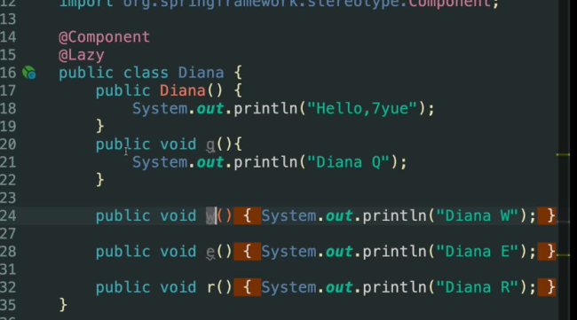

**备注：** 现在有俩个类A和B，如果类A中使用了类B，类B上加了@lazy，这时是不起作用的，因为类A是立即执行

如果想类B中的@lazy有效，就需要在类A上也加@lazy

## DI注入的三种方式

**成员变量注入：** 我项目中最常用的是这种

@Autowired

private Diana diana

**构造注入：**

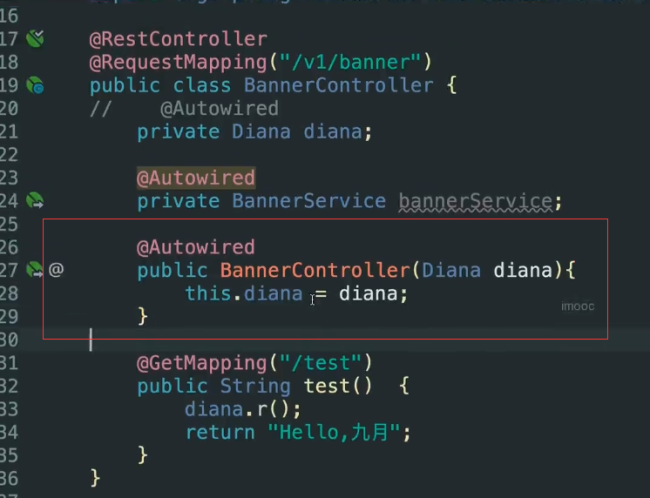

上面定义变量，下面通过构造方法注入并赋值

变量上不用加@Autowired

**方法注入：**


通过set方法给变量赋值

## @Autowired

@Autowired注入的两种方式

bytype 是默认注入方式

byname 多个接口实现类，通过byname方式注入，如果还用bytype会报错

比如现在有个接口ISkill，有irelia和diana俩个实现类

如果是

```java
@Autowired

private ISkill irelia // 这是注入的irelia对象

private ISkill diana // 这是注入的diana对象
```

这俩种写法是对的，SpringBoot通过名字注入不同的实现类的对象

```java
@Autowired

private ISkill iskill
```

这种写法是错误的，因为SpringBoot中的@Autowired默认是bytype注入方式，当ISkill 有俩个实现类时，不知道该注入哪个实现类

如果ISkill 只有一个实现类 那上面的写法是对的

### bytype

是Autowired注解的默认注入方式；可能会有以下几个情况：

* 找不到任何一个bean，直接报错；

* 找到一个，直接注入；

* 找到多个，并不一定会报错，后续spring还会有一个自动推断的行为，它会根据定义的变量名来寻找对应实现类；按照字段的名字推断选择哪个bean; byname

### byname

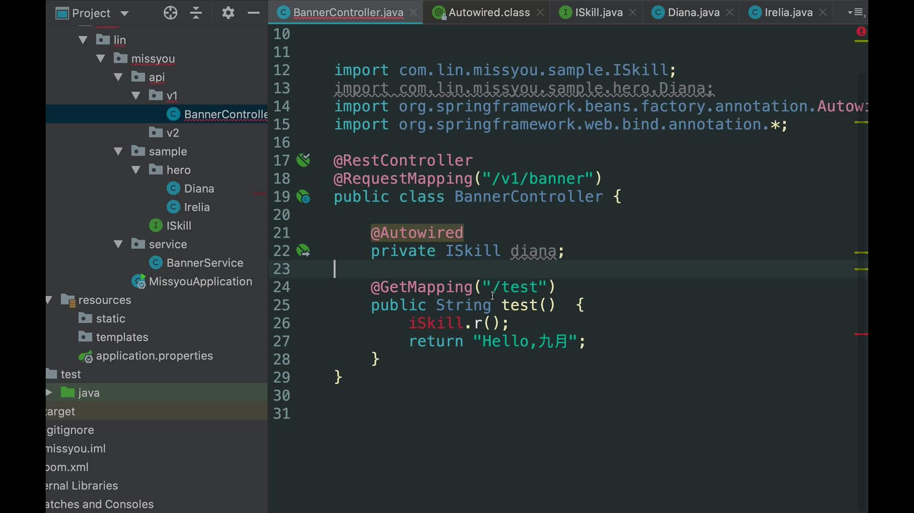

### @Qualifier

上面的写法都是Spring自动推导的

@Qualifier注解可以由我们主动指定选择哪个实现类；

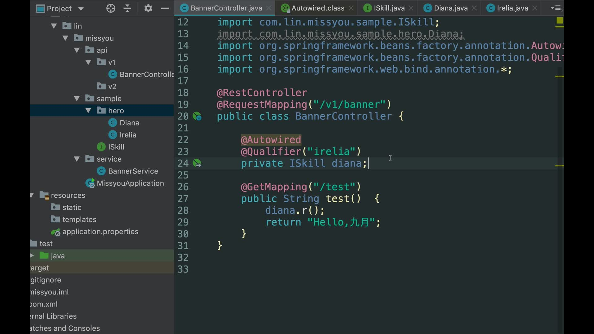

## 面向对象变化中的应对方案

* 策略模式：制定一个interface，然后用多个类实现这个interface

* 属性配置：将变化的地方抽取到配置文件里

一、配置文件具有集中性

二、配置文件清晰，没有业务逻辑干扰

::: tip 备注
实际开发中，我们会把上面的俩种方法集合起来用

将方法抽取为公共接口

将经常改变的放到配置文件里，比如数据库、JPA、redis等配置放到配置文件里
:::

## @Configuration

使用@Configuration和@bean搭配，可以把一个bean放到容器中

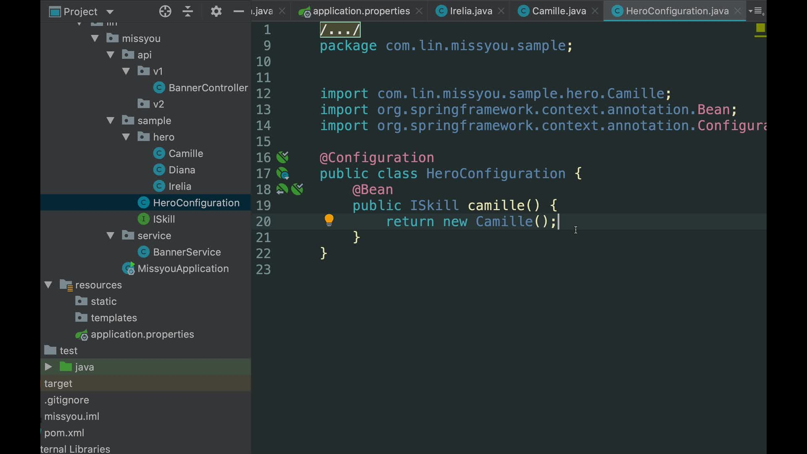

**已经有了@Component，为什么还会出现@Configuration呢？**

为了解决变化，单独的@Component是没有意义的，无法解决变化

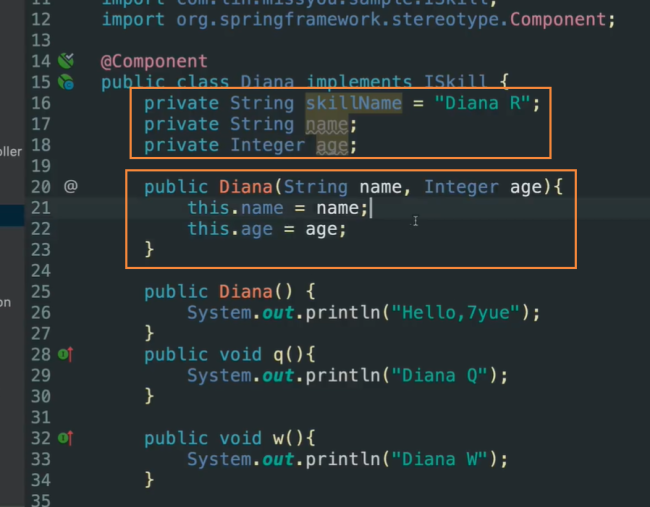

在一个类中，除了有方法，还有变量，如果我们要想给变量赋值，可以使用set方法或者构造函数

上面的例子里只加了@Component注解，只会将类加到容器汇总，无法给变量赋值，但我们用Configuration和@bean搭配，就可以通过调用构造函数给遍历赋值

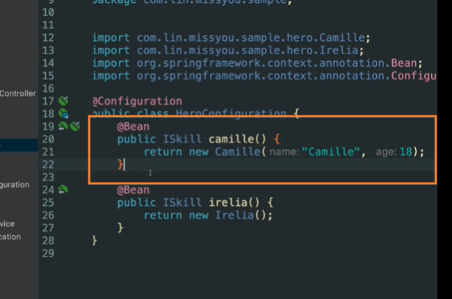

**@Configuration是用来替换bean的xml配置**

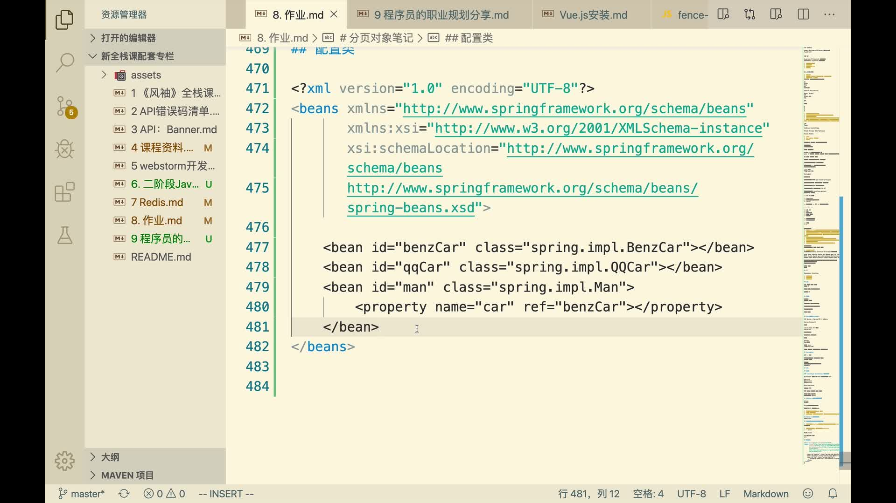

xml的这种配置，现在可以用简单的@Configuration+@bean替换

**为什么spring偏爱配置**

OCP是为了解决代码变化，但是代码变化不能消除，只能进行隔离/反映到配置文件。（修改配置，而不是修改代码）

### 配置的分类

xml配置和application文件里的key、value配置

下面使用的是@Configuration+application文件的实现方案

获取配置文件中的值 @Value("${key}"): key为properties配置文件中的key

```java
@Configuration
public class DatabaseConfiguration {
    @value("${mysql.ip}")
    private String ip;
    @value("${mysql.port}")
    private Integer port;
    
    @Bean
    public IConnect mysql() {
        return new Mysql(this.ip, this.port);
    }
}

public class Mysql implements IConnect {
    private String ip;
    private Integer port;
    
    public Mysql(String ip, Integer port) {
        this.ip = ip;
        this.port = port;
    }
    
    @Override
    public void connect() {
        // xxx
    }
}

// application.properties
mysql.ip="127.0.0.1"
mysql.port=3307
```

## 为什么在bean上添加@Component注解，这个bean就会加到容器中呢？

为什么在bean上添加@Component注解，这个bean就会加到容器中呢？

注解的基本原理是通过反射机制来实现的，通过反射是可以读取到这个注解的信息的

spring通过@ComponentScan这个注解进行扫描，默认加在入口文件上，扫描入口同级和同级包子级

当扫描到bean上有@Component注解，就把这个bean注入到IOC容器中

如果想指定扫描包的位置，可以在@ComponentScan('包的位置'')里添加包，比如@ComponentScan('com.zb')

@ComponentScan指定扫描包的类后，之前默认的还是存在

@ComponentScan('com.zb')中的'com.zb'是给basePackages参数传值，值可以是数组

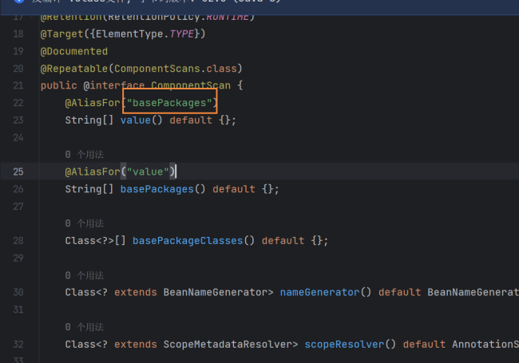

## 对spring-boot的自动装配理解

**自动装配是spring-boot最核心的功能**

**自动装配解决的了什么问题？**

把配置的bean（包括自己写的和第三方的sdk）自动加入到IOC容器中。在没有自动配置的时候，我们是用xml进行配置，然后加入到IOC容器

**原理理解：**

SpringBoot的主配置类：

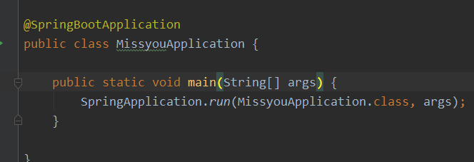

里面有一个main方法运行了一个run()方法，在run方法中要传入一个被@SpringBootApplication注解的类的元类。

### @SpringBootApplication注解

SpringBoot应用中，这个注解标注在哪个类。就说明这个类是SpringBoot的主配置类，SpringBoot就会运行这个类的main方法来启动SpringBoot项目。

那@SpringBootApplication注解到底是什么呢，点进去看看：

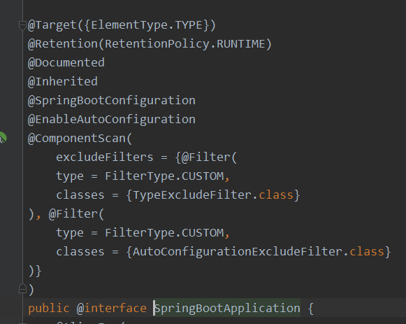

发现@SpringBootApplication是一个组合注解。

### @SpringBootConfiguration注解

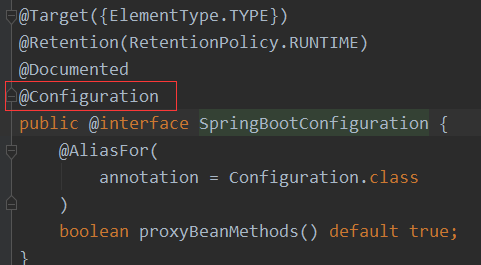

这个注解很简单，表明该类是一个Spring的配置类。

**@Configuration注解**

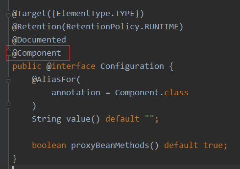

说明Spring的配置类也是Spring的一个bean

**@Configuration**主要做俩件事：

一是使用了@Configuration的bean，部分属性是写在配置文件里的，允许从配置文件里修改bean相关字段的属性，比如端口、ip这些属性，在配置文件里写，通过@value注解赋值给bean中的字段；

二是将这些bean加到IOC容器里

### @EnableAutoConfiguration注解

这个注解是为了实现**模块装配**

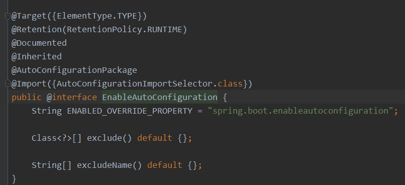

::: tip 备注
模块装配，就是为了实现某个功能，我们将不同的sdk放到一起，比如有功能需要用到redis、mogodb，组合成一个模块，使用@EnableAutoConfiguration可以把这个模块加入到容器里
:::

**已经有了@Confirguration，为什么还要@EnableAutoConfiguration?**

使用@Confirguration，处理的是自己写的业务类，是放在当前的工程下面，这个注解包含@Component注解，我们知道，在启动文件同级或子级包下，带有@Component注解的bean都是可以直接被加入到IOC容器中的

@EnableAutoConfiguration是为了加载引用的jar包或者第三方sdk（包括jar包和spring.factories里的配置文件）

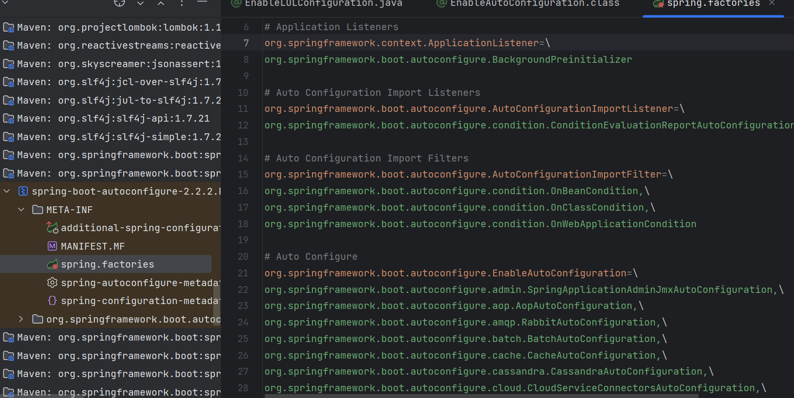

**@AutoConfigurationPackage**

作用是将**添加该注解的类所在的package**作为**自动配置package**进行管理。

可以通过 AutoConfigurationPackages 工具类获取自动配置package列表。当通过注解@SpringBootApplication标注启动类时，已经为启动类添加了@AutoConfigurationPackage注解。路径为 @SpringBootApplication -> @EnableAutoConfiguration -> @AutoConfigurationPackage。也就是说当SpringBoot应用启动时默认会将启动类所在的package作为自动配置的package。

进入AutoConfigurationImportSelector.class

这里有一个最重要的方法：selectImports  这个方法就是用来扫描第三方sdk的配置文件（类似vue里的插件），然后把配置文件里的配置类加入到IOC容器

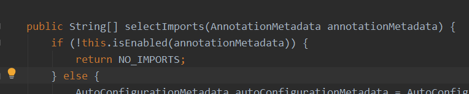

**@Import注解**

一，@Import（配置类.class）

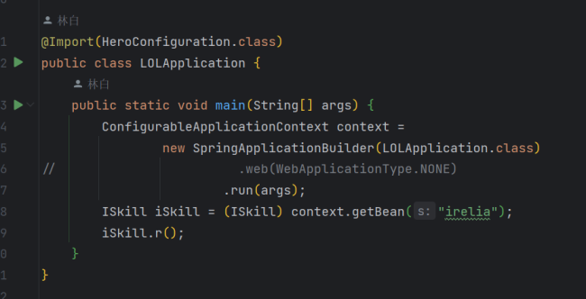

二，设置一个ImportSelector接口的实现类，实现ImportSelects方法，返回配置类全类名；

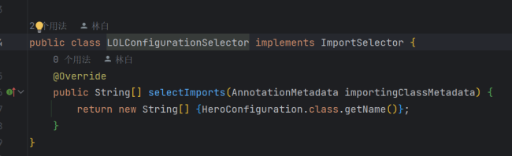

返回的是一个数组，可以一次导入多个bean的元类

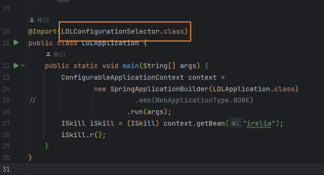

@Import（XXXXSelector.class）

总结：@Import可以直接将配置类导入到容器里，也可以通过ImportSelector接口的实现类将配置类导入到容器里

## SPI：Service Provider Interface 

主要目的：应对变化

多方：调用方 标准服务接口 对应多种方案（a,b,c）

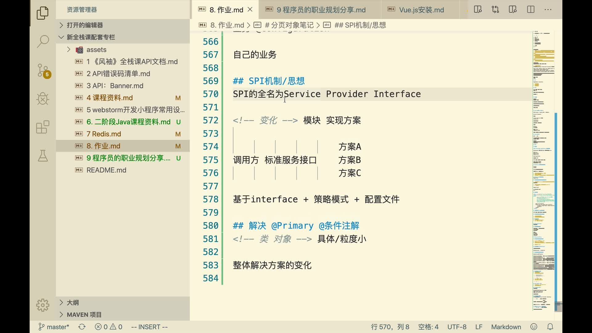

思想就是通过interface和策略模式，写出稳定的代码，对外暴露是标准的接口

把变化放到配置文件里，通过修改配置文件是执行不同的方案

**配置文件和@Primary、@条件注解的区别？**

@Primary、@条件注解关注的是类、对象

配置文件关注的整体的方案，二者的粒度不一样

## SpringBoot主动发现机制

为什么SpringBoot不用在程序开始的时候注册controller，但程序就知道应该走哪一个controller？

为什么我们在SpringBoot项目里写的全局异常类，程序会自己识别呢？

这都是因为SpringBoot的主动发现机制：

* 特定的注解发现，SpringBoot在扫描到这些特定的注解时候，就知道这个类的作用，当符合条件时候就回去调用这个类。比如全局异常处理器上的注解@ControllerAdvice

* 使用接口发现，当类实现WebMvcRegistrations接口的时候SpringBoot就知道这个类的作用。注意这个类需要加入到容器中，即加上@Component注解，下面的实例加的是@Configuation注解

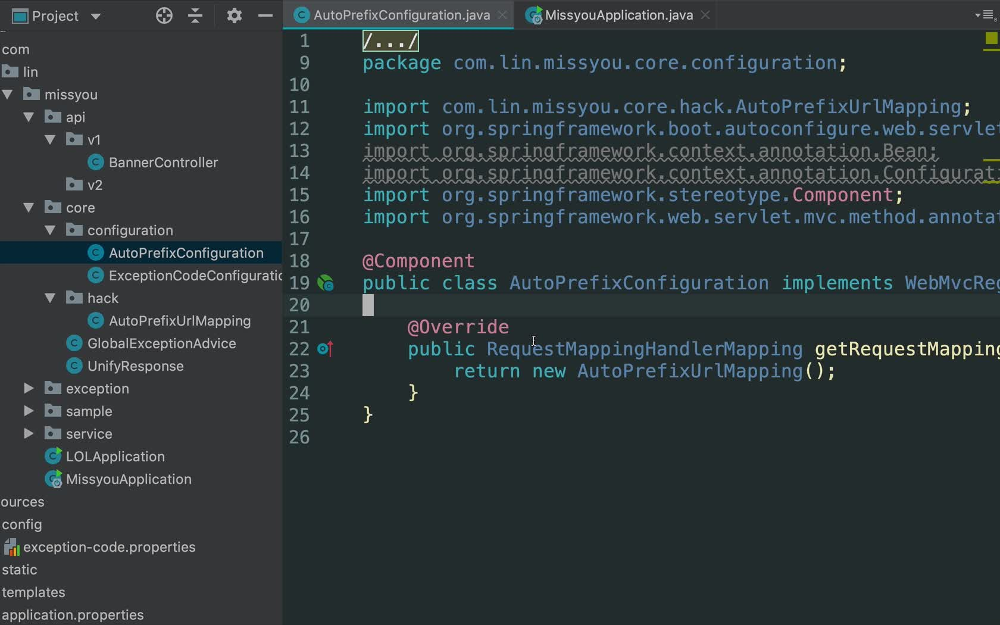

## @ResponseEntity注解

ResponseEntity继承了HttpEntity，可以添加HttpStatus状态码的HttpEntity的扩展类

ResponseEntity可以定义返回的HttpStatus（状态码）和HttpHeaders（消息头：请求头和响应头）

ResponseEntity的优先级高于@ResponseBody。在不是ResponseEntity的情况下才去检查有没有@ResponseBody注解。如果响应类型是ResponseEntity可以不写@ResponseBody注解，写了也没有关系。简单的说

@ResponseBody可以直接返回Json结果，

@ResponseEntity不仅可以返回json结果，还可以定义返回的HttpHeaders和HttpStatus

```java
public ResponseEntity<List<Category>> queryCategoriesByPid(@RequestParam(value = "pid",defaultValue = "0") Long pid){
        if(pid == null || pid.longValue()<0){
            // 响应400，相当于ResponseEntity.status(HttpStatus.BAD_REQUEST).build();
            return ResponseEntity.badRequest().build();

        }
        //ResponseEntity.status(HttpStatus.NOT_FOUND).body(null);
       // ResponseEntity.notFound().build();
        // ResponseEntity.ok(null);

        List<Category> categoryList = this.categoryService.queryCategoriesByPid(pid);
        if(CollectionUtils.isEmpty(categoryList)){
            // 响应404
            return ResponseEntity.notFound().build();
        }
        return ResponseEntity.ok(categoryList);
    }

```

## 分类查询功能的实现

常用的分级处理是记录上级的id，通过parent-id查询，如果是层级低的，4级以下，这种是可以的

但如果层级多，推荐用路径表示法，新增一个字段，值是每级的id或者其他属性拼装起来

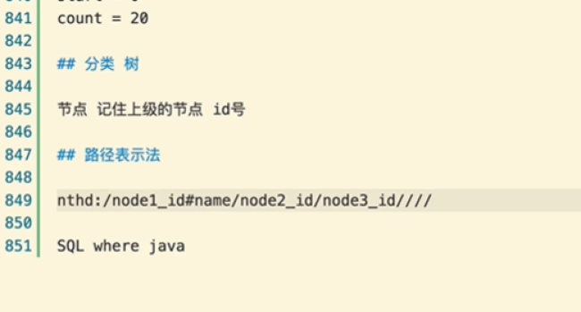

## java bean里可不可以写业务逻辑？

java bean就是定义的model、vo这些类

大部分文章里不建议写，但我认为java bean是实体类，肯定有自己的逻辑，可以根据实际需求，把一些逻辑携带java bean里
