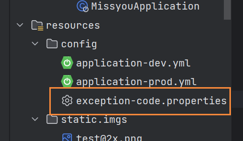
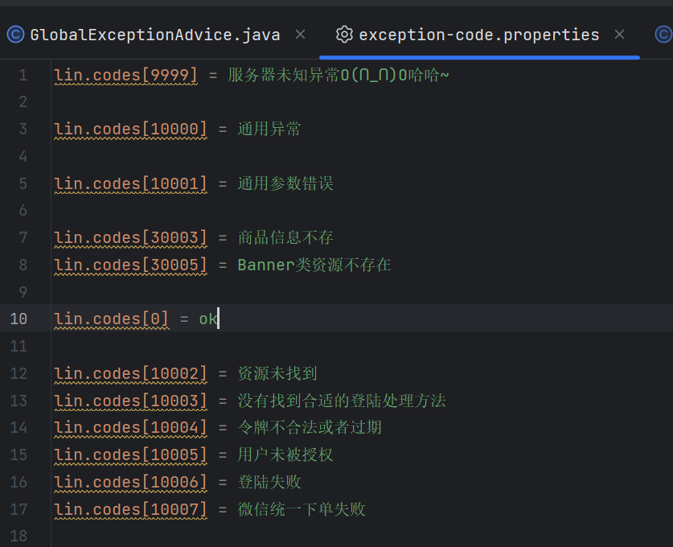

# 异常深度剖析

项目参考地址：https://github.com/zhaobao1830/misszb

## 分类

异常分类Throwable分为Error与Exception

Error:一般系统级别，我们无法处理

Exception：一般应用层面，我们可以处理      

Exception分为：CheckException与RuntimeException 

CheckException：必须处理，如果不处理，在编译阶段就会报错

处理异常的时候，可以在当前位置进行处理，比如记录日志；也可以通过throws Exception往外抛异常，但总有一个地方要对异常进行处理

RuntimeException：运行时异常，不一定能在编译阶段发现，也不要求强制进行处理

::: tip 备注
只要没有继承RuntimeException，那就是CheckException

如果异常在编译阶段就要处理，那就定义成CheckException
:::

## 全局异常处理

GlobalExceptionAdvice.java

```java
package com.zb.misszb.core;

import com.zb.misszb.exception.http.HttpException;
import org.springframework.http.HttpStatus;
import org.springframework.web.bind.annotation.ControllerAdvice;
import org.springframework.web.bind.annotation.ExceptionHandler;
import org.springframework.web.bind.annotation.ResponseBody;
import org.springframework.web.bind.annotation.ResponseStatus;

import javax.servlet.http.HttpServletRequest;

@ControllerAdvice
public class GlobalExceptionAdvice {

    @ExceptionHandler(Exception.class)
    @ResponseBody
    @ResponseStatus(code = HttpStatus.INTERNAL_SERVER_ERROR)
    public UnifyResponse handleException(HttpServletRequest req, Exception e) {
        String requestUrl = req.getRequestURI();
        String method = req.getMethod();
        UnifyResponse message = new UnifyResponse(9999, "服务器异常", method + " "+ requestUrl);
        return message;
    }

    @ExceptionHandler(HttpException.class)
    public void handleHttpException(HttpServletRequest req, Exception e) {
        System.out.println("系统出现错误！");
    }
}

```

### @ControllerAdvice、@ExceptionHandler、@ResponseStatus

@ControllerAdvice用来注册全局异常类

@ExceptionHandler用来在方法上指定监听哪种异常，比如@ExceptionHandler(HttpException.class)，监听的就是HttpException异常，

只要请求的方法里报HttpException类以及子类的异常，就会被这个方法捕获

使用@ResponseStatus注解指定返回的错误码，比如系统错误，就返回500，不要统一都是200

### 为什么要把接口返回的信息都变成异常来处理？

有的项目里，会把返回信息（比如没有找到、查询数据为空等信息）和异常分开处理，缺点是：需要区分什么是异常，什么是正常的返回信息

还有处理方式，就是所有的返回都按异常处理，已知异常就返回message信息和code码，未知异常除了返回信息，还会将错误保存在日志文件里

## 配置文件

在开发项目中，建议将异常信息按照不同的业务单独放到不同的配置文件.properties中；通过类来获取配置文件里的信息

### 为什么推荐把异常信息写在配置文件？

一、异常信息散落在不同的代码文件里，不好管理

二、不好进行国际化处理，国际化针对的就是文本信息中的不同语言

### 使用类来获取配置文件里的信息

ExceptionCodeConfiguration.java

```java
package com.lin.missyou.core.configuration;

import org.springframework.boot.context.properties.ConfigurationProperties;
import org.springframework.context.annotation.PropertySource;
import org.springframework.stereotype.Component;

import java.util.HashMap;
import java.util.Map;


@ConfigurationProperties(prefix = "lin")
@PropertySource(value = "classpath:config/exception-code.properties")
@Component
public class ExceptionCodeConfiguration {

    private Map<Integer, String> codes = new HashMap<>();

    public Map<Integer, String> getCodes() {
        return codes;
    }

    public void setCodes(Map<Integer, String> codes) {
        this.codes = codes;
    }


    public String getMessage(int code){
        String message = codes.get(code);
        return message;
    }
}

```

使用

```java
@Autowired
private ExceptionCodeConfiguration codeConfiguration;

codeConfiguration.getMessage(code);
```

**说明：**

一、使用@PropertySource注解将类和配置文件关联起来

```java
@PropertySource(value = "classpath:config/exception-code.properties")
```



传入的参数是配置文件exception-code.properties所在的目录



这样就可以把类和配置文件关联起来，当传入自定义的codes值，会返回对应的文字

比如传入10000，就会返回通用异常

二、使用@ConfigurationProperties定义前缀

```
lin.codes[10000] = 通用异常

@ConfigurationProperties(prefix = "lin")
```

配置文件里，codes前面的前缀是lin，在获取配置信息的类上要加注解@ConfigurationProperties(prefix = "lin")

第三、配置文件里的信息不用加引号

```
lin.codes[10000] = 通用异常
```

通用异常不用加引号，不然会报错

