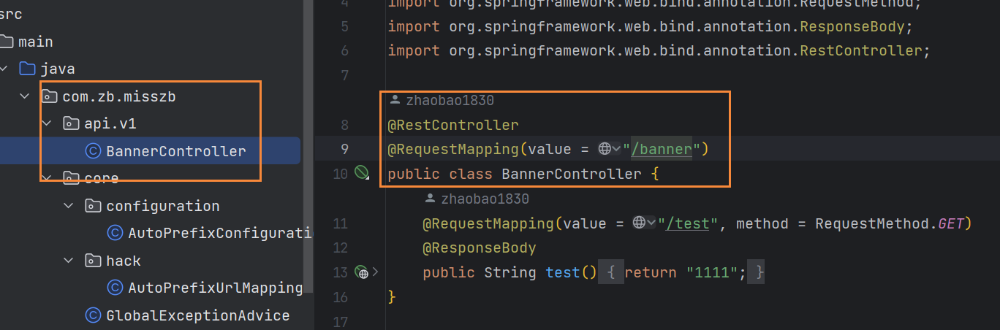

# 根据目录结构自动生成路由前缀



**问题：BannerController类在com.zb.misszb.api.v1目录下，如何只需要在BannerController的RequestMapping里配置/banner就行，v1前缀
自动加上呢？**

解决办法：配置自动路由前缀

一、在application.yml配置文件里添加controller所在的完整路径

application.yml

```yml
misszb:
  api-package: com.zb.misszb.api
```

二、新建AutoPrefixUrlMapping.java文件，重新生成新的RequestMapping

```java
package com.zb.misszb.core.hack;

import org.springframework.beans.factory.annotation.Value;
import org.springframework.web.servlet.mvc.method.RequestMappingInfo;
import org.springframework.web.servlet.mvc.method.annotation.RequestMappingHandlerMapping;

import java.lang.reflect.Method;

public class AutoPrefixUrlMapping extends RequestMappingHandlerMapping {


    @Value("${misszb.api-package}")
    private String apiPackagePath;

    @Override
    protected RequestMappingInfo getMappingForMethod(Method method, Class<?> handlerType) {
        RequestMappingInfo mappingInfo = super.getMappingForMethod(method, handlerType);
        // mappingInfo就是controller和里面的方法
        if(mappingInfo != null){
            // 生成前缀
            String prefix = this.getPrefix(handlerType);
            // 将前缀和controller里的RequestMapping合并
            // SpringBoot 2.2.2版本用这个
            // return RequestMappingInfo.paths(prefix).build().combine(mappingInfo);
            // SpringBoot 2.7.12版本用这个
            return RequestMappingInfo.paths(prefix).options(super.getBuilderConfiguration()).build().combine(mappingInfo);
        }
        return mappingInfo;
    }

    private String getPrefix(Class<?> handlerType){
        // packageName为com.zb.misszb.api.v1
        String packageName = handlerType.getPackage().getName();
        // 对packageName进行处理，将com.zb.misszb.api去掉
        String dotPath = packageName.replaceAll(this.apiPackagePath, "");
        // 返回/v1
        return dotPath.replace(".", "/");
    }
}

```

第三步、新建AutoPrefixConfiguration配置类，将上面新建的AutoPrefixUrlMapping类加入到容器里，并让SpringBoot可以扫码到

```java
package com.zb.misszb.core.configuration;

import com.zb.misszb.core.hack.AutoPrefixUrlMapping;
import org.springframework.boot.autoconfigure.web.servlet.WebMvcRegistrations;
import org.springframework.context.annotation.Configuration;
import org.springframework.web.servlet.mvc.method.annotation.RequestMappingHandlerMapping;

@Configuration
public class AutoPrefixConfiguration implements WebMvcRegistrations{

    @Override
    public RequestMappingHandlerMapping getRequestMappingHandlerMapping() {
        return new AutoPrefixUrlMapping();
    }
}
```

::: tip 备注
需要实现WebMvcRegistrations接口，重写getRequestMappingHandlerMapping方法
:::

项目里加上上面的文件后，只要controller文件在com.zb.misszb.api里，不管嵌套几层，都会自动加上前缀
