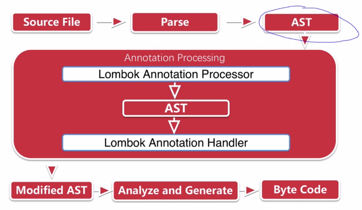

# lombok

## 官网

[https://projectlombok.org/](https://projectlombok.org/)

## 目的

通过简单注解来精简代码

## 优点

* 1、提高编码效率

* 2、使代码更简洁

* 3、消除冗长代码

* 4、避免修改字段的时候忘记修改方法名

## 缺点

1、使用lombok虽然能够省去手动创建setter和getter方法等繁琐，但缺降低了源代码文件的可读性和完整性，降低了阅读源代码的舒适度

## 原理

* 1、JSR 269  Pluggable Annotation Processing Api

* 2、javac从java6开始支持" JSR 269 API" 规范

* 3、只要程序实现了该API，就能在javac运行的时候得到调用

* 4、Lombok实现了" JSR 269 API" ，在编译时，javac编译源码的具体流程如下：



首先有源代码(Source File)，javac对源代码进行处理，生成一颗抽象语法树（AST），lombok对AST进行处理，生成新的抽象语法树，然后生成字节码

## 项目引入

maven引入Lombok：

1、pom.xml文件引入：     

```xml
		<dependency>
			<groupId>org.projectlombok</groupId>
			<artifactId>lombok</artifactId>
			<optional>true</optional>
		</dependency>
```

2、idea在setting -> plugins 安装Lombok插件

## 常用注解

* @Getter 自定义的属性添加getter方法

* @Setter 自定义的属性添加setter方法

* @NoArgsConstructor 生成无参构造函数

* @AllArgsConstructor 生成全参构造函数

* @RequiredArgsConstructor 为所有@NonNull字段生成一个构造函数

* @NonNull 作用于属性，表明属性不能为空

* @Builder 可以使用链式调用，初始化对象

```java
@Builder
@NoArgsConstructor
@AllArgsConstructor
public class PersonDTO {
    private String name;
    private Integer age;
}


@RestController
@RequestMapping(value = "/banner")
public class BannerController {
    @RequestMapping(value = "/test/{id}", method = RequestMethod.GET)
    @ResponseBody
    public String test(@PathVariable Integer id, @RequestParam String name) {
        System.out.println(id);
        System.out.println(name);
        // 链式初始化对象
//        PersonDTO dto = PersonDTO.builder()
//                .age(25)
//                .name("ss")
//                .build();
        PersonDTO dto = new PersonDTO("ss", 25);
        return "1111";
    }
}
```

::: tip 备注
类上加了@Builder注解后，创建对象要这样写：
PersonDTO.builder().name("7yue").age(18).build();

1、一旦带上build注解，就不可以用new方式实例化，而且不可以用set、get去赋值、取值，原因是builder给了一个私有的构造函数

2、如果想既可以用链式创建对象，又想用new创建对象，就需要在类上加@NoArgsConstructor或@AllArgsConstructor注解
:::
