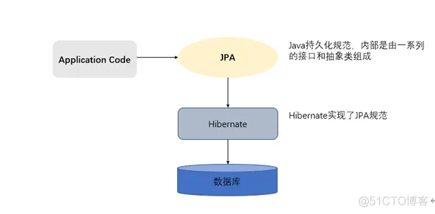

# JPA

项目地址：[https://github.com/zhaobao1830/misszb](https://github.com/zhaobao1830/misszb)

## 简介

JPA(Java Persistence API)意即Java持久化API，是Sun官方在JDK5.0后提出的Java持久化规范。主要是为了简化持久层开发以及整合ORM技术，结束Hibernate、TopLink、JDO等ORM框架各自为营的局面。JPA是在吸收现有ORM框架的基础上发展而来，易于使用，伸缩性强。

JPA的优势：标准化、容器级特性的支持、简单方便、查询能力、高级特性。

与Hibernate的关系：

JPA规范本质上就是一种ORM规范，注意不是ORM框架——因为JPA并未提供ORM实现，它只是制订了一些规范，提供了一些编程的API接口，但具体实现则由服务厂商来提供实现。JPA和Hibernate的关系就像JDBC和JDBC驱动的关系，JPA是规范，Hibernate除了作为ORM框架之外，它也是一种JPA实现。



## SpringBoot整合

### 依赖安装

访问的是mysql数据库

```xml
		<!-- https://mvnrepository.com/artifact/org.springframework.boot/spring-boot-starter-jdbc -->
		<dependency>
			<groupId>org.springframework.boot</groupId>
			<artifactId>spring-boot-starter-jdbc</artifactId>
		</dependency>

		<!-- https://mvnrepository.com/artifact/com.mysql/mysql-connector-j -->
		<dependency>
			<groupId>com.mysql</groupId>
			<artifactId>mysql-connector-j</artifactId>
			<version>8.0.32</version>
		</dependency>


		<!-- https://mvnrepository.com/artifact/org.springframework.boot/spring-boot-starter-data-jpa -->
		<dependency>
			<groupId>org.springframework.boot</groupId>
			<artifactId>spring-boot-starter-data-jpa</artifactId>
		</dependency>
```

### 配置文件

```yml
spring:
  datasource:
    url: 数据库路径
    username: 
    password: 
  jpa:
    properties:
      hibernate:
        # 查询的时候在控制台显示jpa生成的sql
        show_sql: true
        # 格式化控制台显示的sql
        format_sql: true
```

### 使用

以获取banner信息为例，展示如何使用JPA

一、定义实体类

Banner实体类

```java
package com.zb.misszb.model;

import lombok.Getter;
import lombok.Setter;

import javax.persistence.*;
import java.util.List;

@Entity
@Getter
@Setter
@Table(name = "banner")
public class Banner extends BaseEntity {
    @Id
    private Long id;
    private String name;
    private String description;
    private String title;
    private String img;

    @OneToMany(fetch = FetchType.LAZY)
    @JoinColumn(name = "bannerId")
    private List<BannerItem> items;
}
```

items字段，保存的是BannerItem表的信息

导航关系是一对多，通过@OneToMany(fetch = FetchType.LAZY)注解来定义

**fetch = FetchType.LAZY**：表示延迟加载

@JoinColumn(name = "bannerId")注解设置逻辑外键为bannerId

BannerItem实体类

```java
package com.zb.misszb.model;

import lombok.Getter;
import lombok.Setter;

import javax.persistence.*;

@Entity
@Getter
@Setter
@Table(name = "banner_item")
public class BannerItem extends BaseEntity {
    @Id
    private Long id;
    private String img;
    private String keyword;
    private short type;
    private String name;
    private Long bannerId;
}

```

二、定义Repository

```java
package com.zb.misszb.repository;

import com.zb.misszb.model.Banner;
import org.springframework.data.jpa.repository.JpaRepository;

public interface BannerRepository extends JpaRepository<Banner, Long> {
    Banner findOneById(Long id);

    Banner findOneByName(String name);
}
```

需要继承JpaRepository接口，泛型传入的值第一个是查询的实体类，第二个是实体类主键的类型

在这里定义操作数据库的方法

三、定义Service和ServiceImpl

BannerService

```java
package com.zb.misszb.service;

import com.zb.misszb.model.Banner;

public interface BannerService {
    Banner getBannerByName(String name);
}

```

BannerServiceImpl

```java
package com.zb.misszb.service.impl;

import com.zb.misszb.model.Banner;
import com.zb.misszb.repository.BannerRepository;
import com.zb.misszb.service.BannerService;
import org.springframework.beans.factory.annotation.Autowired;
import org.springframework.stereotype.Service;

@Service
public class BannerServiceImpl implements BannerService {
    @Autowired
    private BannerRepository bannerRepository;

    @Override
    public Banner getBannerByName(String name) {
        return bannerRepository.findOneByName(name);
    }
}

```

第四、定义Controller

BannerController

```java
package com.zb.misszb.api.v1;

import com.zb.misszb.exception.http.NotFoundException;
import com.zb.misszb.model.Banner;
import com.zb.misszb.service.BannerService;
import org.springframework.beans.factory.annotation.Autowired;
import org.springframework.validation.annotation.Validated;
import org.springframework.web.bind.annotation.*;

import javax.validation.constraints.NotBlank;

@RestController
@RequestMapping(value = "/banner")
@Validated
public class BannerController {
    @Autowired
    private BannerService bannerService;

    @RequestMapping(value = "/name/{name}", method = RequestMethod.GET)
    public Banner getBannerName(@PathVariable @NotBlank String name) {
        Banner banner = bannerService.getBannerByName(name);
        if (banner == null) {
            throw new NotFoundException(30005);
        }
        return banner;
    }
}

```

## 说明

一、一个功能的实现是：Controller => Service => Repository(=>表示调用)

二、@OneToMany(fetch = FetchType.LAZY)

FetchType.LAZY表示延迟加载

我们在查询的时候没有写关于关联表BannerItem的代码，为什么还是能查询出来呢？

这是因为SpringBoot里自带的序列化插件jackson，在序列化的时候，会将实体类里的所有字段进行序列化（没有被@JsonIgnore注解的字段），如果当前字段
关联的其他表，就是去查询关联表

换个说法就是，如果没有序列化关联的字段，那就不会切查询关联表，因为设置了FetchType.LAZY延迟加载
