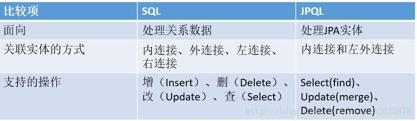

# JPQL和SQL比较

## 前言

Java Persistence Query Language(JPQL)，java持久性查询语言，是JPA规范的重要组成部分。它是一种查询语言，语法类似于SQL，但有本质区别

## 区别

JPQL是面向对象的查询语言，因此它可以完全理解继承、多态和关联等特征，而且内置了大量函数，极大地方便了查询功能。

JPQL操作的对象是实体对象、对象属性。

低层依然是基于SQL的，JPQL到SQL的转换无须开发者关心，JPQL解析器会负责完成这种转换，并负责执行这种转换的SQL语句来操作数据库。

SQL是面向关系数据库的查询语言，因此SQL操作的对象是数据表、数据列。

## 代码对比

SQL

```sql
//原生的SQL语句
select name,age,user_id from t_user
```

JPQL：

```sql
//面向对象的JPQL语句
select name,age,userId from User 
```

第一条语句用于对t_user表执行查询，查询name、age、user_id三个数据列.

第二条语句用于对User实体执行查询，查询的是User实体的name、age、userId属性。

## 总结


