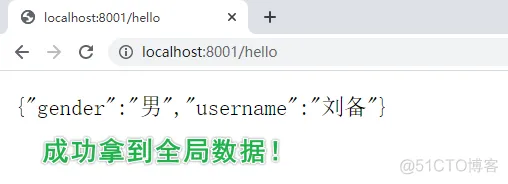

# @ControllerAdvice 与 @RestControllerAdvice

使用的项目: [misscmszb](https://github.com/zhaobao1830/misscmszb)、[misszb](https://github.com/zhaobao1830/misszb)

## @ControllerAdvice概述

### 简介

@ControllerAdvice 是 @Controller 的增强版，其主要用来处理全局数据，一般搭配 @ExceptionHandler 、@ModelAttribute 以及 @InitBinder 使用！

### 使用场景

* 全局异常处理

* 添加全局数据

* 请求参数预处理

## 全局异常处理

### 概述

@ControllerAdvice 最常见的使用场景就是全局异常处理。

举例：封装关于HttpException异常的处理，当代码运行中抛出HttpException异常，就进入当前方法

### 代码演示

misscmszb/RestExceptionHandler.java

```java
package com.zb.misscmszb.core.exception;

import com.zb.misscmszb.core.configuration.CodeMessageConfiguration;
import com.zb.misscmszb.core.util.RequestUtil;
import com.zb.misscmszb.vo.UnifyResponseVO;
import lombok.extern.slf4j.Slf4j;
import org.springframework.core.annotation.Order;
import org.springframework.util.StringUtils;
import org.springframework.web.bind.annotation.ExceptionHandler;
import org.springframework.web.bind.annotation.RestControllerAdvice;

import javax.servlet.http.HttpServletRequest;
import javax.servlet.http.HttpServletResponse;
import java.lang.reflect.InvocationTargetException;

/**
 * 异常配置类
 * 只有配置了这个类 自定义的异常才能正常返回值
 */
@Order
@RestControllerAdvice
@Slf4j
public class RestExceptionHandler {

    @ExceptionHandler({HttpException.class})
    public UnifyResponseVO<String> processException(HttpException exception, HttpServletRequest request, HttpServletResponse response) throws NoSuchMethodException, InvocationTargetException, InstantiationException, IllegalAccessException {
        UnifyResponseVO<String> unifyResponseVO = new UnifyResponseVO<>();
        unifyResponseVO.setRequest(RequestUtil.getSimpleRequest(request));
        int code = exception.getCode();
        unifyResponseVO.setCode(code);
        response.setStatus(exception.getHttpStatusCode());
        String errorMessage = CodeMessageConfiguration.getMessage(code);
        if (!StringUtils.hasText(errorMessage)) {
            unifyResponseVO.setMessage(exception.getMessage());
            log.error("", exception);
        } else {
            unifyResponseVO.setMessage(errorMessage);
            log.error(exception.getClass().getConstructor(int.class, String.class).newInstance(code, errorMessage).toString());
        }
        return unifyResponseVO;
    }
}

```

## 添加全局数据

### 概述

@ControllerAdvice 是一个全局数据处理组件，因此也可以在其中配置全局数据，使用 @ModelAttribute 注解进行配置。

### 代码演示

**全局数据配置 GlobalConfig**

```java
package com.zibo.api.config;

import org.springframework.web.bind.annotation.ControllerAdvice;
import org.springframework.web.bind.annotation.ModelAttribute;

import java.util.HashMap;
import java.util.Map;

@ControllerAdvice
public class GlobalConfig {
    // info表示的是返回数据的key
    @ModelAttribute(value = "info")
    public Map<String,String> userInfo(){
        Map<String,String> map = new HashMap<>();
        map.put("username","刘备");
        map.put("gender","男");
        return map;
    }
}
```

**在Controller中使用全局数据**

```java
package com.zibo.api.controller;

import org.springframework.ui.Model;
import org.springframework.web.bind.annotation.RequestMapping;
import org.springframework.web.bind.annotation.RestController;

import java.util.Map;

@Controller
public class HelloController {

    @RequestMapping("hello")
    @ResponseBody
    public Object hello(Model model){
        Map<String, Object> map = model.asMap();
        return map.get("info");
    }

}
```

**运行结果**



## 请求参数预处理

### 概述

@ControllerAdvice 结合 @InitBinder 实现对请求参数预处理！

### 代码演示

**实体类：Book**

```java
package com.zibo.api.entity;

import lombok.Data;

@Data
public class Book {
    private String name;
    private String author;
}
```

**实体类：Author**

```java
package com.zibo.api.entity;

import lombok.Data;

@Data
public class Author {
    private String name;
    private Integer age;
}
```

**Controller 接收实体类**

```java
@RequestMapping("hi")
    public String hi(@ModelAttribute("b") Book book, @ModelAttribute("a") Author author){
        return book.toString() + "==>" + author.toString();
    }
```

**GlobalConfig**

```java
package com.zibo.api.config;

import org.springframework.web.bind.WebDataBinder;
import org.springframework.web.bind.annotation.ControllerAdvice;
import org.springframework.web.bind.annotation.InitBinder;
import org.springframework.web.bind.annotation.ModelAttribute;

import java.util.HashMap;
import java.util.Map;

@ControllerAdvice
public class GlobalConfig {

    @InitBinder("b")
    public void init(WebDataBinder binder){
        binder.setFieldDefaultPrefix("b.");
    }

    @InitBinder("a")
    public void init2(WebDataBinder binder){
        binder.setFieldDefaultPrefix("a.");
    }
}
```

## @RestControllerAdvice

### 与 @ControllerAdvice 区别

简单地说，@RestControllerAdvice 与 @ControllerAdvice 的区别就和 @RestController 与 @Controller 的区别类似，@RestControllerAdvice 注解包含了 @ControllerAdvice 注解和 @ResponseBody 注解。

**当自定义类加@ControllerAdvice注解时，方法需要返回json数据时，每个方法还需要添加@ResponseBody注解；**

**当自定义类加@RestControllerAdvice注解时，方法自动返回json数据，每个方法无需再添加@ResponseBody注解；**
