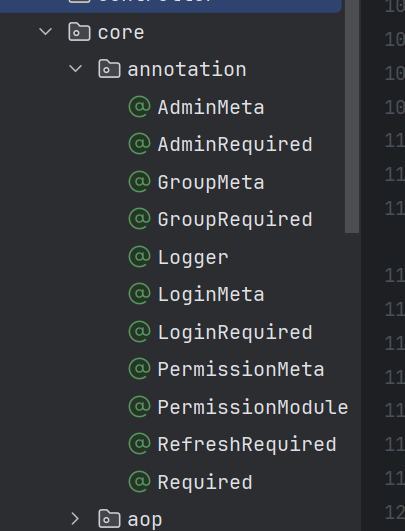

# 权限管理

文档参考地址：[https://doc.cms.talelin.com/server/spring-boot/permission.html](https://doc.cms.talelin.com/server/spring-boot/permission.html)

项目地址：[https://github.com/zhaobao1830/misscmszb](https://github.com/zhaobao1830/misscmszb)

## 权限使用

权限系统的初衷是控制操作只对部分人开放

例子：

BookController.java

```java
package com.zb.misscmszb.controller.v1;

import com.zb.misscmszb.core.annotation.GroupRequired;
import com.zb.misscmszb.core.annotation.Logger;
import com.zb.misscmszb.core.annotation.PermissionMeta;
import com.zb.misscmszb.core.exception.NotFoundException;
import com.zb.misscmszb.dto.book.CreateOrUpdateBookDTO;
import com.zb.misscmszb.model.BookDO;
import com.zb.misscmszb.service.BookService;
import com.zb.misscmszb.vo.CreatedVO;
import com.zb.misscmszb.vo.DeletedVO;
import com.zb.misscmszb.vo.UpdatedVO;
import org.springframework.beans.factory.annotation.Autowired;
import org.springframework.validation.annotation.Validated;
import org.springframework.web.bind.annotation.*;

import javax.validation.constraints.Positive;
import java.util.List;

@RestController
@RequestMapping("/v1/book")
@Validated
public class BookController {

    @Autowired
    private BookService bookService;

    @GetMapping("/delete/{id}")
    @GroupRequired
    @PermissionMeta(value = "删除图书", module = "图书", mount = true)
    public DeletedVO deleteBook(@PathVariable("id") @Positive(message = "{id.positive}") Integer id) {
        BookDO book = bookService.getById(id);
        if (book == null) {
            throw new NotFoundException(10022);
        }
        bookService.deleteById(book.getId());
        return new DeletedVO(14);
    }
}

```

以删除图书接口为例，如果想要权限控制，需要加上@GroupRequired和@PermissionMeta俩个注解

### 说明

#### PermissionMeta注解

会将**deleteBook**纳入到权限系统中

PermissionMeta共有三个参数：

* value 权限名称，如：删除图书，用来给权限命名

* module 权限模块，如：图书，表示该权限属于图书模块

* mount 是否挂载到权限系统中，默认为true，如果为 false ，则该权限不挂载到权限系统中

#### @GroupRequired

表示**deleteBook**只能由**拥有删除图书这个权限的分组**才能访问

@LoginRequired、@GroupRequired、AdminRequired这三个权限是当前项目已经定义好的，后面根据需要可以添加

## 实现

### 新加注解

在core/annotation文件下新加注解



```java
package com.zb.misscmszb.core.annotation;

import com.zb.misscmszb.core.enumeration.UserLevel;

import java.lang.annotation.*;

/**
 * 分组权限
 */
@Target(ElementType.METHOD)
@Retention(RetentionPolicy.RUNTIME)
@Documented
@Required(level = UserLevel.GROUP)
public @interface GroupRequired {
}

```

### 定义用户等级

UserLevel.java定义用户的等级

```java
package com.zb.misscmszb.core.enumeration;

/**
 * 用户等级
 */
public enum UserLevel {

    /**
     * 游客即可访问
     */
    TOURIST,

    /**
     * 登录才可访问
     */
    LOGIN,

    /**
     * 登录有权限才可访问
     */
    GROUP,

    /**
     * 管理员权限
     */
    ADMIN,

    /**
     * 令牌刷新
     */
    REFRESH
}

```

### 路由信息收集器类

**新加路由信息收集器类**，记录有AdminMeta、PermissionMeta、GroupMeta、LoginMeta注解的路由信息，并将其收集

PermissionMetaCollector.java

```java
package com.zb.misscmszb.bean;

import com.zb.misscmszb.core.annotation.*;
import com.zb.misscmszb.core.enumeration.UserLevel;
import com.zb.misscmszb.core.util.AnnotationUtil;
import lombok.Getter;
import org.springframework.beans.factory.config.BeanPostProcessor;
import org.springframework.core.annotation.AnnotationUtils;
import org.springframework.stereotype.Controller;
import org.springframework.util.ReflectionUtils;
import org.springframework.util.StringUtils;

import java.lang.reflect.Method;
import java.util.*;
import java.util.concurrent.ConcurrentHashMap;
import java.util.concurrent.ConcurrentMap;

/**
 * 路由信息收集器
 */
public class PermissionMetaCollector implements BeanPostProcessor {

    /**
     * -- GETTER --
     *  获取路由信息map
     *
     * @return 路由信息map
     */
    @Getter
    private Map<String, MetaInfo> metaMap = new ConcurrentHashMap<>();

    private Map<String, Map<String, Set<String>>> structuralMeta = new ConcurrentHashMap<>();

    public PermissionMetaCollector() {
    }

    @Override
    public Object postProcessBeforeInitialization(Object bean, String beanName) {
        return bean;
    }

    /**
     * 扫描注解信息，并提取
     *
     * @param bean     spring bean
     * @param beanName 名称
     * @return spring bean
     */
    @Override
    public Object postProcessAfterInitialization(Object bean, String beanName) {
        Controller controllerAnnotation = AnnotationUtils.findAnnotation(bean.getClass(), Controller.class);
        // 非 Controller 类，无需检查权限信息
        if (controllerAnnotation == null) {
            return bean;
        }
        Method[] methods = ReflectionUtils.getAllDeclaredMethods(bean.getClass());
        for (Method method : methods) {
            AdminMeta adminMeta = AnnotationUtils.findAnnotation(method, AdminMeta.class);
            if (adminMeta != null && adminMeta.mount()) {
                String permission = StringUtils.hasText(adminMeta.value()) ? adminMeta.value() : adminMeta.permission();
                putOneMetaInfo(method, permission, adminMeta.module(), UserLevel.ADMIN);
                continue;
            }
            GroupMeta groupMeta = AnnotationUtils.findAnnotation(method, GroupMeta.class);
            if (groupMeta != null && groupMeta.mount()) {
                String permission = StringUtils.hasText(groupMeta.value())
                        ? groupMeta.value() : groupMeta.permission();
                putOneMetaInfo(method, permission, groupMeta.module(), UserLevel.GROUP);
                continue;
            }
            LoginMeta loginMeta = AnnotationUtils.findAnnotation(method, LoginMeta.class);
            if (loginMeta != null && loginMeta.mount()) {
                String permission = StringUtils.hasText(loginMeta.value())
                        ? loginMeta.value() : loginMeta.permission() ;
                putOneMetaInfo(method, permission, loginMeta.module(), UserLevel.LOGIN);
                continue;
            }
            // 最后寻找 PermissionMeta
            PermissionMeta permissionMeta = AnnotationUtils.findAnnotation(method,
                    PermissionMeta.class);
            if (permissionMeta != null && permissionMeta.mount()) {
                String permission = StringUtils.hasText(permissionMeta.value())
                        ? permissionMeta.value() : permissionMeta.permission();
                UserLevel level = AnnotationUtil.findRequired(method.getAnnotations());
                putOneMetaInfo(method, permission, permissionMeta.module(), level);
            }
        }
        return bean;
    }

    public MetaInfo findMeta(String key) {
        return metaMap.get(key);
    }

    private void putOneMetaInfo(Method method, String permission, String module,
                                UserLevel userLevel) {
        if (StringUtils.hasText(module)) {
            PermissionModule permissionModule = AnnotationUtils.findAnnotation(
                    method.getDeclaringClass(), PermissionModule.class);
            if (permissionModule != null) {
                module = StringUtils.hasText(permissionModule.value()) ?
                        permissionModule.value() : method.getDeclaringClass().getName();
            }
        }
        String methodName = method.getName();
        String className = method.getDeclaringClass().getName();
        String identity = className + "#" + methodName;
        MetaInfo metaInfo = new MetaInfo(permission, module, identity, userLevel);
        metaMap.put(identity, metaInfo);
        this.putMetaIntoStructuralMeta(identity, metaInfo);
    }

    private void putMetaIntoStructuralMeta(String identity, MetaInfo meta) {
        String module = meta.getModule();
        String permission = meta.getPermission();
        // 如果已经存在了该 module，直接向里面增加
        if (structuralMeta.containsKey(module)) {
            Map<String, Set<String>> moduleMap = structuralMeta.get(module);
            // 如果 permission 已经存在
            this.putIntoModuleMap(moduleMap, identity, permission);
        } else {
            // 不存在 该 module，创建该 module
            Map<String, Set<String>> moduleMap = new HashMap<>();
            // 如果 permission 已经存在
            this.putIntoModuleMap(moduleMap, identity, permission);
            structuralMeta.put(module, moduleMap);
        }
    }

    private void putIntoModuleMap(Map<String, Set<String>> moduleMap, String identity,
                                  String auth) {
        if (moduleMap.containsKey(auth)) {
            moduleMap.get(auth).add(identity);
        } else {
            Set<String> eps = new HashSet<>();
            eps.add(identity);
            moduleMap.put(auth, eps);
        }
    }
}

```

在配置类CommonConfiguration里对PermissionMetaCollector进行配置，注入到容器里

CommonConfiguration.java

```java
/**
 * 公共配置
 */
@Configuration
public class CommonConfiguration {
    /**
     * 记录每个被 @PermissionMeta 记录的信息，在beans的后置调用
     */
    @Bean
    public PermissionMetaCollector postProcessBeans() {
        return new PermissionMetaCollector();
    }
}
```

### 添加权限监听器

PermissionHandleListener.java

```java
package com.zb.misscmszb.core.listener;

import com.baomidou.mybatisplus.core.conditions.query.QueryWrapper;
import com.zb.misscmszb.bean.MetaInfo;
import com.zb.misscmszb.bean.PermissionMetaCollector;
import com.zb.misscmszb.model.PermissionDO;
import com.zb.misscmszb.service.PermissionService;
import org.springframework.beans.factory.annotation.Autowired;
import org.springframework.context.ApplicationListener;
import org.springframework.context.event.ContextRefreshedEvent;
import org.springframework.stereotype.Component;

import java.util.List;
import java.util.Map;

/**
 * 权限监听器
 */
@Component
public class PermissionHandleListener implements ApplicationListener<ContextRefreshedEvent> {

    @Autowired
    private PermissionService permissionService;

    @Autowired
    private PermissionMetaCollector metaCollector;

    @Override
    public void onApplicationEvent(ContextRefreshedEvent event) {
        addNewPermissions();
        removeUnusedPermissions();
    }

    private void addNewPermissions() {
        metaCollector.getMetaMap().values().forEach(meta -> {
            String module = meta.getModule();
            String permission = meta.getPermission();
            createPermissionIfNotExist(permission, module);
        });
    }

    private void createPermissionIfNotExist(String name, String module) {
        QueryWrapper<PermissionDO> wrapper = new QueryWrapper<>();
        wrapper.lambda().eq(PermissionDO::getName, name).eq(PermissionDO::getModule, module);
        PermissionDO permission = permissionService.getOne(wrapper);
        if (permission == null) {
            permissionService.save(PermissionDO.builder().module(module).name(name).build());
        }
        if (permission != null && !permission.getMount()) {
            permission.setMount(true);
            permissionService.updateById(permission);
        }
    }

    private void removeUnusedPermissions() {
        List<PermissionDO> allPermissions = permissionService.list();
        Map<String, MetaInfo> metaMap = metaCollector.getMetaMap();
        for (PermissionDO permission : allPermissions) {
            boolean stayedInMeta = metaMap
                    .values()
                    .stream()
                    .anyMatch(meta -> meta.getModule().equals(permission.getModule())
                            && meta.getPermission().equals(permission.getName()));
            if (!stayedInMeta) {
                permission.setMount(false);
                permissionService.updateById(permission);
            }
        }
    }
}

```

### 添加权限拦截器

AuthorizeInterceptor.java

```java
package com.zb.misscmszb.core.interceptors;

import com.zb.misscmszb.bean.MetaInfo;
import com.zb.misscmszb.bean.PermissionMetaCollector;
import com.zb.misscmszb.core.enumeration.UserLevel;
import com.zb.misscmszb.core.interceptors.interfaces.AuthorizeVerifyResolver;
import com.zb.misscmszb.core.util.AnnotationUtil;
import org.springframework.beans.factory.annotation.Autowired;
import org.springframework.web.method.HandlerMethod;
import org.springframework.web.servlet.HandlerInterceptor;
import org.springframework.web.servlet.ModelAndView;

import javax.servlet.http.HttpServletRequest;
import javax.servlet.http.HttpServletResponse;
import java.lang.annotation.Annotation;
import java.lang.reflect.Method;

/**
 * 权限拦截器
 */
public class AuthorizeInterceptor implements HandlerInterceptor {

    @Autowired
    private AuthorizeVerifyResolver authorizeVerifyResolver;

    @Autowired
    private PermissionMetaCollector permissionMetaCollector;

    private String[] excludeMethods = new String[]{"OPTIONS"};

    public AuthorizeInterceptor() {
    }

    /**
     * 构造函数
     *
     * @param excludeMethods 不检查方法
     */
    public AuthorizeInterceptor(String[] excludeMethods) {
        this.excludeMethods = excludeMethods;
    }

    /**
     * 前置处理
     *
     * @param request  request 请求
     * @param response 相应
     * @param handler  处理器
     * @return 是否成功
     */
    @Override
    public boolean preHandle(HttpServletRequest request, HttpServletResponse response, Object handler) {
        if (checkInExclude(request.getMethod())) {
            // 有些请求方法无需检测，如OPTIONS
            return true;
        }
        if (handler instanceof HandlerMethod) {
            HandlerMethod handlerMethod = (HandlerMethod) handler;
            Method method = handlerMethod.getMethod();
            String methodName = method.getName();
            String className = method.getDeclaringClass().getName();
            String identity = className + "#" + methodName;
            MetaInfo meta = permissionMetaCollector.findMeta(identity);
            // 考虑两种情况，1. 有 meta；2. 无 meta
            if (meta == null) {
                // 无meta的话，adminRequired和loginRequired
                return this.handleNoMeta(request, response, method);
            } else {
                // 有meta在权限范围之内，需要判断权限
                return this.handleMeta(request, response, method, meta);
            }
        } else {
            // handler不是HandlerMethod的情况
            return authorizeVerifyResolver.handleNotHandlerMethod(request, response, handler);
        }
    }

    @Override
    public void postHandle(HttpServletRequest request, HttpServletResponse response, Object handler, ModelAndView modelAndView) {
        authorizeVerifyResolver.handlePostHandle(request, response, handler, modelAndView);
    }

    @Override
    public void afterCompletion(HttpServletRequest request, HttpServletResponse response, Object handler, Exception ex) {
        authorizeVerifyResolver.handleAfterCompletion(request, response, handler, ex);
    }

    /**
     * 校验方法是否包含在数组里
     * @param method 待校验的方法
     * @return true/false
     */
    private boolean checkInExclude(String method) {
        for (String excludeMethod : excludeMethods) {
            if (method.equals(excludeMethod)) {
                return true;
            }
        }
        return false;
    }

    private boolean handleNoMeta(HttpServletRequest request, HttpServletResponse response, Method method) {
        Annotation[] annotations = method.getAnnotations();
        UserLevel level = AnnotationUtil.findRequired(annotations);
        switch (level) {
            case LOGIN:
            case GROUP:
                // 分组权限
                // 登陆权限
                return authorizeVerifyResolver.handleLogin(request, response, null);
            case ADMIN:
                // 管理员权限
                return authorizeVerifyResolver.handleAdmin(request, response, null);
            case REFRESH:
                // 刷新令牌
                return authorizeVerifyResolver.handleRefresh(request, response, null);
            default:
                return true;
        }
    }

    private boolean handleMeta(HttpServletRequest request, HttpServletResponse response, Method method, MetaInfo meta) {
        UserLevel level = meta.getUserLevel();
        switch (level) {
            case LOGIN:
                // 登陆权限
                return authorizeVerifyResolver.handleLogin(request, response, meta);
            case GROUP:
                // 分组权限
                return authorizeVerifyResolver.handleGroup(request, response, meta);
            case ADMIN:
                // 管理员权限
                return authorizeVerifyResolver.handleAdmin(request, response, meta);
            case REFRESH:
                // 刷新令牌
                return authorizeVerifyResolver.handleRefresh(request, response, meta);
            default:
                return true;
        }
    }
}

```
