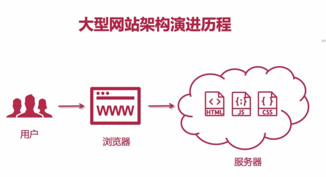
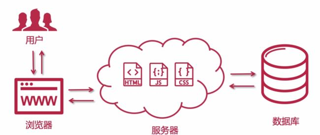
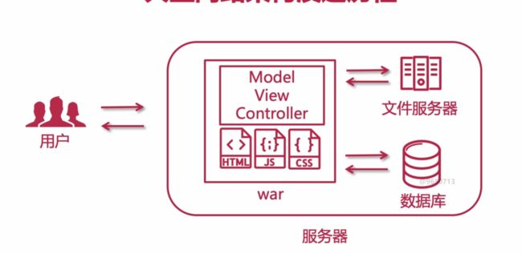
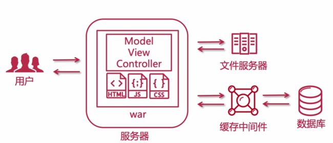
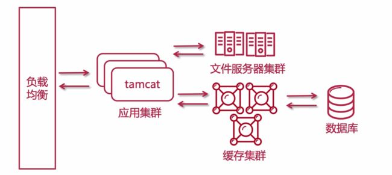
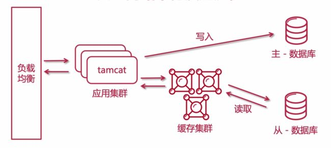
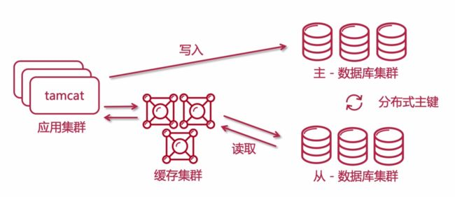
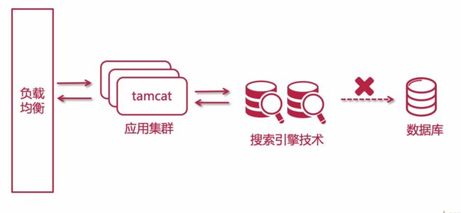
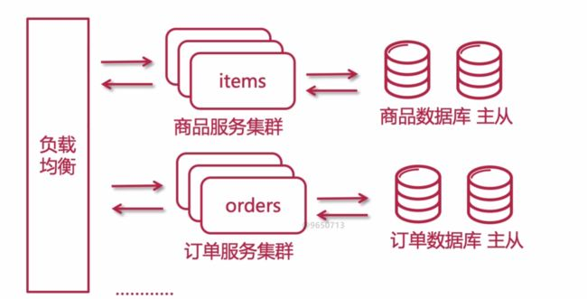
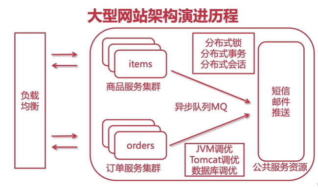

# 项目架构演进历程

## 叙述

**1、最开始是静态网页，是单向的。服务器仅仅提供内容给用户查阅**

**2、用户与服务器之间是双向交互，用户可以对数据CRUD**

**3、早期java web-----用户访问服务器，服务器中有打包成war的项目，有html js css等，也有MVC处理用户请求，文件服务器保存用户头像、文件等，数据库则保存用户信息**

**4、实现前后端分离，可以对请求进行一定程度的降压---将文件服务器与服务器分离，服务器仅仅提供网站信息，文件服务器保存用户信息**

**5、引入缓存钟中间件，等于是防护机制。用户请求首先会在缓存中查询，然后才会在数据库查询。**

**6、单节点遇到瓶颈，使用集群实现负载均衡。读写会直接与数据库交互，用户百万、千万以上如何解决负载能力？**

**7、数据库读写分离，主从复制。读占8，写占2，数据库拆分为读写数据库，主库会定时向从库进行数据同步**

**8、随着业务增长，数据库压力大，对数据库进行分库分表,主库从库都要拆成数据库集群，实现分布式数据库。此时主键不能使用自增主键而是全局唯一主键**

**9、用户会数据的检索出现多样化，数据库增加模糊查询等需求，引入搜索引擎技术。在提供搜索的时候，还要为数据库增加保护措施**

**10、大型项目拆成微服务的一个个集群，数据库也需要进行拆分，作为单独的商品、订单等数据库。此时需要考虑分布式事务。（微服务）**

**11、对JVM Tomcat 和数据库进行调优**

## 分析

### 单体架构

#### 优点

1、小团队成型即可完成开发-测试-上线

2、迭代周期短,速度快

3、打包方便,运维省事

#### 挑战

1、单节点宕机会造成所有服务不可用

2、耦合度太高(迭代,测试,部署)

3、单节点并发能力有限，负载量不够，并发过高，会导致服务奔溃、宕机

#### 优化

1、通过集群实现高可用

2、使用分布式或微服务进行改进

3、负载均衡降低服务器的负载压力，分发用户的请求到其他计算机节点

### 集群

#### 优势

1、提高系统性能，可以分发流量到各个节点

2、提高系统可用性，避免像单体那样,一个服务宕机，整个项目都挂掉了

3、可扩展性高/提高系统可伸缩性，可以在流量高峰期，适当增加计算机节点来支持高峰期的流量（比如微博，当明星出现大新闻时，这时流量大）

#### 注意点

1、用户会话使用分布式会话(redis缓存实现redis分布式会话)

2、定时任务：当定时任务到达定时节点的时候，含有定时任务的集群节点，会将任务都执行一次，可能会造成数据不一致(定时任务：操作)，或降低系统性能(定时任务: 查询)

3、内网必须互通

### 分布式架构

当一个架构进阶为集群以后 ，对于项目本身来讲，还是一个个体，是单个应用，是单独部署的一个webapp。

如果一个请求经过的业务比较长，比较的耗时，这个时候就应该采用分而治之的手段来拆解系统。

将系统拆分成分布式系统。这样分布式的运算能力要远远的超过单个计算机计算机节点的运算能力。

处理用户的请求也会更加的得心应手。

#### 概念

1、不同的业务（功能模块）分散部署在不同的服务器（为单个服务进行了降压，提升了整体的运算能力）

2、每个子系统负责一个或者多个不同的业务模块

3、服务之间可以互相交互通信。

4、分布式系统设计对用户透明（意思是用户不管你的项目是什么架构，只关心用的好不好）

5、可以发展为分布式集群架构（微服务架构其实是属于分布式系统中的一种，但是分布式系统并不是微服务，微服务是分布式的一个子集）

#### 优点

1、业务解耦。单个计算机的性能没有办法满足庞大的业务量。此时就需要有多台计算机应对同一个请求。

2、系统模块化，可重用化。（不同系统的 controller 都可以依赖同一个 service，这样 service 也是可以重用的。 ）

3、提升系统的并发量，拆分之后，用户的流量是会被打散的，这样整体的并发量就上去了

4、优化运维部署效率，（单体是单个包，分布式的话包变得很小）

#### 缺点

1、架构复杂

2、部署多个子系统复杂（后续部署简单）

3、系统之间通信耗时。

4、新人入团队缓慢

5、调试复杂

#### 设计原则

1、异步解耦，分布式是将耦合的模块进行了一个解耦，所以相互进行通信的时候服务之间通信的时候能够使用异步就先使用异步，实在不行再使用同步（异步的效率远远高于同步，异步需要使用到消息队列）

2、幂等一致性，分布式系统中，用户的请求可能会经过多个子系统，这个时候就要保证用户的请求不管是查询还是增删改，数据的一致性是需要得到保证的。（增加的时候就需要保证用户重复提交，数据库不会多出重复记录），幂等主要是针对增加和修改。

3、拆分原则：系统拆分的原则有多种，比如可以根据业务去拆（门户子系统，用户中心子系统，搜索子系统，文件处理子系统）。根据系统功能去拆的话，我们可以将文件系统进行拆分（文件上传、文件下载子系统）

4、融合分布式中间件。Redis作为缓存、Zookeeper作为协调、MQ作为消息队列。

5、容错高可用，分布式系统如果单点部署，也是会存在单点故障的，发生了故障，业务系统就无法提供服务了。分布式系统推荐采用集群的形态，让系统更好的为用户提供不间断的服务。

