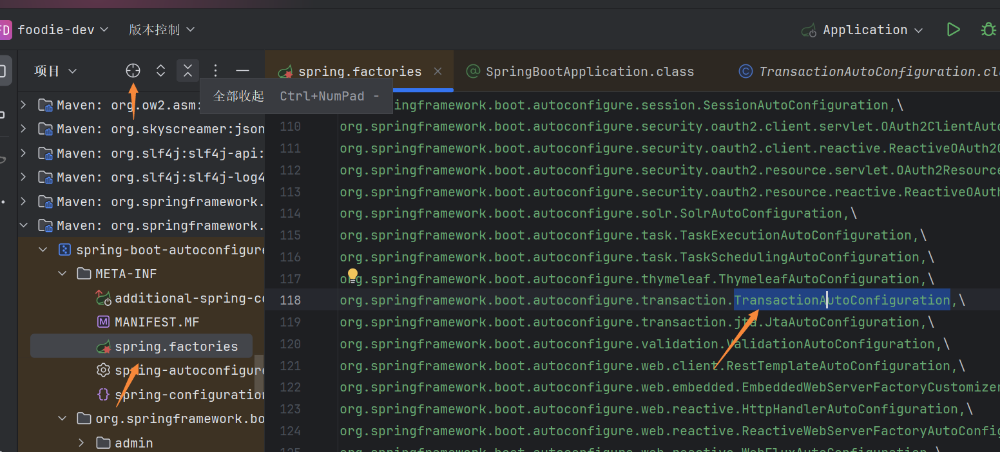
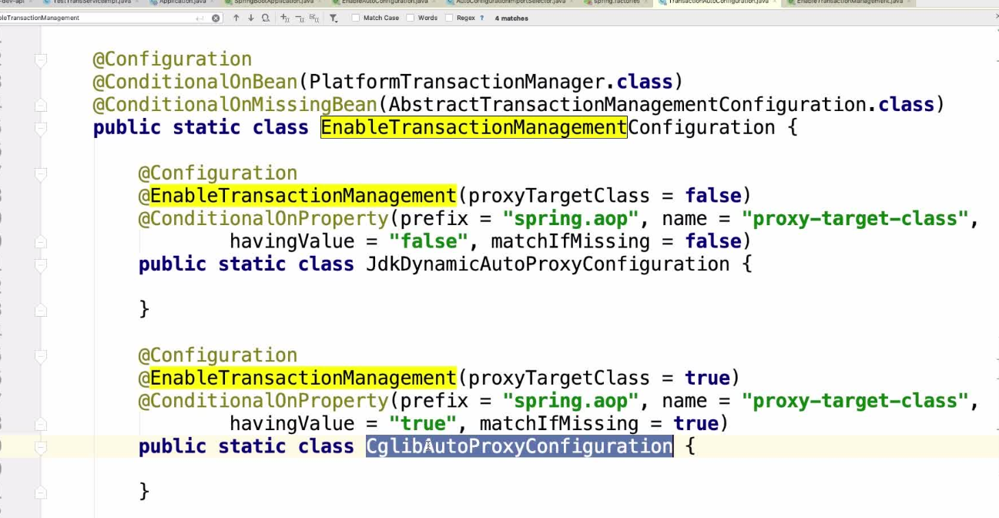

# SpringBoot使用@Transactional注解添加事务

## Java事务

### 事务仅与数据库相关
事务必须服从ISO/IEC所制定的ACID原则。ACID是原子性（atomicity）、一致性（consistency）、隔离性 （isolation）和持久性（durability）的缩写

事务的原子性：表示事务执行过程中的任何失败都将导致事务所做的任何修改失效。
事务的一致性：表示当事务执行失败时，所有被该事务影响的数据都应该恢复到事务执行前的状态。
事务的隔离性：表示在事务执行过程中对数据的修改，在事务提交之前对其他事务不可见。
事务的持久性：表示已提交的数据在事务执行失败时，数据的状态都应该正确。

通俗的理解，事务是一组原子操作单元，从数据库角度说，就是一组SQL指令，要么全部执行成功，若因为某个原因其中一条指令执行有错误，则撤销先前执行过的所有指令。

更简答的说就是：**要么全部执行成功，要么撤销不执行**。

### 为什么需要Java事务

事务是为解决数据安全操作提出的，事务控制实际上就是控制数据的安全访问。

举一个简单例子： 比如银行转帐业务，账户A要将自己账户上的1000元转到B账 户下面，A账户余额首先要减去1000元，然后B账户要增加1000元。

假如在中间网络出现了问题，A账户减去1000元已经结束， B因为网络中断而操作失败，那么整个业务失败。

必须做出控制，要求A账户转帐业务撤销。

这才能保证业务的正确性，完成这个操作就需要事务，将A账户资金减少和B账户资金增加方 到一个事务里面，要么全部执行成功，要么操作全部撤销，这样就保持了数据的安全性。

## SpringBoot使用事务

通过@Transactional注解使用

```java
   @Transactional(propagation = Propagation.REQUIRED)
    @Override
    public void deleteStu(int id) {
        stuMapper.deleteByPrimaryKey(id);
    }
```

## 事务Propagation

事务Propagation有七种类型：REQUIRED、SUPPORTS、MANDATORY、REQUIRES_NEW、NOT_SUPPORTED、NEVER、NESTED

::: tip 备注
下面说的父方法，就是调用子方法的方法
:::

### REQUIRED

使用当前的事务，如果当前没有事务，则自己新建一个事务，子方法是必须**运行在一个事务中**的；如果当前存在事务，则加入这个事务，成为一个整体。

举例：领导没饭吃，我有钱，我会自己买了自己吃；领导有的吃，会分给你一起吃。

**自己理解：** 给父方法加上REQUIRED事务，该方法里面的子方法都会被加入REQUIRED事务，

如果子方法执行报错，父方法和子方法对数据的操作都会回滚；

如果父方法没有REQUIRED事务，子方法上有REQUIRED事务，当子方法执行报错时，只会回滚子方法对数据操作的回滚

::: tip 备注
该事务常用于增删改
:::

### SUPPORTS

如果当前有事务，则使用事务；如果当前没有事务，则不使用事务。

举例：领导没饭吃，我也没饭吃；领导有饭吃，我也有饭吃。

**自己理解：** 在子方法上加SUPPORTS事务：如果父方法上有事务，那子方法上的事务也使用；如果父方法上没有事务，那子方法上加的SUPPORTS事务不起作用

::: tip 备注
该事务常用于查
:::

### MANDATORY

强制必须存在一个事务，如果不存在，则抛出异常

举例：领导必须管饭，不管饭没饭吃，我就不乐意了，就不干了（抛出异常）

**个人理解：** 强制父方法（谁调用当前方法，谁就是父方法）必须有事务，没有事务，就抛出异常

### REQUIRES_NEW

如果当前有事务，则挂起该事务，并且自己创建一个新的事务给自己使用

如果当前没有事务，则同 REQUIRED

举例：领导有饭吃，我偏不要，我自己买了自己吃

**个人理解：** 

1、父方法上没有事务，子方法上有REQUIRES_NEW事务，这时相当于在子方法上加了REQUIRED事务，如果子方法执行报错，只会回滚子方法对数据的操作

2、父方法上有REQUIRED事务，子方法上有REQUIRES_NEW事务，会把父方法上的事务挂起，也就是说如果父方法里报错，对数据的操作不会回滚，但子方法里有报错，子方法对数据的操作会回滚

### NOT_SUPPORTED

如果当前有事务，则把事务挂起，自己不适用事务去运行数据库操作

举例：领导有饭吃，分一点给你，我太忙了，放一边，我不吃

**个人理解：** 子方法上加了NOT_SUPPORTED事务，不管父方法有没有加事务，都对子方法不起作用

### NEVER

如果当前有事务存在，则抛出异常

举例：领导有饭给你吃，我不想吃，我热爱工作，我抛出异常

**个人理解：** 子方法加上NEVER事务，如果父方法上有事务，会抛出异常

### NESTED

如果当前有事务，则开启子事务（嵌套事务），嵌套事务是独立提交或者回滚；

如果当前没有事务，则同 REQUIRED。

如果主事务提交，则会携带子事务一起提交。如果主事务回滚，则子事务会一起回滚。相反，子事务异常，则父事务可以回滚或不回滚。

举例：领导决策不对，老板怪罪，领导带着小弟一同受罪。小弟出了差错，领导可以推卸责任。

**个人理解：** 父方法上有事务，子方法上有NESTED事务，就会开启嵌套事务,如果父方法里报错，父方法和子方法对数据的操作都会回滚

::: tip 备注
父方法上是REQUIRED事务，子方法是NESTED事务，和父子方法上都是REQUIRED事务，展示的效果是一样的

区别是：父子方法上都有REQUIRED事务，事务是共用的，而方法上是REQUIRED事务，子方法是NESTED事务，事务是嵌套的
:::

## SpringBoot项目里为什么不需要@EnableTransactionManagement就可能使用事务？

因为SpringBoot自动装配功能已经调用了@EnableTransactionManagement注解

### 详细步骤

1、打开Application.java

```java
package com.zb;

import org.mybatis.spring.annotation.MapperScan;
import org.springframework.boot.SpringApplication;
import org.springframework.boot.autoconfigure.SpringBootApplication;
import org.springframework.context.annotation.ComponentScan;

@SpringBootApplication
// 扫描mybatis mapper下的包
@MapperScan(basePackages = "com.zb.mapper")
// 扫描所有包以及相关组件包
@ComponentScan(basePackages = {"com.zb", "org.n3r.idworker"})
public class Application {

    public static void main(String[] args) {
        SpringApplication.run(Application.class, args);
    }
}

```

2、点击@SpringBootApplication注解进入SpringBootApplication.class

```java
//
// Source code recreated from a .class file by IntelliJ IDEA
// (powered by FernFlower decompiler)
//

package org.springframework.boot.autoconfigure;

import java.lang.annotation.Documented;
import java.lang.annotation.ElementType;
import java.lang.annotation.Inherited;
import java.lang.annotation.Retention;
import java.lang.annotation.RetentionPolicy;
import java.lang.annotation.Target;
import org.springframework.beans.factory.support.BeanNameGenerator;
import org.springframework.boot.SpringBootConfiguration;
import org.springframework.boot.context.TypeExcludeFilter;
import org.springframework.context.annotation.ComponentScan;
import org.springframework.context.annotation.Configuration;
import org.springframework.context.annotation.FilterType;
import org.springframework.context.annotation.ComponentScan.Filter;
import org.springframework.core.annotation.AliasFor;

@Target({ElementType.TYPE})
@Retention(RetentionPolicy.RUNTIME)
@Documented
@Inherited
@SpringBootConfiguration
@EnableAutoConfiguration
@ComponentScan(
    excludeFilters = {@Filter(
    type = FilterType.CUSTOM,
    classes = {TypeExcludeFilter.class}
), @Filter(
    type = FilterType.CUSTOM,
    classes = {AutoConfigurationExcludeFilter.class}
)}
)
public @interface SpringBootApplication {
    @AliasFor(
        annotation = EnableAutoConfiguration.class
    )
    Class<?>[] exclude() default {};
}

```

3、点击@EnableAutoConfiguration进入EnableAutoConfiguration.class

```java
package org.springframework.boot.autoconfigure;

import java.lang.annotation.Documented;
import java.lang.annotation.ElementType;
import java.lang.annotation.Inherited;
import java.lang.annotation.Retention;
import java.lang.annotation.RetentionPolicy;
import java.lang.annotation.Target;
import org.springframework.context.annotation.Import;

@Target({ElementType.TYPE})
@Retention(RetentionPolicy.RUNTIME)
@Documented
@Inherited
@AutoConfigurationPackage
@Import({AutoConfigurationImportSelector.class})
public @interface EnableAutoConfiguration {
    String ENABLED_OVERRIDE_PROPERTY = "spring.boot.enableautoconfiguration";

    Class<?>[] exclude() default {};

    String[] excludeName() default {};
}

```

4、点击AutoConfigurationImportSelector进入AutoConfigurationImportSelector.class

在这里面找到getAutoConfigurationEntry

```java
AutoConfigurationEntry autoConfigurationEntry = this.getAutoConfigurationEntry(annotationMetadata)
```

点击进入getAutoConfigurationEntry方法，找到getCandidateConfigurations

```java
List<String> configurations = this.getCandidateConfigurations(annotationMetadata, attributes);
```

点击getCandidateConfigurations进去，可以看见`classes found in META-INF/spring.factories nor`

点击左上角的选择打开文件按钮，打开META-INF下的spring.factories



5、找到TransactionAutoConfiguration，点击进去，文件里就有@EnableTransactionManagement注解

::: tip 备注
TransactionAutoConfiguration在springBoot2.7之前的版本的META-INF下的spring.factories里可以找到，
2.7版本之后，改成了META-INF/spring/org.springframework.boot.autoconfigure.AutoConfiguration.imports
:::

::: tip 备注
事务的事务的管理是基于Spring的AOP（面向切面编程）实现的

AOP的原理分为两种：

1、JDK的动态代理

2、CGlib的动态代理


:::
