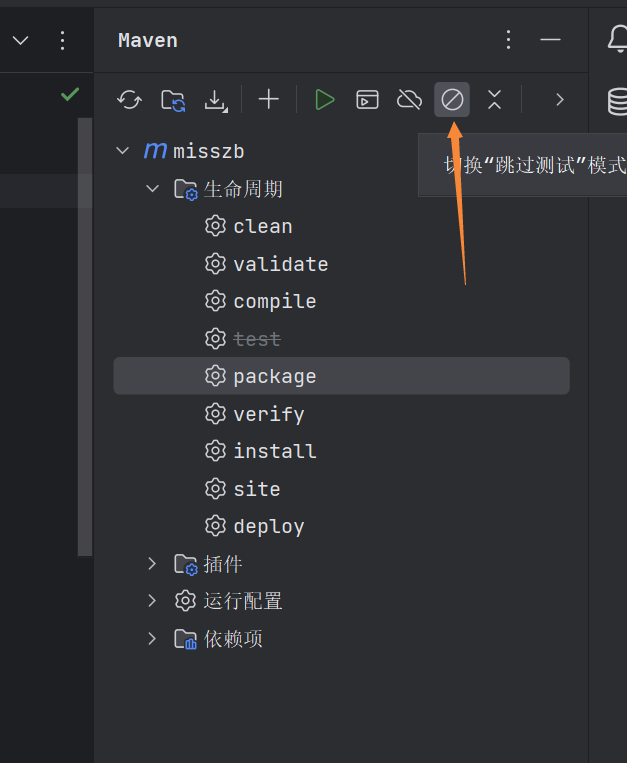
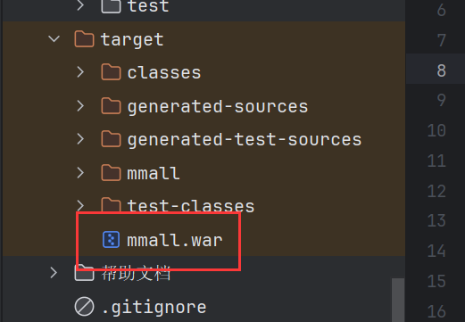
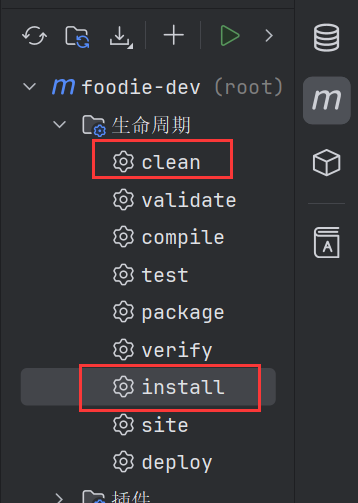
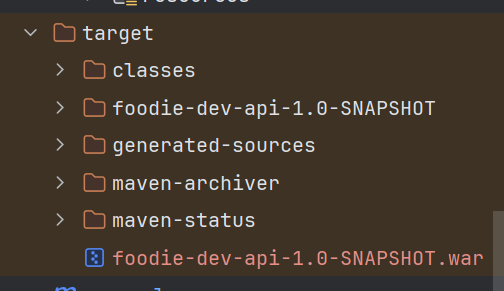
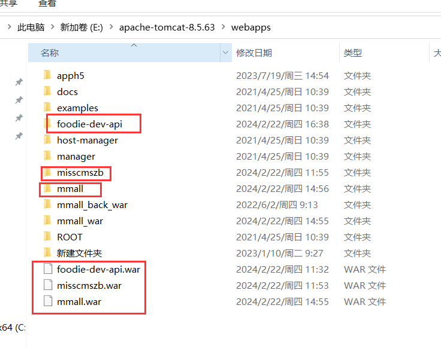

# java项目打包部署

## jar和war对比

### 打包方式

jar文件是将所有的资源文件和Java类文件打包成一个jar文件

war文件则是将Web应用程序的所有资源文件和Java类文件打包成一个war文件

### 部署方式

jar文件部署需要当前服务器有java环境就可以，在cmd中，切换到jar包所在目录，执行命令 java -jar xxx.jar

war需要放到tomcat的webapps文件夹，启动tomcat进行部署

### 适用场景

jar适用于适用前后端分离项目，项目里只包含java相关代码，springCloud微服务项目打包的都是jar包

war适用于包含web代码的项目，比如jsp、html

### 说明

1、`Please refer to dump files (if any exist) [date].dump, [date]-jvmRun[N].dump and [date]`

Maven打包项目的时候，会进行代码测试，测试不通过就会报上面的错误，解决办法是：点击右上角的关闭测试按钮



## 打包

### 普通java项目

#### war

1、在pom.xml里添加packaging

```xml
<packaging>war</packaging>
```

2、点击项目运行按钮，运行完成后打开target文件夹，找到项目名.war文件



### springBoot项目

#### war

以[foodie-dev/dev-mybatis-plus](https://github.com/zhaobao1830/foodie-dev)为例

1、在pom.xml(foodie-dev-api)里添加packaging

```xml
<packaging>war</packaging>
```

2、在pom.xml(foodie-dev)去掉springBoot项目自带的tomcat依赖

```
<dependency>
    <groupId>org.springframework.boot</groupId>
    <artifactId>spring-boot-starter-web</artifactId>
    <!-- 打包war [2] 移除自带内置tomcat -->
    <exclusions>
        <exclusion>
            <artifactId>spring-boot-starter-tomcat</artifactId>
            <groupId>org.springframework.boot</groupId>
        </exclusion>
    </exclusions>
</dependency>
```

3、由于第2步去掉了tomcat依赖，里面的servlet依赖也没有了，在pom.xml(foodie-dev)添加servlet依赖

```xml
<!-- 打包war [3] 添加依赖 -->
<dependency>
    <groupId>javax.servlet</groupId>
    <artifactId>javax.servlet-api</artifactId>
    <scope>provided</scope>
</dependency>
```

4、新建关于war的依赖类

```java
package com.zb;

import org.springframework.boot.builder.SpringApplicationBuilder;
import org.springframework.boot.web.servlet.support.SpringBootServletInitializer;

// 打包war [4] 增加war的启动类
public class WarStarterApplication extends SpringBootServletInitializer {

    @Override
    protected SpringApplicationBuilder configure(SpringApplicationBuilder builder) {
        // 指向Application这个springboot启动类
        return builder.sources(Application.class);
    }
}

```

5、先执行maven里的clean，再执行install，执行成功后，在target文件夹找到生成的war包





## 部署

### tomcat

1、将上面打包生成的war包放到tomcat的webapps文件下，启动tomcat，就会自动解压



2、通过端口+项目名字访问对应接口


