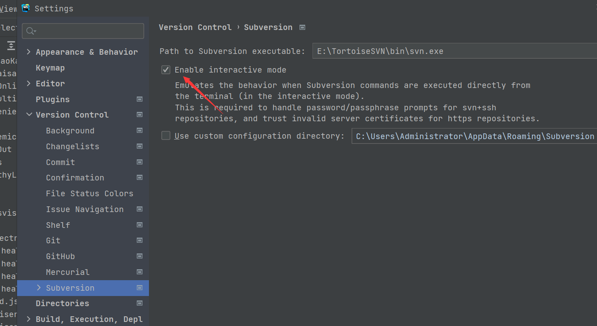

# webstorm中使用svn出现问题，无法连接url

错误提示：Error:svn: E170013: Unable to connect to a repository at URL 'https://192.168.0.100:8089/svn/health_app/05-%E5%AE%9E%E7%8E%B0/source/dev/%E4%BF%9D%E5%BA%B7/%E5%B1%85%E6%B0%91%E7%AB%AF/health_baokang_h5' svn: E230001: Server SSL certificate verification fa

解决办法：

Enable选择;

Use custom去掉选择
