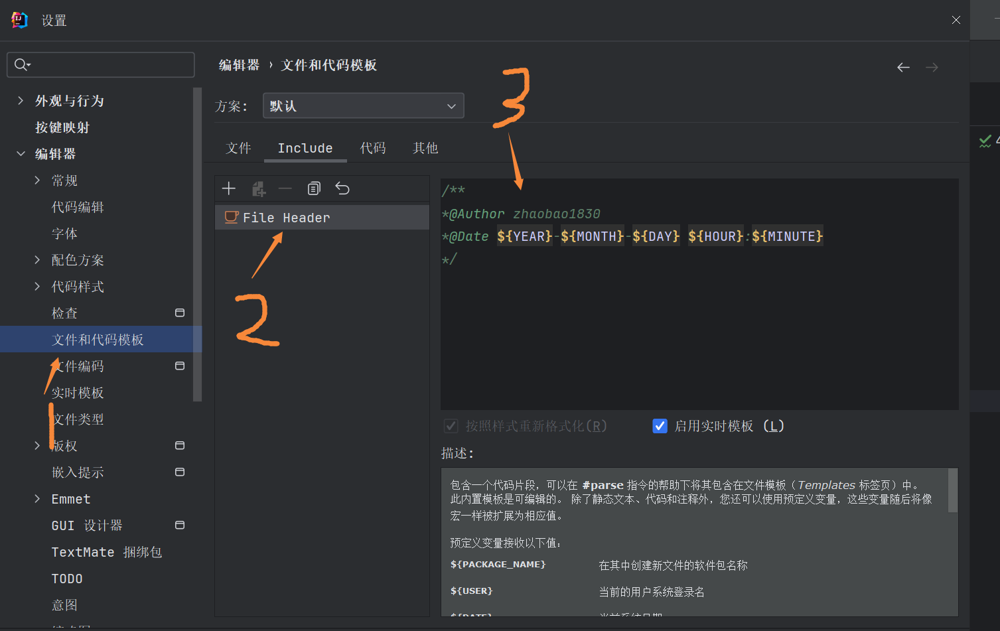

# IDEA自定义注释@Author、@Date、@Description

新建文件后，自动添加@Author、@Date、@Description等注释



1、在设置-编辑器-文件和代码模板里，选择Include，新建File Header实时模板，

在模板里添加如下代码：

```
/**
*@Author zhaobao1830
*@Date ${YEAR}-${MONTH}-${DAY} ${HOUR}:${MINUTE}
*/
```

${YEAR}这些值可以在下面的描述里查找

2、启用实时模板
