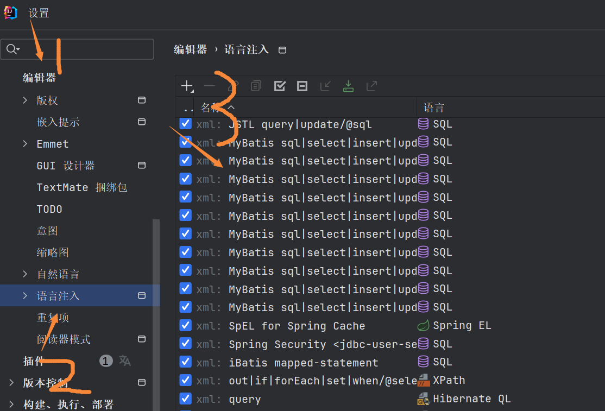
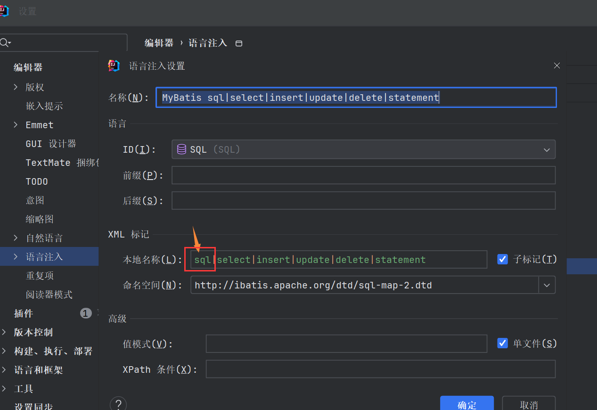

# `<statement>` 或 DELIMITER，得到 'id'

**问题：**

在mybatis里的mapper.xml文件中，id下有红线，错误信息是：`<statement>` 或 DELIMITER，得到 'id'

**原因：**

这是IDEA对mybatis的sql校验失败

**解决：**

在编辑器-语言注入-找到xml:mybatis，点击进去，将最前面的sql删了就没有报错了

::: tip 备注
不知道为什么xml:mybatis文件会自动增加，可能是以项目里的mybatis.xml文件有关
:::
