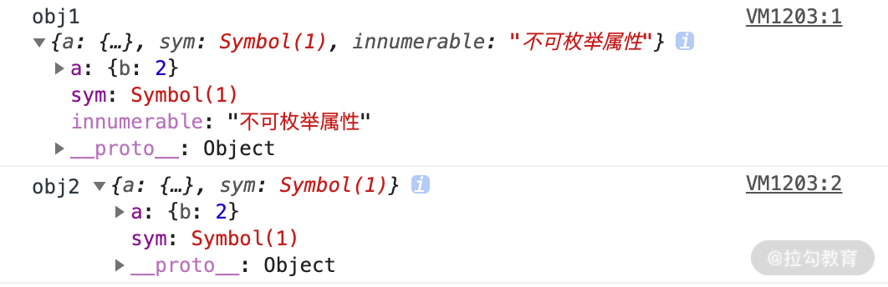

# 浅拷贝的原理和实现

::: tip 浅拷贝定义
自己创建一个新的对象，来接受你要重新复制或引用的对象值。如果对象属性是基本的数据类型，复制的就是基本类型的值给新对象；但如果属性是引用数据类型，复制的就是内存中的地址，如果其中一个对象改变了这个内存中的地址，肯定会影响到另一个对象。
:::

JavaScript 提供的浅拷贝方法：

## 方法一：object.assign

object.assign 是 ES6 中 object 的一个方法，该方法可以用于 JS 对象的合并等多个用途，其中一个用途就是可以进行浅拷贝。该方法的第一个参数是拷贝的目标对象，后面的参数是拷贝的来源对象（也可以是多个来源）。

::: tip 语法
Object.assign(target, ...sources)
:::

object.assign 的示例代码如下：

```js
let target = {};

let source = { a: { b: 1 } };

Object.assign(target, source);

console.log(target); // { a: { b: 1 } };

```

从上面的代码中可以看到，通过 object.assign 我们的确简单实现了一个浅拷贝，“target”就是我们新拷贝的对象，下面再看一个和上面不太一样的例子。

```js
let target = {};

let source = { a: { b: 2 } };

Object.assign(target, source);

console.log(target); // { a: { b: 10 } }; 

source.a.b = 10; 

console.log(source); // { a: { b: 10 } }; 

console.log(target); // { a: { b: 10 } };

```

从上面代码中我们可以看到，首先通过 Object.assign 将 source 拷贝到 target 对象中，然后我们尝试将 source 对象中的 b 属性由 2 修改为 10。通过控制台可以发现，打印结果中，三个 target 里的 b 属性都变为 10 了，证明 Object.assign 实现了我们想要的拷贝效果。

但是使用 object.assign 方法有几点需要注意：

::: tip 注意
1、它不会拷贝对象的继承属性；

2、它不会拷贝对象的不可枚举的属性；

3、可以拷贝 Symbol 类型的属性。
:::

可以简单理解为：Object.assign 循环遍历原对象的属性，通过复制的方式将其赋值给目标对象的相应属性，来看一下这段代码，以验证它可以拷贝 Symbol 类型的对象。

```js
let obj1 = { a:{ b:1 }, sym:Symbol(1)}; 

Object.defineProperty(obj1, 'innumerable' ,{

    value:'不可枚举属性',

    enumerable:false

});

let obj2 = {};

Object.assign(obj2,obj1)

obj1.a.b = 2;

console.log('obj1',obj1);

console.log('obj2',obj2);

```

我们来看一下控制台打印的结果，如下图所示。



从上面的样例代码中可以看到，利用 object.assign 也可以拷贝 Symbol 类型的对象，但是如果到了对象的第二层属性 obj1.a.b 这里的时候，前者值的改变也会影响后者的第二层属性的值，说明其中依旧存在着访问共同堆内存的问题，也就是说这种方法还不能进一步复制，而只是完成了浅拷贝的功能。

## 方法二：扩展运算符方式

::: tip 语法
扩展运算符的语法为：let cloneObj = { ...obj };
:::

```js
/* 对象的拷贝 */

let obj = {a:1,b:{c:1}}

let obj2 = {...obj}

obj.a = 2

console.log(obj)  //{a:2,b:{c:1}} console.log(obj2); //{a:1,b:{c:1}}

obj.b.c = 2

console.log(obj)  //{a:2,b:{c:2}} console.log(obj2); //{a:1,b:{c:2}}

/* 数组的拷贝 */

let arr = [1, 2, 3];

let newArr = [...arr]; //跟arr.slice()是一样的效果

```

扩展运算符和object.assign实现浅拷贝一样，推荐使用扩展运算符

## 方法三：concat 拷贝数组

数组的 concat 方法其实也是浅拷贝，所以连接一个含有引用类型的数组时(基本没用过)

```js
let arr = [1, 2, 3];

let newArr = arr.concat();

newArr[1] = 100;

console.log(arr);  // [ 1, 2, 3 ]

console.log(newArr); // [ 1, 100, 3 ]

```

## 方法四：slice 拷贝数组

slice 方法会返回一个新的数组，这一对象由该方法的前两个参数来决定原数组截取的开始和结束位置，不影响原始数组。

::: tip 语法
slice 的语法为：arr.slice(begin, end);
:::

```js
let arr = [1, 2, {val: 4}];

let newArr = arr.slice();

newArr[2].val = 1000;

console.log(arr);  //[ 1, 2, { val: 1000 } ]

```

## 手工实现一个浅拷贝

大致的思路分为两点：

1、对基础类型做一个最基本的一个拷贝；

2、对引用类型开辟一个新的存储，并且拷贝一层对象属性。
