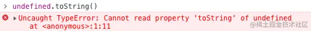
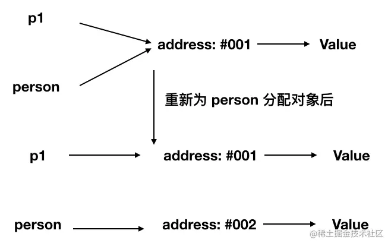

# js数据类型

JS 中分为七种内置类型，七种内置类型又分为两大类型：原始类型和对象类型

## 原始类型

原始类型有七种： null，undefined，boolean，number，string，symbol，bigint。

原始类型存储的都是值，是没有函数可以调用的，比如 undefined.toString()



此时你肯定会有疑问，这不对呀，明明 '1'.toString() 是可以使用的。其实在这种情况下，'1' 已经不是原始类型了，而是被强制转换成了`String`类型也就是对象类型，所以可以调用 toString 函数。

除了会在必要的情况下强转类型以外，原始类型还有一些坑。

其中 JS 的 number 类型是浮点类型的，在使用中会遇到某些 Bug，比如 0.1 + 0.2 !== 0.3

另外 string 类型的值是不可变的，无论你在 string 类型上调用何种方法，都不会对值有改变。

最后对于 null 来说，很多人会认为他是个对象类型，其实这是错误的。虽然 typeof null 会输出 object，但是这只是 JS 存在的一个悠久 Bug。在 JS 的最初版本中使用的是 32 位系统，为了性能考虑使用低位存储变量的类型信息，000 开头代表是对象，然而 null 表示为全零，所以将它错误的判断为 object 。虽然现在的内部类型判断代码已经改变了，但是对于这个 Bug 却是一直流传下来。

## 对象（Object）类型

对象类型和原始类型不同的是，原始类型存储的是值，一般存储在栈上，对象类型存储的是地址（指针），数据存储在堆上

当创建了一个对象类型的时候，计算机会在堆内存中帮我们开辟一个空间来存放值，但是我们需要找到这个空间，这个空间会拥有一个地址（指针）。

```js
const a = []
```

对于常量 a 来说，假设内存地址（指针）为 #001，那么在地址 #001 的位置存放了值 []，常量 a 存放了地址（指针） #001，再看以下代码

```js
const a = []
const b = a
b.push(1)
```

当我们将变量赋值给另外一个变量时，复制的是原本变量的地址（指针），也就是说当前变量 b 存放的地址（指针）也是 #001。因此当我们对任一变量进行数据修改的时候，等同于修改存放在地址（指针） #001 上的值，所以就导致了两个变量的值都发生了改变。

接下来我们来看函数参数是对象的情况：

```js
function test(person) {
  person.age = 26
  person = {
    name: 'yyy',
    age: 30
  }
  return person
}
const p1 = {
  name: 'yck',
  age: 25
}
const p2 = test(p1)
console.log(p1) // -> ?
console.log(p2) // -> ?
```

对于以上代码，你是否能正确的写出结果呢？

* 首先，函数传参是传递对象指针的副本

* 到函数内部修改参数的属性这步，我相信大家都知道，当前 p1 的值也被修改了，也就是说 age 从 25 变成了 26

* 但是当我们重新为 person 分配了一个对象时就出现了分歧，请看下图


