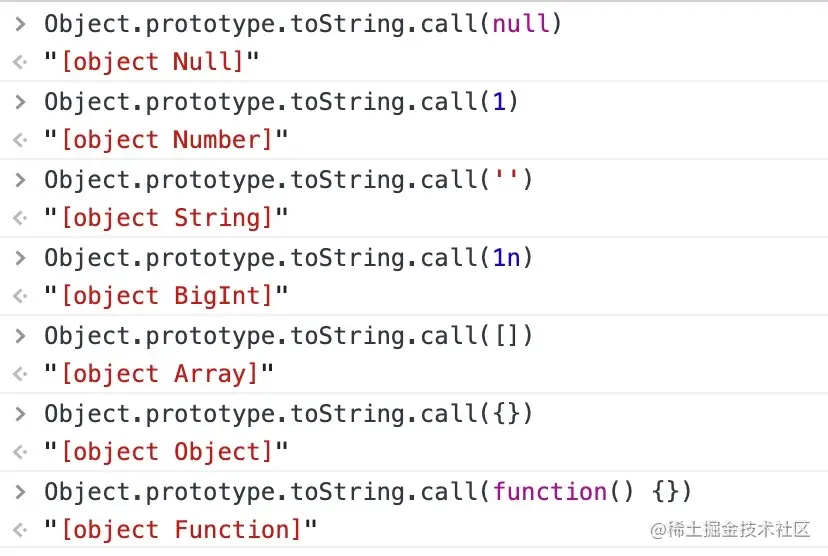

# js类型判断有几种方式

## typeof

typeof 对于原始类型来说，除了 null 都可以显示正确的类型

```js
typeof 1 // 'number'
typeof '1' // 'string'
typeof undefined // 'undefined'
typeof true // 'boolean'
typeof Symbol() // 'symbol'
typeof 1n // bigint
```

typeof 对于对象来说，除了函数都会显示 object，所以说 typeof 并不能准确判断变量到底是什么类型。

```js
typeof [] // 'object'
typeof {} // 'object'
typeof console.log // 'function'
```

## instanceof

instanceof 通过原型链的方式来判断是否为构建函数的实例，常用于判断具体的对象类型

```js
const Person = function() {}
const p1 = new Person()
p1 instanceof Person // true

var str = 'hello world'
str instanceof String // false

var str1 = new String('hello world')
str1 instanceof String // true
```

对于原始类型来说，你想直接通过 instanceof 来判断类型是不行的，但是我们还是有办法实现的。

```js
class PrimitiveString {
  static [Symbol.hasInstance](x) {
    return typeof x === 'string'
  }
}
console.log('hello world' instanceof PrimitiveString) // true
```

你可能不知道 Symbol.hasInstance 是什么东西，其实就是一个能让我们自定义 instanceof 行为的东西，以上代码等同于 typeof 'hello world' === 'string'，所以结果自然是 true 了。

这其实也侧面反映了一个问题：instanceof 并不是百分之百可信的。

另外其实我们还可以直接通过构建函数来判断类型：

```js
// true
[].constructor === Array
```

## Object.prototype.toString.call

开发中用的最多的是Object.prototype.toString.call



## 其他

判断是否为数组的 Array.isArray()
