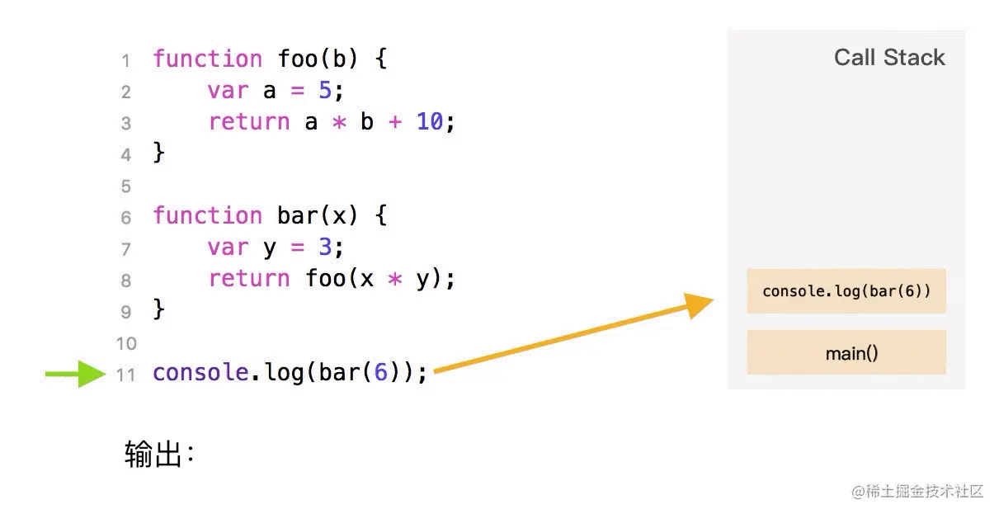
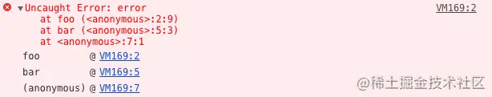
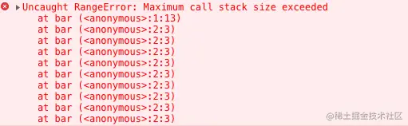

# 事件循环机制 Event Loop

## 进程与线程

相信大家经常会听到 **JS 是单线程**执行的，但是你是否疑惑过什么是线程？

讲到线程，那么肯定也得说一下进程。本质上来说，这两个名词都是 CPU 工作时间片的一个描述。

进程描述了 CPU 在运行指令及加载和保存上下文所需的时间，放在应用上来说就代表了一个程序。线程是进程中的更小单位，描述了执行一段指令所需的时间。

把这些概念拿到浏览器中来说，当你打开一个 Tab 页时，其实就是创建了一个进程，一个进程中可以有多个线程，比如渲染线程、JS 引擎线程、HTTP 请求线程等等。当你发起一个请求时，其实就是创建了一个线程，当请求结束后，该线程可能就会被销毁。

面试题：

**JS 单线程执行带来的优缺点**

优点：代码依次执行，确保了事件执行的稳定性，不会产生多线程冲突。

缺点：遇到耗时任务容易造成堵塞，影响后续代码的执行。

## 执行栈

可以把执行栈认为是一个存储函数调用的**栈结构**，遵循先进后出的原则。



当开始执行 JS 代码时，首先会执行一个 main 函数，然后执行我们的代码。根据先进后出的原则，后执行的函数会先弹出栈，在图中我们也可以发现，foo 函数后执行，当执行完毕后就先从栈中弹出了。

另外在平时开发过程中，大家也可以在报错中找到执行栈的痕迹：

```js
function foo() {
  throw new Error('error')
}
function bar() {
  foo()
}
bar()
```



大家可以在上图清晰的看到报错在 foo 函数，foo 函数又是在 bar 函数中调用的。

当我们使用递归的时候，因为执行栈的内存空间是有限的，一旦存放了过多的函数且没有得到释放的话，就会出现爆栈的问题。

```js
function bar() {
  bar()
}
bar()
```



## 浏览器中的 Event Loop

上一小节中我们讲到了什么是执行栈，大家也知道了当我们执行 JS 代码的时候其实就是往执行栈中放入函数，那么当遇到异步代码的时候该怎么办？

其实当遇到异步代码时，会被挂起并在需要执行的时候加入到 Task（有多种 Task） 队列中。一旦执行栈为空，Event Loop 就会从 Task 队列中拿出需要执行的代码并放入执行栈中执行。


不同的任务源会被分配到不同的 Task 队列中，任务源可以分为 微任务（microtask） 和 宏任务（macrotask）。在 ES6 规范中，microtask 称为 jobs，macrotask 称为 task。

微任务包括 process.nextTick 、queueMicrotask、promise.then 、MutationObserver，其中 process.nextTick 为 Node 独有。

宏任务包括 script 、 setTimeout 、setInterval 、setImmediate 、I/O 及 UI rendering。

讲了这么多，想必大家肯定对于这个 Loop 是怎么样执行的很感兴趣吧。

* 首先执行同步代码，这属于宏任务

* 当执行完所有同步代码后，执行栈为空，查询是否有异步代码需要执行

* 执行所有微任务

* 当执行完所有微任务后，如有必要会渲染页面

* 然后开始下一轮 Event Loop，执行宏任务中的异步代码，也就是 setTimeout 中的回调函数

这里很多人会有个误区，认为微任务快于宏任务，其实是错误的。因为宏任务中包括了 script ，浏览器一定会**先执行一个 script**，接下来才会执行微任务。

了解完以上内容，我们通过一段代码来看看掌握情况：

```js
console.log('script start')

async function async1() {
  await async2()
  console.log('async1 end')
}
async function async2() {
  console.log('async2 end')
}
async1()

setTimeout(function() {
  console.log('setTimeout')
}, 0)

new Promise(resolve => {
  console.log('Promise')
  resolve()
})
  .then(function() {
    console.log('promise1')
  })

console.log('script end')
// script start => async2 end => Promise => script end 
// => async1 end  => promise1 => setTimeout
```

以上代码能很好地帮助我们理解宏任务及微任务的执行顺序，务必搞懂。

如果你对执行顺序有迷惑的话，可以再结合 Event Loop 的执行顺利再思考下。我们首先根据代码执行顺序分离出同步代码，也就是注释第一行的 log 顺序。另外在这些同步代码执行过程中，微任务及宏任务也被推入了相应的队列中等待执行。

接下来我们再根据微任务进入队列的顺序得出打印结果为 async1 end 及 promise1。

最后当微任务执行完毕后需要执行宏任务，此时打印 setTimeout。


